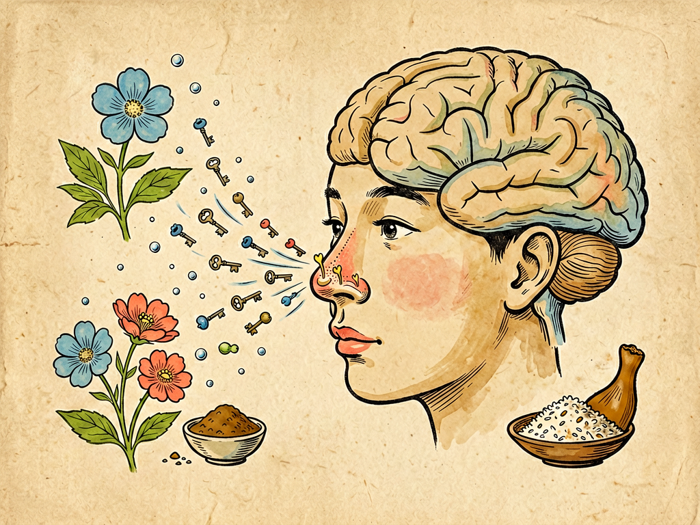

## 第五章 香——谈气味

---

### 📍 本章导航
**核心主题**：嗅觉是最古老最直接的感官——气味是分子，香臭是文化，气味里藏着记忆、健康和情感  
**你将发现**：
- 你闻到的"味道"其实是飘在空气中的化学分子
- 人有400种嗅觉受体，能识别上万种气味，比视觉的3种视锥细胞丰富得多
- 香和臭不是绝对的——吲哚稀薄时是茉莉花香，浓烈时是粪臭味；有人爱香菜，有人觉得是肥皂味
- 嗅觉是唯一不经过丘脑中转的感官，直接连接记忆和情绪——一缕气味能瞬间把你带回童年
- 鼻子是健康预警器——"鼻子不灵"可能是阿尔茨海默病的早期信号
- 狗的嗅觉比人灵敏1万-10万倍

**阅读建议**：读完这一章，你会重新发现你的鼻子——它比你想象的厉害得多。

---

### 🖋️ 经典原文

讲完了视觉和听觉，今天我们讲五感里最古老、最直接、也最容易被忽略的一个——**嗅觉，也就是"闻味道"**。

你可能觉得嗅觉不如视觉重要——眼睛瞎了是天大的事，鼻子闻不见好像没什么大不了。但你错了。在所有感官里，嗅觉是最古老的——几亿年前，生命还在海洋里的时候，最先演化出来的感官就是嗅觉，靠闻水里的化学分子找食物、躲天敌；嗅觉也是最直接的——视觉需要光，听觉需要空气振动，嗅觉什么都不需要，只要分子飘进你鼻子，你就能直接"接触"到那个东西本身。

我们说"闻香识女人""闻香下马""臭气相投"——气味里藏着的东西，比你想象的多得多。

首先说一个最基本的问题：**气味到底是什么？**
气味不是什么虚无缥缈的"气"，它就是**物质分子**。一个东西要有味道，必须满足三个条件：
第一，它得有**挥发性**——能从表面飘出分子到空气里。你能闻到花香，是因为花瓣里的挥发性分子飘在空气里；你闻不到钢铁石头的味道，是因为它们不挥发，没有分子飘出来；
第二，它得能**溶于水和脂肪**——鼻腔黏膜是湿润的，分子得能溶解在黏膜层里，才能碰到嗅觉受体；
第三，它得有足够低的浓度——鼻子极其灵敏，很多分子只要几个ppb（十亿分之一）的浓度就能被闻到。比如乙硫醇（就是煤气里加的那个臭味剂），500亿个空气分子里只要有1个乙硫醇分子，你就能闻见——相当于在50个标准游泳池里滴一滴乙硫醇，你一进水就能闻出来。

你闻到的玫瑰花香，是香叶醇、苯乙醇等几十种分子的混合；醋的酸味是乙酸分子；臭鸡蛋味是硫化氢；鱼腥味是三甲胺；烂白菜味是甲硫醇；你大便的臭味主要是吲哚和粪臭素——但你知道吗？吲哚在低浓度的时候是茉莉花和栀子花的香味，很多香水里都有它，高浓度才是臭味。

鼻子是怎么闻到这些分子的？在你鼻腔顶部，有一块只有邮票大小（约5平方厘米）的黏膜，叫**嗅上皮**，上面密密麻麻分布着1000万个嗅觉神经元——每个神经元顶端都有纤毛，伸到鼻腔的黏液层里，纤毛表面有400种不同的嗅觉受体蛋白。1991年，美国科学家琳达·巴克（Linda Buck）和理查德·阿克塞尔（Richard Axel）发现了嗅觉受体的工作机制，他们因此获得了2004年的诺贝尔奖。

他们的发现说起来很简单，就是"**锁和钥匙**"理论：
- 每一种嗅觉受体蛋白就像一把锁，有特定的形状；
- 气味分子就像钥匙，形状匹配就能"开锁"，激活这个神经元；
- 一种气味分子能打开好几把"锁"（匹配好几种受体），好几种分子也能打开同一把"锁"；
- 不同受体被激活的组合，就像钢琴的和弦——400个琴键能弹出无穷无尽的曲子，400种受体也能组合出上万种不同的气味。

这个组合编码能力有多强？2^400种组合，比宇宙中原子的总数还多。所以别小瞧你的鼻子——它的信息编码能力，比眼睛和耳朵加起来还强。

嗅觉信号传到大脑的路径也特别特殊：其他感官（视觉、听觉、触觉）的信号都要先经过丘脑这个"中转站"，再传到大脑皮层；但嗅觉信号不经过丘脑，直接从嗅球传到**杏仁核（情绪中心）**和**海马体（记忆中心）**。这就是为什么气味和情绪、记忆绑定得特别紧——你可能忘了小时候外婆家是什么样子，但你一闻到外婆做的饭菜香，童年的记忆就会瞬间涌上来；你可能忘了初恋的样子，但你闻到她当年用的香水味，还是会心里一动；普鲁斯特在《追忆似水年华》里写，一小块玛德莱娜蛋糕蘸着茶的味道，一下子就把他带回了童年，这不是文学夸张，这就是嗅觉的神经机制。

嗅觉有很多有意思的特点：
第一，**香和臭是相对的，不是绝对的。**
- **浓度决定香臭**：刚才说的吲哚，低浓度是花香，高浓度是粪臭；麝香浓了很腥，稀释了是香的；
- **基因决定喜好**：最有名的就是香菜——约15%的人觉得香菜有肥皂味、臭虫味，不是他们挑食，是因为他们的OR6A2基因对香菜里的醛类特别敏感。这是天生的，不是"矫情"；
- **文化决定偏好**：榴莲在东南亚是水果之王，在很多酒店、机场被禁止携带；瑞典的鲱鱼罐头臭得惊人，却是瑞典人的传统美食；中国南方很多人爱吃的折耳根（鱼腥草），北方人觉得像鱼腥味+肥皂味。没有什么"天生就该是香的/臭的"，习惯了就香，不习惯就臭；
- **嗅觉疲劳来得很快**："入芝兰之室，久而不闻其香；入鲍鱼之肆，久而不闻其臭"——你在有味道的房间里待几分钟就闻不到了，这是大脑的保护机制，避免信息过载，让你能闻见新的气味。所以你自己喷了香水自己闻不到，别人一靠近就觉得特别浓；你自己有口臭自己闻不到，别人却很明显。

第二，**嗅觉会老化，而且可能是疾病的预警。**
- 婴儿的嗅觉最灵敏，刚出生就能分辨出妈妈的奶味；
- 儿童和年轻人嗅觉最好；
- 60岁以上，约25%的人嗅觉明显减退；80岁以上，超过一半的人鼻子不灵了；
- 最需要警惕的是：**嗅觉减退可能是阿尔茨海默病（老年痴呆）和帕金森病的最早信号，比记忆力下降、手抖早出现好几年**。因为这些神经退行性疾病最早损伤的就是嗅球和嗅觉神经。如果家里老人突然"鼻子不灵了"，别不当回事，最好去医院检查一下；
- 新冠病毒感染后很多人失去嗅觉，就是因为病毒攻击了嗅上皮的支持细胞，大部分人几周内能恢复，但也有少数人长期嗅觉异常。

第三，**气味是健康的"晴雨表"。**
很多疾病会产生特殊的气味，有经验的医生靠闻就能诊断：
- 糖尿病酮症酸中毒的病人，呼出的气有烂苹果味；
- 肾功能衰竭的病人，呼吸有尿骚味；
- 肝功能衰竭的病人，呼吸有霉臭味或鱼腥味；
- 肺结核、肺癌病人的痰液有特殊的臭味；
- 口腔卫生差、扁桃体结石会有顽固性口臭；
- 煤气公司在无色无味的天然气里加了乙硫醇，就是为了让你一闻到就知道煤气漏了——这是救命的味道。

第四，**人类的嗅觉其实"够用"，只是你不常用。**
很多人说"人类嗅觉不如狗"——没错，狗的嗅觉比人灵敏1万到10万倍，有20亿个嗅觉受体（人只有1000万），能闻出几公里外的气味，能分辨出不同人身上细微的体味差异，甚至能闻出癌症、糖尿病、新冠。但人类的嗅觉其实已经足够应付生存需要了，只是现代人太依赖视觉，很多时候"视而不见，闻而不觉"——品酒师、香水师、厨师、调香师，经过训练能分辨出上千种不同的气味，说明鼻子的潜力很大。

最后我们说说"香"的文化。人类对香的追求几乎和文明一样古老：
- 原始人烧芳香植物驱邪、祭祀；
- 古埃及人做木乃伊要用大量香料（乳香、没药）；
- 古代中国文人雅士焚香、佩香囊、品香，是"君子四艺"之一；
- 中世纪欧洲，胡椒、肉桂、丁香这些东方香料比黄金还贵，是香料贸易推动了地理大发现——哥伦布远航本来是为了找去印度的香料航路，结果误打误撞发现了美洲；
- 今天，香水、香薰、精油、空气清新剂……香料工业是一个每年几千亿美元的大产业。

但是我也要提醒一句：**不要用香味掩盖问题。** 有异味的时候，应该先找到异味的来源解决它（发霉了就通风去霉，有煤气就关阀门开窗，口臭就去看牙医），而不是喷空气清新剂、香水把味道盖住——这就像发烧了只吃退烧药不治病，是自欺欺人。

你的鼻子每天24小时值班，帮你闻花香、闻饭菜香、闻危险信号，却从来不求回报。别忽略它——吃饭的时候仔细闻闻饭菜的香气，走进树林闻闻草木的清香，下雨后闻闻泥土的味道，你会发现，这个世界除了好看、好听，还很好闻。

下一章，我们讲"味"。

---

> 📜 **科学史话：嗅觉研究的千年之路——从亚里士多德到巴克和阿克塞尔**
>
> 人类对嗅觉的认识，走了特别长的弯路。
>
> 古希腊的亚里士多德认为，气味是物体散发出来的"原子"，进入鼻子被感知，这个方向其实是对的，但他之后近两千年，嗅觉研究几乎没什么进展；
>
> 18世纪，瑞典植物学家林奈（就是发明生物分类法的那个林奈）第一次尝试把气味分类，分成了7种；
>
> 19世纪，苏格兰科学家艾特肯提出了"振动理论"，认为不同气味是因为分子振动频率不同，这个理论错了，但影响了很久；
>
> 1940年代，美国科学家阿莫尔（John Amoore）提出了"立体化学理论"，认为不同形状的分子对应不同的气味——这就是"锁和钥匙"理论的雏形，他把气味分成了7个基本类型（樟脑味、麝香味、花香味、薄荷味、乙醚味、辛辣味、腐臭味）；
>
> 1991年，琳达·巴克和理查德·阿克塞尔在《细胞》杂志发表了一篇里程碑式的论文，他们在小鼠身上发现了编码嗅觉受体的基因家族——约1000个不同的嗅觉受体基因（人类因为演化，有400个功能性的，剩下600个退化成了假基因）。这篇论文彻底解开了嗅觉识别的分子机制，被认为是嗅觉研究的"圣杯"，他们也因此获得了2004年的诺贝尔奖。
>
> 巴克是一位女科学家，她做这项研究的时候已经40多岁了，在阿克塞尔实验室做博士后。她回忆说，她当年就是好奇"我们怎么能闻到一万种不同的气味"，花了三年时间，用当时刚发明不久的PCR技术，一个一个找，终于找到了整个嗅觉受体基因家族。
>
> 科学发现有时候就是这样——一个简单的问题，可能要花人类几千年才能回答。

---

> 🔬 **科学更新：嗅觉不只是闻味道——它还影响免疫、择偶，甚至寿命？**
>
> 过去十几年，嗅觉研究有很多颠覆认知的新发现：
>
> 第一，**嗅觉影响免疫**。2020年左右的研究发现，嗅觉受体不只是在鼻子里有——在你的皮肤、呼吸道、肠道、甚至免疫细胞上都有嗅觉受体。当细菌产生的特定气味分子激活这些受体时，会直接影响免疫细胞的反应——也就是说，你的免疫系统也在"闻"细菌的味道。这解释了为什么某些气味能让人放松或紧张，为什么芳香疗法有时候真的有效——不只是心理作用，还有生理基础。
>
> 第二，**嗅觉影响择偶**。1995年瑞士生物学家韦奇金做了著名的"汗味T恤实验"：让男人穿T恤两天不洗澡，然后让女人闻这些T恤的味道，选自己喜欢的。结果发现，女人最喜欢的是MHC基因（和免疫相关的基因）和自己差异最大的男人的味道——从演化角度说，这样生出来的孩子免疫力更强。这就是所谓的"一见钟情"，很可能你鼻子先"喜欢"了，大脑才喜欢。当然，避孕药、香水、化妆品会干扰这个机制。
>
> 第三，**嗅觉和寿命相关**。2014年《科学》杂志发表了一项研究：限制果蝇的嗅觉，能让果蝇寿命延长20%左右。后来在小鼠身上也发现，嗅觉受损的小鼠体重更轻、代谢更好、寿命更长。这不是说要把鼻子弄瞎能长寿，而是说明嗅觉和代谢、衰老之间有深层的神经联系——嗅觉告诉大脑"环境里有食物"，大脑就会让身体进入"储能模式"；如果闻不到食物味道，身体就会进入"节能模式"，延长寿命。
>
> 第四，**电子鼻和疾病诊断**。现在科学家正在开发"电子鼻"——用几十个不同的气体传感器模拟人的嗅觉受体，通过分析人呼出的气体里的挥发性分子，就能早期诊断肺癌、胃癌、糖尿病、肾病等很多疾病。未来可能你去医院体检，不用抽血不用拍片，对着仪器吹一口气就能筛查十几种癌症——这就是嗅觉技术给医学带来的革命。
>
> 你看，我们对嗅觉的了解还只是冰山一角——这个看似简单的"闻味道"，背后藏着比我们想象的多得多的秘密。

---

> 💡 **动手试一试：训练你的鼻子，做一个"嗅觉小实验"**
>
> 你可以做几个简单的小实验，重新认识你的鼻子：
>
> **实验一：分辨家里的气味**
> 闭上眼睛，让家人帮忙拿几种有明显气味的东西（咖啡、醋、酒、香水、酱油、橘子皮、薄荷糖等），放在鼻子下面10厘米远，一个一个闻，看看你能准确分辨出几种？再试试捏住鼻子，还能分辨吗？（捏鼻子闻不到，因为气味分子到不了嗅上皮）
>
> **实验二：体验"嗅觉疲劳"**
> 拿一瓶香水或者醋，放在鼻子下面持续闻30秒，你会发现味道越来越淡，最后几乎闻不到了。这时候让旁边的人拿开1分钟，再拿回来闻——又能闻到了。这就是嗅觉疲劳。
>
> **实验三：试试味道"协同"**
> 拿一颗水果糖（比如草莓味）放进嘴里，捏住鼻子嚼——你只能尝到甜味，尝不出"草莓味"；松开鼻子，草莓的香味一下子就出来了。这说明：你吃东西尝到的"味道"，90%其实是嗅觉！鼻子堵了吃什么都没味，就是这个道理——舌头只能尝到酸甜苦咸鲜五种基本味道，剩下的几千种"风味"全是鼻子闻出来的。
>
> **实验四：你的嗅觉还好吗？**
> 找10种家里常见的有气味的东西（大蒜、柠檬、茶叶、咖啡、醋、酒精、香水、薄荷、巧克力、酱油），闭着眼睛一个个闻，看看能认出几个。如果认不出5个以上，说明你的嗅觉可能有减退，最好去医院耳鼻喉科检查一下。
>
> 平时也可以有意识地训练你的鼻子——吃饭的时候先闻闻再吃，走进公园闻闻花草树木的味道，慢慢你会发现，你能分辨出越来越多的气味，生活也会变得更有"滋味"。

---

### 💬 读后思考与讨论

1. "你吃到的味道90%是嗅觉"——这个事实让你惊讶吗？回忆一下你感冒鼻塞的时候吃东西是不是没味道？
2. 有没有一种气味，一闻到就能让你想起某个特定的人或者某段特定的记忆？是什么气味？它唤起了你什么样的回忆？
3. 有人爱吃香菜，有人特别讨厌；有人爱吃榴莲，有人闻了就吐——这是"挑食"还是"天生的"？生活中我们应该怎么对待和自己口味/气味偏好不同的人？
4. "嗅觉减退可能是老年痴呆的早期信号"——你以前知道吗？家里有没有老人"鼻子不灵"？这一章之后你会提醒他们去检查吗？
5. 如果让你失去一种感官（视觉、听觉、嗅觉、味觉、触觉），你最不愿意失去哪一个？为什么？

### 🔗 关联阅读
- 第二部第四章：《声——爆竹声中话耳鼓》→ 五感之听觉
- 第二部第六章：《味——说吃苦》→ 五感之味觉
- 第三部第二十六章：《大脑的秘密》→ 嗅觉与记忆、情绪的关系
- 跨章节思考：五感是大脑认识世界的五个窗口——我们对世界的认知，有多少是"客观"的，又有多少是被我们的感官建构出来的？
