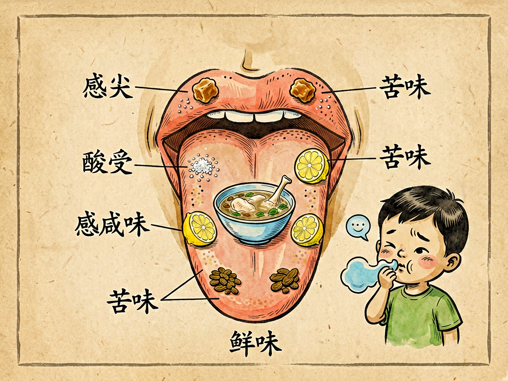

## 第六章 味——说吃苦

---

### 📍 本章导航
**核心主题**：味觉不只是"好吃不好吃"，它是身体的化学检测系统——苦味是警报，五味是营养信号  
**你将发现**：
- 人类只有5种基本味觉：甜、酸、咸、苦、鲜——你吃到的上万种"味道"，80%其实是嗅觉！
- 对苦味的敏感度比甜味高1000倍——因为大部分有毒的东西都是苦的，这是保命的本能
- 人有25种苦味受体，是五味中最多的；约25%的人是"超级味觉者"，对苦味特别敏感
- "良药苦口"有科学道理——很多药用成分（奎宁、咖啡因、黄连素、吗啡）都是苦的
- 辣椒的"辣"、花椒的"麻"不是味觉，是痛觉和触觉
- 味蕾10-14天更新一次，是人体更新最快的组织之一；年纪大了味蕾减少，口味会变重

**阅读建议**：读完这一章，你会明白为什么"吃苦"是一种能力，也是一种修养。

---

### 🖋️ 经典原文

讲完了眼睛看的色、耳朵听的声、鼻子闻的香，今天我们讲舌头尝的——**味，专门说一说"苦"**。

中国人讲"酸甜苦辣咸"五味俱全，"苦"虽然排在中间，却是五味里最特殊、最有故事的一味。我们说"良药苦口""苦尽甘来""吃得苦中苦，方为人上人""不吃苦中苦，难为人上人"——苦不只是一种味道，它几乎成了一种人生哲学。

但今天我们不聊人生，先聊科学：**苦到底是什么？我们为什么怕苦？又为什么离不开苦？**

首先说味觉本身。很多人以为我们能尝出成千上万种味道，其实不对。**舌头只能尝出五种基本味道：甜、酸、咸、苦、鲜**——就像眼睛只有三种视锥细胞却能看见百万种颜色、鼻子有400种受体能闻出上万种气味一样，这五种基本味按不同比例组合，再加上鼻子闻到的香气、舌头感受到的触觉（麻、辣、涩、凉、烫），才构成了我们说的"味道"。

- **甜**：信号是"有能量"——糖和碳水化合物是甜的，告诉大脑"这个有营养，可以吃"；
- **咸**：信号是"有矿物质"——盐是氯化钠，钠是人体必需的电解质，告诉大脑"这个能补盐"；
- **酸**：信号是"可能坏了"——食物腐败会变酸，未成熟的果子也是酸的，是一种"警示"但不是绝对危险；
- **鲜**：信号是"有蛋白质"——谷氨酸（味精）、肌苷酸（肉）、鸟苷酸（蘑菇）是鲜的，告诉大脑"这个有优质蛋白"；
- **苦**：信号是"有毒！"——这是五味里最强烈的警报，敏感度比甜味高1000倍，一点点苦就能尝出来，本能反应就是吐出来。

你看，五味不是随便长的——它们是几百万年演化出来的"化学检测系统"：甜、咸、鲜告诉你"这是好东西，多吃点"；酸告诉你"小心点，可能坏了"；苦告诉你"别吃！这个可能要命"。

以前有个流传很广的"味觉地图"，说"甜在舌尖、酸在舌两侧、苦在舌根、咸在舌边"——这个是1901年一个德国科学家提出来的，后来被证明是错的。实际上，舌头的所有区域都能尝到五种味道，只是敏感度略有不同：舌尖对甜稍微敏感一点，舌根对苦稍微敏感一点，仅此而已。

舌头上密密麻麻分布着大约8000到10000个**味蕾**——每个味蕾像一个小洋葱，里面有50-100个味觉细胞。食物被唾液溶解后，分子碰到味觉细胞上的受体，就会产生电信号，通过味觉神经传到大脑。味蕾的寿命很短，只有10-14天，是人体更新最快的组织之一——所以你烫到舌头，几天就好了，因为旧的味蕾死了，新的很快长出来。年纪大了味蕾会减少，60岁以上的人味蕾可能只有年轻时的一半，所以老人口味会变重，吃什么都觉得淡。

现在重点说**苦**。为什么苦味这么特殊？
第一，**人对苦味的警惕是刻在基因里的。** 我们有25种不同的苦味受体（TAS2R基因家族），比其他四味加起来还多——为什么？因为在野外，有毒的东西太多了：毒蘑菇、毒草、生物碱、氰化物……几乎都是苦的。在几百万年的演化中，对苦味不敏感的祖先都被毒死了，活下来的都是"一吃苦就吐"的人。这就是为什么小孩天生就怕苦，第一次吃药、第一次喝啤酒、第一次吃苦瓜都会皱眉头——不是孩子娇气，是保命的本能。

人群中大约25%的人是"**超级味觉者**"——他们的苦味受体比常人多，对苦味（还有甜味、辣味）特别敏感，一点点苦就觉得受不了，通常挑食，不爱吃西兰花、苦瓜、黑咖啡、浓茶；还有25%的人是"味盲"，对苦味很迟钝，喝黑咖啡像喝水一样；剩下50%的人是中间型。这是天生的基因差异，不是"能吃苦"和"不能吃苦"的区别。

第二，**苦不总是坏的——"良药苦口"是真的。** 植物不能跑也不能打，遇到动物吃它们怎么办？它们就制造各种"化学武器"：生物碱、酚类、苷类，让自己变苦，让动物吃一口就吐。但"是药三分毒"，反过来"是毒三分药"——这些化学物质在小剂量的时候，往往就是药：
- 金鸡纳树皮里的奎宁是苦的，能治疟疾；
- 黄连里的黄连素是苦的，能抗菌治拉肚子；
- 咖啡里的咖啡因、茶叶里的茶多酚是苦的，能提神抗氧化；
- 巧克力里的可可碱是苦的，能改善情绪；
- 苦瓜里的苦瓜素是苦的，能降血糖；
- 很多中药里的有效成分都是苦的。

人类很聪明，发现了这个秘密：**小剂量的"毒"就是药**。所以我们学会了喝茶、喝咖啡、吃苦瓜、喝中药——我们主动找苦吃，因为我们知道苦的背后往往有好处。这是人类和其他动物最大的区别之一：其他动物本能地拒绝所有苦的东西，而人类能理性地接受甚至享受苦味。

第三，**苦的文化意义，是人类独有的。**
- 佛教说"生老病死都是苦"，苦是修行的起点，"苦海无边，回头是岸"；
- 儒家说"天将降大任于斯人也，必先苦其心志，劳其筋骨"，苦是成才的必经之路；
- 民间说"苦尽甘来""不吃苦中苦，难为人上人"，苦是幸福的前奏；
- 甚至在爱情里，我们也说"相思苦""苦恋"——最深刻的情感往往和"苦"联系在一起。

为什么我们会把"苦味"和"苦难"联系在一起？因为味觉上的苦和心理上的"苦"，在大脑里激活的区域有重叠——吃到苦的东西会皱眉、摇头、想吐，遇到难受的事情也会有类似的生理反应。这是一种"通感"，也是人类文化演化的奇妙结果。

这里要澄清一个误区：**辣不是味觉，麻也不是味觉。**
辣椒的"辣"是辣椒素刺激了舌头上的**痛觉受体**（TRPV1），产生的是灼烧感——和你摸到开水、摸到辣椒手会疼是同一个受体。所以辣是痛觉，不是味觉；
花椒的"麻"是花椒麻素刺激了舌头上的**触觉神经**，产生的是50赫兹的震颤感——和你坐久了腿麻、胳膊肘碰到麻筋是同一种感觉。所以麻是触觉，不是味觉。
我们说"麻辣"，其实是痛觉+触觉+温度觉+味觉的混合体验——这就是川菜这么迷人的原因，它调动了口腔里所有的感受器。

还有一个重要的事实：**你吃到的"味道"，70%-80%其实是嗅觉贡献的。** 上一章讲过，嗅觉不经过丘脑直接连到情绪和记忆，所以你吃东西的时候，食物的挥发性分子从口腔后面进到鼻腔，被嗅觉受体闻到，和舌头尝到的五味合在一起，才是完整的"味道"。你捏住鼻子吃东西，只能尝到甜酸苦咸鲜，尝不出苹果和梨的区别、草莓和樱桃的区别；感冒鼻塞的时候吃什么都没味，不是舌头坏了，是鼻子堵了。品酒师、品茶师、美食家厉害，主要不是舌头厉害，是鼻子厉害。

嘴里的细菌也会影响味觉。我们口腔里有700多种细菌，它们分解食物残渣会产生硫化物，这就是口臭的来源；如果舌苔太厚、有牙周炎、蛀牙，细菌产生的毒素会麻痹味蕾，让你吃东西没味道，口味越来越重。所以早晚刷牙、饭后漱口、定期洗牙、偶尔刷刷舌苔，不只是为了牙齿健康，也是为了保护你的味觉。

最后我们说说现代食品工业对味觉的影响。人类演化出来的味觉系统，是为了适应食物匮乏的野外环境：甜和咸是稀缺的好东西，所以我们天生爱吃甜爱吃咸。但今天，食品工业把糖、盐、味精、香精加到所有加工食品里，让每一口都"超级够味"——奶茶甜得发腻，薯片咸得齁人，零食鲜得不正常。这些"过度刺激"会让你的味蕾变得迟钝，你会越来越觉得家里的菜淡、天然食物没味道，陷入"越吃越重口，越重口越迟钝"的恶性循环。

现在越来越多的孩子只吃炸鸡、薯片、奶茶，不吃蔬菜、不吃原味食物，就是因为他们的味觉被加工食品"轰炸"得迟钝了，尝不出天然食物本来的味道。这是现代公共卫生的大问题——肥胖、高血压、糖尿病，很多都和"味觉被宠坏了"有关。

味觉是生命给你的礼物。婴儿用嘴探索世界，老人味觉退化吃什么都不香——能清晰地尝出甜酸苦咸鲜，本身就是一种幸福。能享受甜，是本能；能接受苦，是成熟；能品尝淡，是境界。愿你既能尝遍人间百味，也能品味平淡是真。

下一章，我们讲"触"。

---

> 📜 **科学史话：味觉研究的趣史——从"味觉地图"谬误到鲜味的发现**
>
> 味觉研究史上有两个特别有名的故事，一个是错误流传了一百年的"味觉地图"，一个是"鲜味"的发现。
>
> 先说说那个著名的"味觉地图"。1901年，德国科学家大卫·哈尼格（David P. Hanig）做了一个实验，在舌头不同部位滴不同味道的溶液，测量各个部位的敏感度阈值。他发现舌尖对甜稍微敏感一点，舌根对苦稍微敏感一点，但差异其实非常小，所有部位都能尝到所有味道。
>
> 但1942年，哈佛的心理学家波林（Edwin Boring）在写一本心理学教科书的时候，错误解读了哈尼格的数据，把"敏感度略有差异"画成了"不同部位负责不同味道"的地图——舌尖甜、舌边咸、舌侧酸、舌根苦。这个错误的"味觉地图"太直观太好记了，被印进了全世界所有的中小学教科书，流传了整整一百年，直到1990年代才被科学家推翻，但直到今天还有很多人相信。
>
> 这告诉我们一个道理：一个错误的理论，只要足够简单、足够好记，就会传播得很快，哪怕它是错的。
>
> 再说说"鲜味"的发现。1908年，日本东京帝国大学的化学家池田菊苗教授发现，海带汤里有一种独特的味道，不是甜酸苦咸任何一种。他花了半年时间从海带里提取出了这种物质——谷氨酸钠，也就是味精。他把这种味道命名为"umami"（鲜味），来自日语的"うまい"（好吃）。
>
> 但是在之后将近100年里，西方科学家都不承认"鲜"是一种基本味，认为它只是"咸味的一种"或者"味觉增强"。直到2000年，科学家发现了舌头上专门感受谷氨酸的受体（mGluR4和T1R1/T1R3），才正式确认"鲜"是第五种基本味道——这时候距离池田菊苗发现味精，已经过去了快100年。
>
> 一个新的基本味觉，从发现到被承认，花了一百年。科学的进步，有时候就是这么慢。

---

> 🔬 **科学更新：不止五味——味觉比我们想象的更复杂**
>
> 过去二十年，味觉研究又有很多新发现，可能会颠覆你的认知：
>
> 第一，**可能还有第六味、第七味**。现在科学家已经发现了更多味觉受体：
> - **脂肪味**：舌头上有CD36受体，能直接尝出脂肪酸的味道——也就是"油味"，很多人爱吃肥肉、油炸食品，就是对脂肪味的偏好；
> - **淀粉味**：我们能尝出米饭、馒头、面包里淀粉的味道，不是甜味，是一种独特的"主食味"，现在已经找到了相关受体；
> - **金属味**：铁、铜等金属离子的味道，也有专门的受体；
> - **涩味**：未成熟的柿子、茶叶里的单宁产生的涩味，是一种收敛感；
> - **凉感/热感**：薄荷的凉、辣椒的热，是温度受体被激活产生的感觉。
> 很可能再过十年，我们教科书里的"五味"就要变成"六味""七味"了。
>
> 第二，**苦味受体不只是在舌头上**。和嗅觉受体一样，25种苦味受体不只是长在舌头上——在你的呼吸道、肠道、心脏、甚至大脑里都有表达。比如在鼻窦里的苦味受体，能检测到细菌产生的苦味分子，触发免疫反应杀死细菌；在胃里的苦味受体，检测到苦味物质会加速胃排空，让你尽快把可能有毒的东西排出去。
>
> 第三，**肠道也能"尝味道"**。你的肠道内壁上有和舌头一样的甜味、苦味、鲜味受体。当肠道尝到甜味，会分泌胰岛素调节血糖；尝到鲜味，会分泌消化酶促进蛋白质消化；尝到苦味，会分泌激素告诉你"吃饱了，别吃了"。这解释了为什么人工甜味剂（比如阿斯巴甜、三氯蔗糖）喝起来是甜的却没有热量——它们骗得过舌头，骗不过肠道，肠道尝不到真正的糖，就不会给大脑"饱了"的信号，所以你喝无糖可乐反而会更想吃东西。
>
> 第四，**味觉改变可以治病**。现在很多制药公司在研究"苦味阻断剂"——一种能暂时封闭特定苦味受体的物质，加在儿童药、口服液里，让药不苦，孩子就不会抗拒吃药；还有公司在研究"甜味增强剂"，能让糖的甜度提高几十倍，这样食品里只需要加一点点糖就够甜，能减少糖的摄入，预防肥胖和糖尿病。
>
> 你看，我们对舌头的了解，其实还刚刚开始。

---

> 💡 **现实连接：从味觉到餐桌——健康饮食的实用建议**
>
> 了解味觉科学，能帮你和你的家人吃得更健康：
>
> **1. 尊重孩子的"怕苦"本能，慢慢引导**
> 小孩怕苦、挑食、不爱吃蔬菜是正常的，不是"娇生惯养"。不要强迫孩子吃苦瓜、西蓝花，可以换个做法（比如西蓝花焯水后炒肉片、苦瓜切薄了用盐腌一下去苦味），多试几次，孩子慢慢就接受了。儿童的味觉比成人敏感，你觉得"一点都不苦"的东西，对孩子来说可能苦得难以下咽。
>
> **2. 警惕"重口味陷阱"，保护家人的味觉**
> 尽量少在家做过甜过咸过油的菜，少给孩子喝奶茶、吃薯片、辣条这些加工食品。清淡饮食不是"没味道"，是让你能尝出食物本来的鲜味——鸡肉的鲜、青菜的甜、米饭的香，这些天然的味道，比加了一堆味精鸡精的菜好吃得多。如果家里老人做饭越来越咸，要提醒他们，不是菜淡了，是他们的味蕾退化了。
>
> **3. "吃苦"要适度，不是越苦越好**
> 苦瓜、苦丁茶、莲子心这些苦味食物，适量吃有好处，但不要盲目追求"吃苦养生"——很多苦味食物确实含有少量毒素，吃多了会伤胃、伤肝。中药也要按医嘱喝，不要自己随便买苦的东西"去火"。
>
> **4. 口腔健康=味觉健康**
> 每半年到一年洗一次牙，每天早晚刷牙，刷完牙轻轻刷一下舌苔（不要太用力，会伤到味蕾），有蛀牙及时补，有牙周炎及时治。嘴里清爽了，吃东西才香。
>
> **5. 吃饭慢一点，多咀嚼**
> 狼吞虎咽的人尝不到食物的味道，容易吃多。每一口饭多嚼几下，让食物充分和唾液混合，味道分子充分释放，你会发现你吃得更少，但更满足。
>
> 好的味觉，是吃出来的——好好对待你的舌头，它会回报你一辈子的好胃口。

---

### 💬 读后思考与讨论

1. 你是"超级味觉者"还是"迟钝味觉者"？能喝黑咖啡不加糖吗？爱吃苦瓜和西蓝花吗？你的家人有没有口味偏好和你完全不一样的？
2. "辣不是味觉，是痛觉"——这个事实让你惊讶吗？你爱吃辣吗？吃辣的时候，你享受的是"痛感"还是"痛并快乐着"？
3. 小时候不爱吃的东西（比如香菜、苦瓜、胡萝卜），长大之后突然爱吃了——你有过这样的经历吗？你觉得是味觉变了，还是心理变了？
4. 现代食品工业用大量糖、盐、香精制造"超级刺激"的食物，让很多孩子只爱吃加工食品，不爱吃天然食物——你怎么看这个问题？怎么才能让孩子养成健康的饮食习惯？
5. 我们说"吃苦是福""苦尽甘来"——除了味觉上的苦，生活中的"苦"（学习的苦、工作的苦、失败的苦）有没有什么价值？你吃过的"苦"，后来给你带来了什么？

### 🔗 关联阅读
- 第二部第五章：《香——谈气味》→ 五感之嗅觉，味道的80%来自鼻子
- 第二部第七章：《触——谈痒》→ 五感之触觉，辣和麻其实是触觉/痛觉
- 第一部第三章：《我的家庭生活》→ 口腔里的细菌和龋齿
- 跨章节思考：从甜到苦，从香到臭——我们的感官偏好是演化来的，这些偏好在现代社会是帮了我们，还是害了我们？
