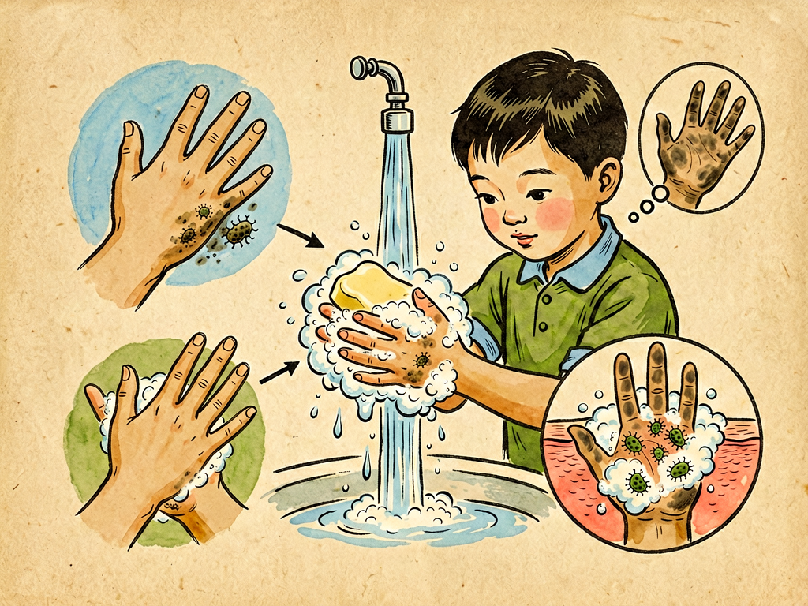

## 第七章 触——清洁的标准

---

### 📍 本章导航
**核心主题**：触觉是五感里唯一直接接触世界的感官，但"摸起来干净"不等于真的干净——清洁有科学标准，不是主观感觉  
**你将发现**：
- 皮肤是人体最大的器官（约2平方米），分布着50万个感觉神经末梢
- 触觉只能感知物理粗糙/光滑，看不见细菌、病毒、化学残留
- 真正的清洁有三层：物理清洁（无可见脏污）、化学清洁（无有害残留）、生物清洁（无致病菌）
- 你手上每平方厘米可能有上万个细菌，光靠"摸"根本摸不出来
- 皮肤表面有1000亿个常驻细菌，它们是保护你的"友军"，过度消毒反而会破坏皮肤屏障
- 过度清洁反而容易过敏、哮喘——这就是"卫生假说"：免疫系统需要"训练"
- 七步洗手法是最廉价有效的防病手段，每次洗手要20秒以上

**阅读建议**：读完这一章，你会重新理解"干净"两个字。五感系列到这一章就结束了。

---

### 🖋️ 经典原文

色、声、香、味四篇讲完，今天讲五感的最后一篇——**触觉，和"清洁的标准"**。

五感里面，视觉、听觉、嗅觉、味觉都是"有距离"的感觉：眼睛看几公里外的东西，耳朵听几百米外的声音，鼻子闻几十米外的气味，舌头尝已经进了嘴的食物，但好歹还没直接接触。只有触觉不一样——**触觉是零敲碎打、零距离的接触**，你摸到什么，你的皮肤就直接和那个东西贴在一起了。

皮肤是人体最大的器官，摊开有2平方米那么大，差不多一张单人床单的大小；如果算上皮下组织，重量能占体重的16%。你全身上下的皮肤里，埋着大约50万个感觉神经末梢，分成好几种：迈斯纳小体管轻触，梅克尔盘管持续压力，帕齐尼小体管振动，鲁菲尼末牵拉，克劳斯终球管冷，游离神经末梢管热、痛、痒。这些神经末梢像一张密密麻麻的网，把你整个身体包起来，让你时刻知道自己在"接触"什么。

但是，触觉有一个致命的弱点：**它只能感知物理属性，感知不到化学和生物属性**。换句话说，它能摸出一个东西是光滑还是粗糙、是软还是硬、是冷还是热，但它摸不出上面有没有细菌、有没有病毒、有没有农药残留、有没有有毒化学物质。

这就引出了我们这一章的核心问题：**什么才是真正的"干净"？**

我们平时判断一个东西干不干净，最常用的就是三个办法：看一眼亮不亮，摸一下滑不滑，闻一闻有没有味。但这三个办法都靠不住：
- 看起来白净的桌子，可能刚刚被感冒的人摸过，上面有几百万个感冒病毒；
- 摸起来光滑的碗，可能用抹布擦过，抹布上的细菌都沾到碗上了；
- 闻起来香喷喷的空气清新剂，只是用香味盖住了异味，有害物质一点没少。

你有过这种经历吗？摸了门把手、摸了钱、摸了电梯按钮，觉得"手也不脏啊"，就直接拿东西吃——但你知道吗？
- 一张流通的纸币上，最多能有几百万个细菌；
- 公共电梯的按钮上，每平方厘米有几百到几千个细菌；
- 没洗过的手上，每平方厘米能有上万个细菌，其中可能就有致病菌；
- 冲马桶的时候如果不盖盖子，细菌会喷到几米高，落在你的毛巾、牙刷上——你摸毛巾的时候根本摸不出来。

细菌太小了，一个细菌只有1微米大，1000个细菌排成队才1毫米长。你的手指分辨率最多也就1毫米左右，比细菌大了1000倍——就像你用大网捞小鱼，根本捞不着。所以**"摸起来干净"和"真的干净"，完全是两回事**。

那真正的清洁是什么？真正的清洁有三层，一层比一层深：
第一层是**物理清洁**——没有可见的灰尘、污渍、脏东西，这是最基础的。你用扫帚扫地、用干布擦桌子、用水冲手，做到的都是物理清洁。但物理清洁只能去掉"看得见的脏"，去不掉看不见的细菌和化学残留；
第二层是**化学清洁**——用洗涤剂、肥皂、酒精这些化学品，溶解油污、杀死大部分细菌。你用洗洁精洗碗、用肥皂洗手、用酒精擦桌子，做到的是化学清洁。但化学清洁可能有残留，也杀不死所有细菌（比如细菌芽孢）；
第三层是**生物清洁**——通过高温、高压、紫外线、高效消毒剂，把所有致病菌（包括芽孢）都杀死，或者把细菌数量降到安全水平。比如你把碗放开水里煮10分钟、用高压锅灭菌、医院做手术用的高压蒸汽灭菌，做到的就是生物清洁。

日常生活中，我们大部分时候只做到了第一层"物理清洁"，部分时候做到了第二层"化学清洁"，几乎很少做到第三层"生物清洁"。这不是说什么东西都要灭菌——家里又不是手术室，不需要完全无菌，但你得知道"干净"有不同的标准，不要被"看起来干净""摸起来干净"骗了。

说到这里，我必须澄清一个常见误区：**清洁不是要把所有细菌都杀光**。
很多人觉得"无菌才是最干净的"，天天用消毒水擦地、擦桌子、擦手机，给孩子用消毒湿巾擦手，甚至洗澡都要用抗菌沐浴露——其实这是错的。为什么？
因为你的皮肤表面，本来就住着大约1000亿个细菌，每平方厘米就有100万个。这些细菌不是"敌人"，是你的"常驻居民"：表皮葡萄球菌、痤疮丙酸杆菌、棒状杆菌……它们在你皮肤上形成一层"菌膜屏障"，占满了位置，坏细菌来了就没地方落脚；它们还会分泌一些抑菌物质，帮你抵抗致病菌；它们甚至能调节你的免疫系统，让免疫系统"认识"哪些是无害的细菌，不要过度反应。
如果你天天用强消毒剂洗手洗澡，把这些常驻菌都杀死了，坏细菌反而更容易定植，皮肤会变得干燥、敏感、容易发炎，霉菌、金黄色葡萄球菌这些坏东西就来了。

更重要的是，现在有一个很有名的理论叫"**卫生假说**"：科学家发现，在农村长大、小时候经常接触泥土、接触动物、接触各种微生物的孩子，长大后过敏、哮喘、湿疹、自身免疫病的概率，比城市里天天待在"干净"环境里、天天用消毒剂的孩子低得多。为什么？因为免疫系统就像军队，需要"实战训练"——小时候接触各种无害的细菌、寄生虫，免疫系统才能学会"分清敌我"，不会一碰到花粉、尘螨、花生蛋白这些无害的东西就过度反应，过敏就是免疫系统"认错人了"，把无害的东西当成敌人打。
所以说，**清洁要适度，不要"洁癖"**。"干净"不是"无菌"，而是"细菌数量在安全水平以下"——就像治安好的城市不是没有一个坏人，而是坏人少到不会影响正常生活。

那日常生活中，哪些地方需要特别注意清洁？我给你几个实用的原则：
第一，**手是最需要清洁的地方**。手是你全身上下接触细菌最多、传播细菌最快的部位——你摸了脏东西，再摸嘴、摸鼻子、摸眼睛、摸食物，细菌就直接进入你身体了。预防感冒、腹泻、新冠、流感……所有传染病，最有效最简单的办法就是**勤洗手**。WHO推荐的七步洗手法（内外夹弓大立腕），用肥皂或洗手液，每次洗20秒以上（大概唱两遍《生日快乐》歌的时间），就能洗掉手上99%以上的细菌和病毒。注意要洗指尖、指缝、大拇指、手腕这些容易漏掉的地方，洗完用一次性擦手纸擦干，不要用脏毛巾擦——毛巾是细菌的温床，用久了比手还脏。
第二，**厨房是家里最脏的地方，不是厕所**。很多人以为厕所最脏，其实厨房比厕所脏得多：切生肉的菜板、菜刀上，可能有沙门氏菌、大肠杆菌；洗碗的海绵、抹布上，每平方厘米有几百万甚至上千万个细菌，是家里细菌最多的东西；冰箱不是"保险箱"，低温只能让细菌繁殖变慢，杀不死细菌——生肉放冰箱里，细菌还会慢慢长，所以生熟一定要分开，菜板菜刀要生熟分开，抹布要经常煮、经常换，冰箱要定期清理。
第三，**经常接触的表面要定期清洁**：手机屏幕（你每天摸几百次，比马桶按钮还脏）、门把手、电梯按钮、电脑键盘、电灯开关、遥控器……这些地方每天都被很多人摸，细菌最多，要经常用酒精棉片擦一擦。
第四，**不要滥用消毒剂**。日常家居清洁，用肥皂、洗洁精、清水就足够了；只有在流感季节、家里有人得传染病、或者接触过污染物品的时候，才需要用消毒剂。消毒剂用多了，不仅会破坏皮肤菌群，还会让细菌产生耐药性——以后真的需要消毒的时候，就不管用了。
第五，**不要过度清洁皮肤**。每天用温水洗澡就够了，不需要天天用沐浴露，更不要用强碱性的肥皂使劲搓。很多人洗澡喜欢搓澡，搓出一条条"泥"才觉得干净——其实那些"泥"大部分是脱落的角质细胞、皮脂、汗液，还有你的常驻菌群。搓太狠了会破坏皮肤屏障，越洗越痒、越洗越敏感。脸上也不要过度清洁，一天洗两次脸就够了，不要天天用去角质产品、洁面仪，把皮肤的保护层洗坏了，反而会变成敏感肌、痘痘肌。

最后我们说说"清洁感"这个东西。现在很多广告都在卖"清洁感"：洗衣液要洗出"阳光的味道"，洗洁精要洗出"柠檬的清香"，洗手液要洗了"清爽顺滑"，空气清新剂要"像森林一样"——这些都是厂家制造出来的"感觉"，不是真正的清洁。"清新的香味"不代表没有细菌，"摸起来顺滑"不代表没有化学残留，"看起来白净"不代表真的干净。
真正的清洁，是看不见、摸不着、闻不到的——它不需要香味来证明，不需要滑溜来证明，不需要视觉效果来证明。它是一个科学标准，不是心理感受。

从这一章回头看我们讲过的五感：眼睛看色，耳朵听声，鼻子闻香，舌头尝味，皮肤触摸——这五个感官是我们认识世界的五个窗口，但它们都有局限，都会"骗人"。眼睛会有错觉，耳朵会有幻听，鼻子会疲劳，舌头会被重口味麻醉，触觉会摸不出细菌。
科学的思维，就是不轻易相信"我亲眼看见""我亲耳听见""我亲手摸到"，而是用实验、用数据、用标准去验证——这就是科学带给我们的，比感官更可靠的"第六感"。

下一章开始，我们从"人"的视角回到"细菌"的视角，看看细菌的衣食住行。

---

> 📜 **科学史话：洗手的革命——塞麦尔维斯的悲剧故事**
>
> 你知道吗？"医生接生前要洗手"这件今天天经地义的事，在170年前是离经叛道的，发现这个道理的医生甚至因此被逼疯，死在精神病院里。
>
> 19世纪中期，欧洲医院里产妇生完孩子后得"产褥热"的死亡率非常高，有时候甚至高达30%——十个产妇里有三个生完孩子就死了，医生们都不知道为什么。
>
> 1847年，匈牙利医生塞麦尔维斯（Ignaz Semmelweis）在维也纳总医院做产科医生。他发现一个奇怪的现象：医学院的医生和学生负责的产房，产褥热死亡率是8%-10%；而助产士负责的产房，死亡率只有2%，差了四五倍。
>
> 他仔细观察了很久，终于发现了区别：医生和学生们常常在解剖完尸体之后，不洗手就直接去给产妇检查、接生；而助产士不解剖尸体，手更"干净"。他想：会不会是尸体上的什么"尸毒素"通过医生的手传给了产妇？
>
> 于是他规定：所有医生和学生，在给产妇检查之前，必须用含有漂白粉的水彻底洗手。就这么一个简单的规定，产褥热的死亡率在一个月内就从18%降到了1%，有时候甚至连续几个月没有一例死亡。
>
> 你猜怎么着？这个伟大的发现，当时不但没有被医学界接受，反而遭到了同行的激烈反对和嘲笑。当时的主流医学认为"疾病是体液不平衡导致的"，他们不相信"看不见的小颗粒"能致病，觉得塞麦尔维斯是在说"医生的手不干净"，是对医生的侮辱。
>
> 塞麦尔维斯被医院开除，后来被同行逼得精神失常，47岁的时候死在了精神病院里——他死后仅仅20年，巴斯德和科赫证明了细菌致病理论，李斯特发明了外科消毒法，人们才终于意识到塞麦尔维斯是对的，称他为"母亲的救星"。
>
> 今天，全世界每一个医生护士都知道要洗手，但很少有人记得，这个简单的常识背后，有一个医生付出了生命的代价。科学的进步，有时候就是这么残酷。

---

> 🔬 **科学更新：皮肤菌群和卫生假说——我们对清洁的认知正在被改写**
>
> 过去二十年，微生物组研究彻底改变了我们对"干净"和"细菌"的理解，塞麦尔维斯的故事之后，我们对清洁的认知正在发生第二次革命。
>
> 第一，**皮肤菌群是人体不可缺少的"器官"**。2007年美国NIH启动了"人类微生物组计划"，花了1.7亿美元，对人体表面和体内的细菌进行基因测序。结果发现：人体上的细菌数量比人体细胞还多（大约1.3:1），细菌的基因数量是人类基因的150倍。你不只是"你"，你是"你+你身上的细菌"组成的超级生物体。
> 皮肤上的1000亿个细菌，不只是"住"在你身上，它们会帮你：
> - 分泌抗菌肽，杀死金黄色葡萄球菌、链球菌这些坏细菌；
> - 调节皮肤的炎症反应，减少湿疹、皮炎；
> - 甚至能调节伤口愈合，减少疤痕形成。
> 现在已经有公司在做"皮肤益生菌"产品了——就像喝酸奶调理肠道菌群一样，以后可能会有"益生菌沐浴露""益生菌护肤品"，用来修复被过度清洁破坏的皮肤菌群。
>
> 第二，**卫生假说升级成了"老朋友假说"**。最初的卫生假说认为"太干净了容易过敏"，但科学家后来发现，问题不是"太干净"，而是"接触的微生物种类太少"。人类在几百万年的演化中，和土壤里的细菌、肠道里的寄生虫、环境中的各种微生物共同演化，这些微生物是我们免疫系统的"老朋友"——它们在怀孕的时候就通过胎盘，出生的时候通过产道，喂奶的时候通过母乳，早早地"训练"我们的免疫系统，让它学会分辨"有害"和"无害"。
> 现在城市里的孩子，出生在消毒过的医院，喝配方奶，天天待在钢筋水泥的房子里，接触土壤和动物的机会太少，这些"老朋友"不在了，免疫系统就容易"草木皆兵"，把花粉、尘螨、食物蛋白当成敌人攻击，就导致了过敏。现在科学家正在做"微生物暴露疗法"——让过敏的孩子定期接触农场的泥土、动物，甚至吃寄生虫卵（当然是安全的），来治疗过敏和哮喘，已经取得了很好的效果。
>
> 第三，**抗菌产品的危害被证实了**。三氯生是过去很多抗菌肥皂、抗菌牙膏、抗菌湿巾里的主要成分，用了几十年。但最近的研究发现：长期用三氯生，不仅不防感染，还会改变人体的激素水平，破坏肠道菌群和皮肤菌群，甚至会让细菌产生抗生素耐药性。2016年，美国FDA已经禁止在普通肥皂里添加三氯生了——你看，"抗菌"不一定是好事，普通肥皂和清水就足够了。
>
> 第四，**"过度消毒"反而增加感染风险**。新冠疫情期间，很多人天天用高浓度酒精、84消毒液擦家里所有东西，结果很多人出现了皮肤过敏、呼吸道刺激，甚至有因为混合使用消毒剂产生氯气中毒送急诊的。后来研究发现，天天用消毒剂的家庭，儿童的哮喘和湿疹发病率反而更高。
>
> 总结成一句话就是：**清洁很重要，但不要灭菌；要讲卫生，但不要怕细菌**。我们和细菌打了几亿年的交道，它们不是我们的敌人，是我们离不开的"老朋友"。

---

> 💡 **现实连接：日常清洁的实用指南——什么地方要"干净"，什么地方别"太干净"**
>
> 结合最新的科学研究，给你一份可以直接用的"家庭清洁指南"：
>
> **✅ 必须认真清洁的地方：**
> 1. **手**：饭前便后、摸了公共物品（门把手、电梯按钮、钱）之后、照顾病人前后、处理生肉之后、打喷嚏咳嗽捂嘴之后，一定要用肥皂/洗手液洗20秒以上，七步洗手法。这是最划算的健康投资；
> 2. **厨房：**
>    - 菜板、菜刀生熟分开，切完生肉用洗洁精洗干净，定期用开水煮10分钟消毒；
>    - 洗碗海绵、抹布是家里细菌最多的地方，用完拧干挂起来通风，每1-2周用开水煮10分钟，或者直接换新的，不要一块抹布用几个月；
>    - 冰箱定期清理，生肉放密封盒里，放在下层，避免血水滴到其他食物上，剩菜放冰箱不要超过3天，吃之前充分加热；
> 3. **卫生间：**
>    - 冲马桶一定要盖盖子，避免细菌喷溅；
>    - 牙刷不要放在马桶旁边，离马桶至少1米远，每3个月换一次；
>    - 马桶圈、水龙头把手定期用清洁剂擦干净；
> 4. **高频接触表面：** 手机、电脑键盘、遥控器、电灯开关、门把手、电梯按钮，每周用酒精棉片擦1-2次，疫情期间每天擦。
>
> **❌ 不要过度清洁的地方：**
> 1. **皮肤：** 每天用37度左右的温水洗澡就够了，冬天不用天天用沐浴露，不要使劲搓澡，脸上一天洗两次脸，用温和的氨基酸洗面奶，不要频繁去角质、用洁面仪；
> 2. **家里的地板、家具：** 平时用清水、普通洗洁精拖地擦桌子就够了，不用天天用84消毒液、消毒水，只有在传染病流行期、家里有病人的时候才需要偶尔消毒；
> 3. **孩子：** 不用每天给孩子用消毒湿巾擦手，不用天天给玩具消毒，让孩子玩泥土、玩沙子、接触小动物是好事，能训练免疫系统；孩子的餐具用洗洁精洗干净、用开水烫一下就够了，不用每次都放消毒锅；
> 4. **不要滥用抗菌产品：** 普通肥皂和洗手液比抗菌肥皂好，普通牙膏比添加了抗菌剂的好，普通洗衣液比抗菌洗衣液好——"抗菌"两个字，大部分时候是营销噱头。
>
> **💡 记住一个原则：清洁是"减少致病菌到安全水平"，不是"杀死所有细菌"。**
> 你的身体比你想象的强大得多，它有皮肤屏障、有免疫系统、有常驻菌群保护你。生活在一个"有点细菌"的环境里，反而比生活在"完全无菌"的环境里更健康。

---

### 💬 读后思考与讨论

1. 以前你判断"干净"的标准是什么？是看、摸、闻吗？读了这一章之后，你对"干净"的定义变了吗？
2. 你或身边的人有"洁癖"吗？学了卫生假说之后，你怎么看过度清洁这件事？
3. 你平时洗手是怎么洗的？能做到每次洗20秒、用七步洗手法吗？
4. 很多广告卖"抗菌""无菌""99.9%杀菌"的产品，学了这一章之后，你会被这些营销影响吗？
5. 五感（色、声、香、味、触）都有局限性，我们生活中还有哪些"我以为是真的，其实是感官骗了我"的例子？

### 🔗 关联阅读
- 第二部第六章：《味——说吃苦》→ 五感之味觉
- 第二部第八章：《细菌的衣食住行》→ 回到细菌视角，看看细菌怎么生活
- 第一部第三章：《我的家庭生活》→ 细菌的生活环境
- 跨章节思考：五感是人类认识世界的窗口，但它们都有局限——科学方法为什么比"亲身感受"更可靠？在生活中，我们怎么区分"主观感受"和"客观事实"？

---

**五感系列（色、声、香、味、触）到此完结。这个系列带我们用科学的眼光重新认识了眼、耳、鼻、舌、身五个感官——它们是几百万年演化的杰作，是我们连接世界的桥梁，但它们也有局限、会犯错。科学的思维方式，就是帮我们超越感官的局限，看到更真实的世界。**
