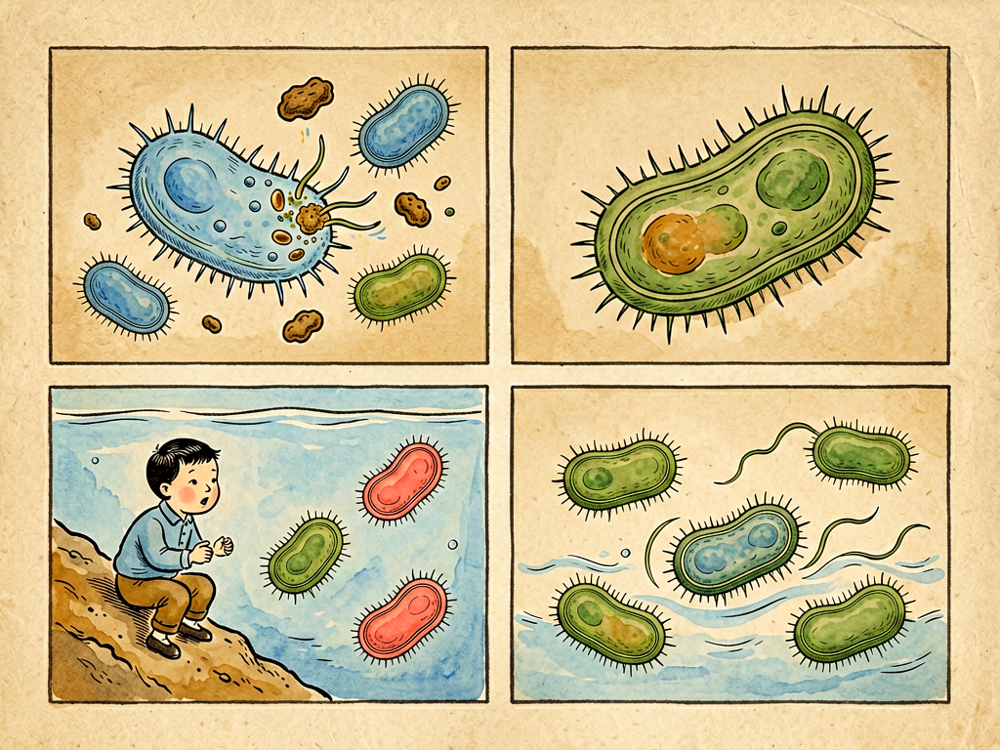

## 第八章 细菌的衣食住行

---

### 📍 本章导航
**核心主题**：细菌不是抽象的"病菌"，它们是有自己生活的微小生命——它们要穿"衣服"、要"吃饭"、要"住房子"、要"旅行"，甚至有"社会生活"  
**你将发现**：
- 细菌的"衣服"有三层：细胞膜（内衣）、细胞壁（盔甲）、荚膜（雨衣）——青霉素就是靠破坏细胞壁杀菌的
- 细菌的"口味"各不相同：有的爱吃糖，有的爱吃铁，有的靠吃石头、晒太阳就能活
- 37摄氏度（人体体温）刚好是致病菌最喜欢的温度，胃酸能杀死大部分细菌但幽门螺杆菌例外
- 细菌20-30分钟就能繁殖一代，一个细菌一天理论上能繁殖出4000吨后代
- 细菌会"盖房子"形成生物膜（牙菌斑就是），耐药性比单个细菌强1000倍
- 细菌会"开会议"——群体感应，凑够数量就一起搞事情（释放毒素、形成生物膜）
- 芽孢是细菌的"诺亚方舟"，能在沸水中活几个小时，甚至能活几千万年

**阅读建议**：读完这一章，你会像了解一个老朋友一样了解细菌——知己知彼，才能和它们好好相处。

---

### 🖋️ 经典原文

前七章我们从人的角度，讲了人身上的细菌、人的感官、人和细菌的互动。从这一章开始，我们把镜头反过来，**站在细菌的角度，看看它们是怎么生活的**。

中国人讲"衣食住行"是生活的四件大事——其实对细菌来说也是一样。它们也有"衣服"保护自己，也有"食物"提供能量，也有喜欢"住"的环境，也有各种"出行"和传播的方式。它们不是什么抽象的"病菌"，它们是活了35亿年的地球最古老的居民，是把"生活"这件事玩到极致的生命。

我们先说细菌的"**衣**"——也就是它们外面的保护层。细菌穿三层"衣服"：
最里面一层叫**细胞膜**，相当于它们的"内衣"，是一层薄薄的磷脂双分子层，就像你们细胞的细胞膜一样。这层膜特别重要：什么东西能进细胞、什么东西能出细胞，全靠它控制；呼吸作用、能量生产也在这层膜上进行——细菌没有线粒体，它们把"发电厂"建在细胞膜上。
中间一层叫**细胞壁**，相当于它们的"盔甲"。这层壁是细菌独有的东西，我们人类的细胞就没有细胞壁——这太重要了，因为青霉素、头孢这些抗生素，就是专门攻击细菌细胞壁合成的，能把细胞壁拆了让细菌涨破死掉，却不会伤害我们的细胞，因为我们根本没有细胞壁。根据细胞壁的结构不同，细菌被分成两大类：革兰氏阳性菌（细胞壁厚，染成紫色，比如葡萄球菌、链球菌）和革兰氏阴性菌（细胞壁薄，外面还有一层外膜，染成红色，比如大肠杆菌、沙门氏菌）。革兰氏阴性菌更难对付，因为它们的外膜能挡住很多抗生素，而且外膜上的脂多糖（LPS）就是所谓的"内毒素"——细菌死了之后释放出来，会让你发烧、休克。
最外面一层，有些细菌还会穿一件"雨衣"——**荚膜**，是一层黏糊糊的多糖。这件雨衣太有用了：第一，能抗干燥，在干的地方也能活很久；第二，能躲避免疫系统——我们的白细胞要吃细菌，有了这层滑溜溜的荚膜就抓不住、吞不下去；第三，能粘在各种表面，比如牙齿上、呼吸道黏膜上，不会被冲走。有荚膜的细菌往往毒力特别强，肺炎链球菌、脑膜炎球菌都是靠这层"雨衣"致病的。
除了这三层衣服，很多细菌还有"配饰"：有的长着长长的**鞭毛**，像船的螺旋桨一样转，能推动细菌在水里游来游去，速度特别快——一秒钟能游相当于自身长度100倍的距离，比人游泳快多了；有的长着短短的**菌毛**，像小钩子一样，能勾在我们的细胞上不让被冲走；还有的长着"性菌毛"，两个细菌靠它连在一起，交换基因——这就是细菌传递耐药性的"秘密通道"。

再来说细菌的"**食**"——也就是它们的营养和代谢。细菌真的是什么都能吃，比人类不挑食多了：
- 有的细菌是"自养菌"，像植物一样，靠晒太阳（蓝细菌、光合细菌）或者氧化无机物（比如硫细菌吃硫化氢、硝化细菌吃氨、铁细菌吃铁离子）就能自己制造有机物，不需要吃别的生物；
- 大部分细菌是"异养菌"，和我们一样需要吃现成的有机物。其中有的是"腐生菌"，吃动植物的尸体、落叶、残羹剩饭——大自然的清道夫，没有它们地球就会被尸体堆满；有的是"寄生菌"，吃活的动植物和人——这些就是让我们生病的致病菌。
细菌吃饭不挑，但它们对"住"的环境要求各不相同，这就是我们说的"**住**"：
第一是**温度**。大部分致病菌都是"嗜温菌"，最喜欢20-45摄氏度，最适合的就是37摄氏度——刚好是我们人体的体温，这不是巧合，是致病菌专门演化来适应我们身体的；冰箱冷藏温度4摄氏度，大部分细菌长不快，但有一类"嗜冷菌"比如李斯特菌，在冰箱里照样能长，所以冰箱里拿出来的剩菜一定要充分加热再吃，不是放冰箱就安全了；还有"嗜热菌"，能在七八十度的温泉里活，PCR技术用的Taq酶就是从嗜热菌里提取的，能耐95度高温。
第二是**氧气**。有的细菌必须有氧气才能活（专性需氧菌，比如结核菌），有的细菌见了氧气就会死（专性厌氧菌，比如破伤风梭菌、肉毒梭菌——所以深的伤口要用双氧水冲洗，就是为了制造氧气杀死厌氧菌），有的细菌有氧无氧都能活（兼性厌氧菌，比如大肠杆菌，适应性最强）。
第三是**酸碱度**。大部分细菌喜欢中性环境，我们的胃酸pH值1-3，是强酸性，能杀死几乎所有吃进去的细菌——但幽门螺杆菌是个例外，它能分泌尿素酶，把周围的尿素变成氨，中和胃酸，在胃里给自己造一个"中性小窝"，在胃黏膜上安家，导致胃炎、胃溃疡甚至胃癌。
第四是**渗透压**。为什么腌咸菜、腌肉、做蜜饯不会坏？因为高浓度的盐或者糖会让细菌细胞里的水吸出来，细菌失水就死了。这是人类用了几千年的食物保存方法。
细菌最厉害的本事之一是"盖房子"——它们不是单个散着住的，只要有表面，它们就会粘上去，分泌胞外多糖，一层一层叠起来，形成一个黏糊糊的"细菌城市"，叫**生物膜**。你牙齿上那层黄黄黏黏的牙菌斑就是生物膜，里面住着700多种细菌；水管里的水垢、导尿管上的感染、慢性中耳炎、牙周炎、心内膜炎……很多慢性感染都是生物膜导致的。生物膜最可怕的地方是：**细菌一旦住进"城市"里，耐药性会比单个细菌强100到1000倍**——抗生素能杀死游出来的单个细菌，但杀不死膜里面的细菌，因为药渗不进去，而且膜里的细菌生长很慢，对很多抗生素不敏感。
在生物膜里，细菌还会"开会议"——这叫**群体感应**：每个细菌都会分泌一种信号分子，细菌越多，信号分子浓度就越高，等浓度达到一个阈值，所有细菌就会"收到信号"，统一行动：一起释放毒素、一起形成生物膜、一起发光（海洋里的发光细菌就是这样，凑够数量才一起发光）。以前我们以为细菌是孤零零的单细胞生物，现在才知道，它们是有"社会"的——会交流、会合作、会集体决策，像一个多细胞生物一样。

然后是细菌的"**行**"——它们怎么传播、怎么旅行？细菌没有脚没有翅膀，但它们的传播能力比任何动物都强：
- **空气传播**：咳嗽、打喷嚏喷出的飞沫，带着细菌能飞几米远，结核杆菌、白喉杆菌、感冒病毒都是这么传的；
- **水传播**：霍乱、伤寒、痢疾都是喝了被粪便污染的水传播的，所以自来水要消毒、不喝生水是公共卫生的基础；
- **食物传播**：沙门氏菌、金黄色葡萄球菌、肉毒梭菌都是通过食物传播的，生熟不分、食物没煮熟，就容易中招；
- **接触传播**：手摸了被污染的东西，再摸嘴、摸鼻子、摸眼睛，就会感染——这就是为什么勤洗手这么重要；
- **虫媒传播**：蚊子传疟疾、登革热，跳蚤传鼠疫，苍蝇带着各种细菌落在食物上；
- **垂直传播**：妈妈怀孕或者生孩子的时候，把细菌传给孩子，比如梅毒、乙肝。
细菌本身也会动：有鞭毛的细菌能在水里游；没有鞭毛的也能靠空气流动、水流、灰尘、人和动物带着它们到处跑。一个细菌今天还在土壤里，明天可能就被风吹到几千米外，后天可能就进到某个人的呼吸道里——它们的旅行能力是我们难以想象的。

除了衣食住行，细菌还有一个最厉害的本事，就是"**生**"——繁殖。细菌繁殖是最简单的"二分裂"：一个细菌长大一点，DNA复制一份，然后从中间一分为二，变成两个一模一样的细菌。在理想条件下，这个过程只需要20到30分钟——也就是说，20分钟翻一倍。
你算一下：一个细菌，20分钟变2个，40分钟变4个，1小时变8个……24小时之后，是2^72个，大约4700000000000000000000个，总重量超过4000吨——这就是指数增长的可怕之处。当然，现实中它们不可能这么长，因为营养会耗尽、空间会不够、废物会积累，但这已经足够说明为什么细菌感染发作那么快——吃进去几个沙门氏菌，几个小时就能繁殖到几百万个，让你上吐下泻。
遇到恶劣环境怎么办？有些细菌有终极绝招——变成**芽孢**。它们会把自己浓缩成一个小小的休眠体，外面包上厚厚的壁，停止代谢，几乎是"假死"状态。芽孢的抵抗力有多强？能在100摄氏度的沸水中活好几个小时，要121度高压蒸汽灭菌15-20分钟才能杀死；能抗干燥、抗辐射、抗消毒剂，在干燥环境里能活几十年甚至几百万年——科学家曾经从2500万年前的琥珀里、从几千万年前的盐矿结晶里复活过芽孢杆菌。一旦环境合适了，它们就会"苏醒"，发芽变成正常的细菌，继续繁殖。芽孢就是细菌的"诺亚方舟"，帮它们熬过世界末日一样的极端环境。
最可怕的是，细菌之间还会"交换情报"——传递耐药基因。很多耐药基因都在"质粒"（一种小环状DNA）上，两个细菌碰到一起，通过性菌毛连起来，就能把质粒从一个细菌传给另一个，甚至能传给不同种类的细菌。一个细菌产生了耐药性，很快就能传给周围成千上万的细菌，这就是为什么超级细菌（MRSA、CRE这些）出现得这么快——我们用抗生素筛选它们，它们就用基因交换快速进化，和我们展开军备竞赛。

很多人觉得细菌是"敌人"，要把它们全部杀光。但你想想：细菌在地球上活了35亿年，而人类才出现了几百万年；地球上细菌的总数量大约是5×10^30个，比所有动植物加起来还多；我们身体里的细菌数量比我们自己的细胞还多。它们是地球的原住民，我们才是后来者。它们不只是让我们生病的病菌——它们分解尸体、肥沃土壤、制造氧气、帮我们消化食物、生产抗生素和各种食物。没有细菌，就没有我们今天的世界。
理解了细菌的衣食住行，你就会明白：和细菌相处，不是要"杀光"它们，而是要"管理"它们——不让坏细菌进到不该去的地方，让好细菌好好待在该待的地方。知己知彼，才能和平共处。

下一章，我们讲细菌的大菜馆。

---

> 📜 **科学史话：青霉素的发现——一个"幸运的失误"改变了人类命运**
>
> 人类发现抗生素的故事，就是利用细菌"衣服"弱点的最佳例子，而这个发现完全是一个意外。
>
> 1928年，英国细菌学家亚历山大·弗莱明（Alexander Fleming）在实验室培养葡萄球菌。有一次他度假回来，发现一个培养皿被霉菌污染了——通常这种污染的培养皿就直接扔掉了，但弗莱明注意到：霉菌菌落周围的葡萄球菌都被杀死了，形成了一个透明的"抑菌圈"。
>
> 弗莱明仔细研究了这个霉菌，发现它是青霉菌（Penicillium），它分泌的一种物质能杀死葡萄球菌、链球菌等很多革兰氏阳性菌——他把这种物质命名为"青霉素"。
>
> 但是弗莱明一直没能把青霉素提纯出来，这个发现被冷落了十几年。直到1940年代二战期间，澳大利亚病理学家弗洛里（Howard Florey）和德国生物化学家钱恩（Ernst Chain）才找到了提纯青霉素的方法，在美国大规模生产出来，在二战中救了几百万受伤士兵的命——在此之前，一个小小的伤口感染、肺炎、肺结核都可能死人。
>
> 1945年，弗莱明、弗洛里、钱恩三个人一起获得了诺贝尔奖。但就在获奖的时候，弗莱明就警告说：如果滥用青霉素，细菌很快就会产生耐药性——他说的话在今天已经变成了现实。
>
> 青霉素的作用机制是什么？很简单：它专门抑制细菌细胞壁肽聚糖的合成，让细菌没法造自己的"盔甲"。细菌在繁殖的时候需要不断合成新的细胞壁，青霉素一捣乱，细胞壁就有缺陷，细菌就会因为渗透压涨破死掉——而我们人类细胞没有细胞壁，所以青霉素对我们毒性很小。
>
> 一个培养皿的污染，一个科学家的细心观察，一个持续十几年的接力研究——改变了整个人类的命运。人类的平均寿命因为抗生素的出现延长了至少15年。

---

> 🔬 **科学更新：细菌比我们想象的更聪明——从群体感应到细菌"互联网"**
>
> 过去20年，微生物学最颠覆认知的发现，就是细菌不是"孤独的单细胞"，它们有复杂的社会生活，甚至有"互联网"一样的通讯系统。
>
> 第一，**群体感应不只是"凑数开会"，它有复杂的语言系统**。发现群体感应的邦尼·巴斯勒（Bonnie Bassler）教授发现：细菌不只是说一种语言，它们有"菌种内部语言"和"细菌通用语"两种信号系统。也就是说，细菌不仅知道"自己人有多少"，还知道"其他种类的细菌有多少"，它们会根据整个微生物群落的组成决定自己的行为——就像一个多种族的社会，不同物种之间也会交流。巴斯勒教授现在在研究"群体感应抑制剂"——不让细菌"开会"，它们就不会一起释放毒素、形成生物膜，这样就不会致病，也不会产生耐药性。这是下一代抗生素的新方向，不会杀死细菌，只是让它们"变哑"。
>
> 第二，**生物膜不是乱堆在一起，它们是有规划的"城市"**。高分辨率显微镜发现，生物膜里面有复杂的结构：有输送营养的"通道"（像城市的道路），有不同功能的细菌分工（有的负责附着，有的负责繁殖，有的负责释放毒素），甚至有"下水道"排废物。生物膜里的细菌和单个浮游细菌，基因表达有70%是不一样的——它们完全是另一种生存状态。
>
> 第三，**细菌的"水平基因转移"比我们想象的频繁得多**。以前我们以为细菌只是"生孩子"的时候把基因传给后代（垂直传递），现在发现细菌之间随时随地都在交换基因，像发微信一样——不只是质粒，还有噬菌体（病毒）当"快递员"在细菌之间传基因，甚至细菌死了之后，DNA释放到环境里，其他细菌还能捡起来用（转化）。耐药基因就是靠这个"细菌互联网"，在短短几十年里传遍了全世界的细菌。更可怕的是，这些耐药基因甚至能从环境细菌（比如土壤里的细菌）传到致病菌身上——这就是为什么很多抗生素用不了几年就失效了。
>
> 第四，**绝大多数细菌是不能人工培养的**。我们现在能在实验室培养的细菌还不到1%，剩下99%的细菌我们根本不知道它们怎么生活、吃什么、有什么功能——它们是"微生物暗物质"。现在用宏基因组测序技术，我们不用培养就能直接测环境里所有细菌的DNA，正在不断发现全新的细菌门、全新的代谢途径，很多我们以为是"生物特性"的东西，其实是细菌发明的。
>
> 越研究细菌，我们越发现：它们不是简单的"低等生物"，它们是在地球上活了35亿年的"生存大师"，它们的社会结构、通讯系统、进化能力，比我们想象的要复杂得多。

---

> 💡 **现实连接：我们怎么利用和对付细菌？——衣食住行里的细菌学**
>
> 了解了细菌的衣食住行，你就能明白日常生活里很多做法背后的科学道理，也能避免很多误区：
>
> **对付坏细菌的方法，就是破坏它们的衣食住行：**
> 1. **对付"衣"——破坏它们的保护层：** 75%酒精能溶解细菌的细胞膜和外膜，所以用来消毒皮肤、物体表面很好；青霉素、头孢破坏细胞壁，是很好的抗生素；但要注意，抗生素不能杀病毒，感冒吃抗生素没用；
>
> 2. **对付"食"——断它们的粮：** 食物密封保存，就是不让细菌有营养可以吃；把食物晒干、糖渍、盐渍，都是让细菌没法利用食物里的水和营养；
>
> 3. **对付"住"——改变环境让它们住不下去：**
>    - 低温冷藏（4度）能减慢大部分细菌繁殖，冷冻（-18度）能让细菌完全停止生长；
>    - 高温加热是最可靠的杀菌方法——食物中心温度达到70度以上就能杀死大部分致病菌，煮沸10分钟能杀死几乎所有营养细胞（但杀不死芽孢）；
>    - 干燥：保持干燥细菌就长不起来，所以洗完碗要沥干、毛巾要挂起来通风、伤口要保持干燥；
>    - 深的伤口要打破伤风针，因为深伤口是无氧环境，适合破伤风梭菌（厌氧菌）生长——双氧水冲洗伤口能释放氧气，杀死厌氧菌；
>
> 4. **对付"行"——切断它们的传播途径：**
>    - 勤洗手：手是细菌最主要的交通工具；
>    - 咳嗽打喷嚏遮口鼻，戴口罩：切断空气传播；
>    - 不喝生水、生熟分开、食物煮熟：切断食物和水传播；
>    - 多通风：减少空气中的细菌数量。
>
> **利用好细菌的方法，就是给它们合适的衣食住行：**
> - 酿酒、做酱油、做醋、做酸奶、做泡菜、做面包，都是给特定细菌/真菌合适的温度、营养、环境，让它们帮我们制造食物；
> - 抗生素是细菌自己制造出来"打架"用的化学武器，我们拿来当药用；
> - 污水处理厂靠细菌吃掉污水里的有机物，净化水质；
> - 农业上用根瘤菌给植物固氮，减少化肥使用；
> - 未来我们还会用细菌生产塑料、生产燃料、治理污染、甚至治疗癌症。
>
> **记住：细菌不全是敌人，大部分细菌是中性的，很多是有益的，只有很少一部分会让我们生病。和细菌相处的智慧，就是"分清敌我、合理管控、和平共处"——既不要恐慌，也不要大意。**

---

### 💬 读后思考与讨论

1. 青霉素能杀死细菌但对人副作用小，是因为人类细胞没有细胞壁——这个"选择性毒性"原理很聪明。你还能想到哪些类似的"利用差异针对性解决问题"的例子？
2. 细菌20-30分钟繁殖一代，指数增长非常可怕——现实中有哪些"指数增长"的例子？我们应该怎么应对指数增长的风险？
3. 细菌有"社会生活"，会交流、会合作、会搞"城市建设"——这改变了你对细菌的认知吗？你还知道哪些看起来"简单"的生物，其实有复杂的社会行为？
4. 抗生素滥用导致超级细菌出现，弗莱明1945年就警告过了，但我们还是走到了今天这一步——你觉得怎么才能解决抗生素滥用问题？是靠医生自律、靠政策管控，还是靠公众科学素养提升？
5. "我们不是要杀光细菌，而是要和它们和平共处"——这种思路在生活中其他地方有没有适用的地方？有没有什么问题不是"消灭对方"而是"共存共赢"才能解决的？

### 🔗 关联阅读
- 第一部第四章：《无情的火》→ 高温杀菌的原理
- 第一部第十五章：《经济关系》→ 细菌在工业、农业、医药上的用途
- 第二部第十六章：《凶手在哪儿》→ 细菌怎么传播疾病，怎么找到传染病的源头
- 第三部第三十章：《痰》→ 呼吸道细菌的传播
- 跨章节思考：细菌35亿年的生存智慧，给人类社会带来了什么启示？比如生物膜的"团结就是力量"、群体感应的"集体决策"、耐药基因的"共享知识"，这些和人类社会的运作有什么相似之处？
