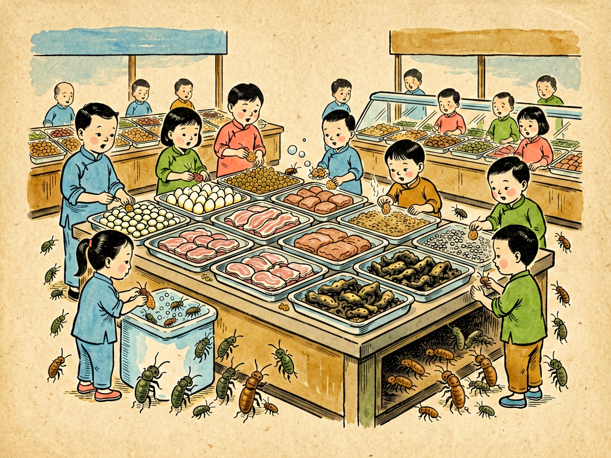

## 第九章 细菌的大菜馆

---

### 📍 本章导航
**核心主题**：只要有营养和水的地方，就是细菌的"菜馆"——人体、厨房、垃圾、污水、伤口、土壤，都是细菌的自助餐厅，切断它们的"餐桌"就是最好的防病方法  
**你将发现**：
- 人体本身就是细菌最大的自助餐厅，每克粪便里有1万亿个细菌
- 你家厨房的洗碗海绵比马桶还脏20万倍，每立方厘米有几亿个细菌
- 剩菜在室温下放2小时，细菌就能从几个繁殖到几百万个
- 伤口是细菌的"血宴"——血液里的营养是它们最喜欢的高级大餐
- 1克花园土壤里有10亿个细菌，比地球上的总人口还多
- 全球每年6亿人因为吃了被细菌污染的食物生病，42万人死亡
- 医院是耐药菌的"高级菜馆"，免疫力低下的病人在那里很容易被感染

**阅读建议**：读完这一章，你会明白为什么饭前洗手、生熟分开、垃圾及时清理，这些简单习惯能救你的命。

---

### 🖋️ 经典原文

上一章我们讲了细菌的衣食住行，知道了它们要穿"衣服"、要"吃饭"、要"住房子"、要"旅行"。今天这一章，我们专门讲一讲细菌吃饭的地方——**细菌的大菜馆**。

"大菜馆"就是我们说的餐厅、饭馆。你可能没想到，我们人类生活的地方，到处都是细菌的"连锁菜馆"，24小时不打烊，全年无休，而且完全免费。只要有水分、有营养、温度合适，细菌就会"闻风而至"，坐下来大吃大喝，吃饱了就繁殖后代，吃完留下一堆代谢废物——这些废物要么发臭变馊，要么产生毒素让你生病。

细菌最大、最豪华的菜馆在哪里？就在**你自己身上**。你的身体就是一个超级大的24小时自助餐厅，从里到外都给细菌准备了丰盛的菜肴：
- 你的皮肤天天出汗、分泌皮脂、掉角质细胞，这些都是细菌爱吃的东西——每平方厘米皮肤上住着100万个细菌，腋窝、腹股沟、脚趾缝这些又潮又闷的地方更多；
- 你的嘴里有食物残渣、唾液、脱落的口腔上皮，700多种细菌在这里安了家，牙菌斑就是它们盖的"餐厅大楼"；
- 你的胃虽然有强酸能杀死大部分细菌，但幽门螺杆菌这种"VIP客户"会自己给自己中和胃酸，在胃黏膜下开包间吃饭，吃久了就吃出胃炎、胃溃疡；
- 你的小肠有丰富的氨基酸、葡萄糖，是大肠杆菌、肠球菌这些常住居民的主餐厅；
- 你的大肠就更不用说了，这里是整个身体里细菌最多的地方，每克粪便里有大约1万亿个细菌，重量能占到粪便干重的1/3——它们在这里帮你消化食物、合成维生素、训练免疫系统，是交了房租的"好租客"。

除了人体，**家里的厨房**是细菌的第二大菜馆，也是最容易被我们忽略的地方。很多人以为厕所最脏，其实厨房比厕所脏得多：
- **菜板**是细菌的"豪华包间"，特别是木质菜板，刀痕里藏着无数食物残渣和水分，生肉里的沙门氏菌、弯曲菌、大肠杆菌能在这里存活好几天；
- **抹布和洗碗海绵**是家里最脏的东西，一块用过的洗碗海绵上，每立方厘米能有几亿个细菌，比马桶座圈脏20万倍——你用它擦碗，等于给碗"接种"细菌；
- **冰箱不是保险箱**，4摄氏度能让大部分细菌长慢一点，但李斯特菌这种"嗜冷菌"照样能在冰箱里繁殖，孕妇感染了可能流产；
- 剩菜剩饭在室温下放2个小时，细菌就能从几个繁殖到几百万个，温度合适的时候20分钟翻一倍。特别是米饭，蜡样芽孢杆菌会在米饭里产生耐热毒素，就算你把米饭再煮开，毒素也不会被破坏，吃了就会呕吐腹泻——这就是"炒饭综合征"。

然后是**餐桌**，也就是我们吃饭的地方。如果不分餐、不用公筷，那餐桌就是细菌开"交流会"的地方：你筷子上的细菌夹到菜里，我筷子上的细菌再夹走，大家互相交换——幽门螺杆菌、流感病毒、EB病毒、甚至乙肝病毒，都能通过共餐传播。很多人一大家子都有幽门螺杆菌，就是因为不分餐、互相夹菜。中国人传统说"不分家就是亲"，但这种"亲热"的代价，是胃病、传染病的家族聚集。

**垃圾桶**是细菌的"剩饭收集站"。厨余垃圾里有大量食物残渣，温度合适时几个小时就能腐败变质，每克垃圾里有几亿个细菌，发出硫化氢、甲硫醇的臭味——这就是细菌"吃饭"时排出来的"屁"。垃圾还会招来苍蝇、蟑螂、老鼠，这些小动物就是细菌的"外卖小哥"，爪子上、身上沾着几亿个细菌，飞到食物上、餐具上，就把细菌送进我们嘴里。所以垃圾分类、垃圾日产日清、垃圾桶盖好，看起来是小事，其实是在切断细菌的"粮食供应"。

**污水**是细菌的"液态大餐厅"。粪水、生活污水里有大量粪便、食物残渣、有机物，是霍乱弧菌、伤寒杆菌、痢疾杆菌这些致命细菌的天堂。1854年伦敦霍乱大流行，死了一万多人，一开始大家都以为是"瘴气"传染的，直到医生约翰·斯诺（John Snow）通过调查发现，所有病人都喝过同一个水泵的水——那个水泵被附近的污水坑污染了。他让人把水泵的把手拆掉，疫情很快就控制住了。这是公共卫生史上最经典的案例，它告诉我们：**被污水污染的水，比什么毒药都可怕**。今天我们喝的自来水要经过消毒、不喝生水，本质就是不让我们喝到细菌的"剩汤"。

**伤口**是细菌最期待的"血宴"，因为血液里有它们最喜欢的葡萄糖、蛋白质、铁离子，营养特别丰富，温度刚好37度，简直是细菌的米其林三星餐厅。如果你的皮肤破了，没有及时清洗消毒，周围的细菌就会蜂拥而至：金黄色葡萄球菌会让伤口化脓长疖子，链球菌会让皮肤红肿得丹毒，泥土里的破伤风梭菌会在深的缺氧伤口里繁殖，产生破伤风毒素让你肌肉痉挛——死亡率能到30%以上。所以受伤之后第一时间要用清水冲干净、用碘伏消毒，深的、被泥土污染的伤口一定要打破伤风针，本质就是把细菌的"宴席"给掀了，把"客人"赶跑。

**土壤**是细菌最大的地下菜馆。你可能从来没想过，你家楼下花园里一克泥土（大概一颗花生米那么重）里，就有10亿个细菌，几千个不同的种类，比全球人口还多。它们在土壤里分解落叶、腐尸、动植物残体，把有机物变成植物能吸收的养分，没有它们，地球早就被尸体堆满了，植物也长不出来。但土壤里也有坏细菌：破伤风梭菌、肉毒梭菌、产气荚膜梭菌，它们的芽孢能在土壤里活几十年，所以伤口沾了泥土一定要小心处理。

还有医院，那是耐药菌的"高级菜馆"。医院里有大量免疫力低下的病人、大量使用抗生素筛选出来的耐药菌、还有各种插管和医疗器械给细菌提供"落脚地"。耐甲氧西林金黄色葡萄球菌（MRSA）、耐碳青霉烯肠杆菌（CRE）、鲍曼不动杆菌……这些"超级细菌"很多都是医院里出来的，普通抗生素杀不死，一旦感染死亡率很高。所以医院里医生护士要严格洗手、无菌操作，就是为了不让这些"超级食客"到处乱跑。

当然，动物也是细菌的重要菜馆：鸡身上有沙门氏菌和弯曲菌，猪身上有链球菌，牛身上有布鲁氏菌和结核菌，狗猫身上有狂犬病病毒、弓形虫、钩端螺旋体……现在人类60%以上的传染病都是人畜共患病，从SARS、禽流感、埃博拉到新冠，都是从动物身上传到人身上的——因为动物身上的细菌和病毒，偶尔也会"换个菜馆"，到人类身上开分店。

说了这么多细菌的菜馆，你可能会觉得害怕，好像哪里都是细菌。但我要告诉你：**细菌的菜馆本来就到处都是，真正可怕的不是细菌存在，而是我们自己给细菌"搭台子、请客人、上菜"**。
- 你饭前便后不洗手，就是用手当细菌的"专车"，把它们从垃圾、门把手、马桶按钮送到你嘴里；
- 你切生肉和切熟食的菜板菜刀不分开，就是把生肉里的细菌直接"端"到熟食上；
- 你把剩菜在室温下放一下午再吃，就是给细菌几个小时的时间大吃大喝繁殖后代，还顺便给你生产毒素；
- 你不盖垃圾桶、垃圾几天不扔，就是给苍蝇蟑螂开party，让它们把细菌送到你家每个角落；
- 你伤口破了不消毒、随便用脏手摸，就是直接给细菌发"血宴"邀请函；
- 你一生病就吃抗生素、感冒也吃抗生素，就是帮细菌筛选出耐药的"超级食客"。

反过来，预防细菌感染其实特别简单，不需要什么高科技，就是掀翻细菌的"餐桌"就行：
- 勤洗手，特别是饭前便后、做饭前、处理生肉后、接触垃圾后，用肥皂洗20秒，就洗掉了手上99%的细菌；
- 生熟分开，菜板菜刀至少准备两套，切生肉的和切熟食/水果的分开；
- 食物要煮熟，中心温度70度以上就能杀死大部分致病菌，剩菜要及时放冰箱，吃之前彻底加热；
- 垃圾要每天清理，垃圾桶盖好，厨余垃圾沥干水再扔；
- 伤口及时清洗消毒，深伤口打破伤风针；
- 不喝生水，自来水烧开再喝；
- 抗生素要遵医嘱吃，不要自己随便买着吃。

细菌是35亿年的生存大师，它们不会消失，也不会被我们杀光。我们不需要生活在无菌环境里——那样反而会让免疫系统出问题。我们只需要搞清楚：哪些菜馆是它们的，哪些菜馆是我们的，不要请它们到我们不该去的地方"吃饭"就行了。和平共处的秘密，从来不是杀光所有细菌，而是管好我们自己的"卫生边界"。

下一章，我们讲细菌的形态。

---

> 📜 **科学史话：约翰·斯诺和霍乱——流行病学的诞生**
>
> 1854年英国伦敦霍乱大流行的故事，是公共卫生史上最经典的案例，它彻底改变了人类对传染病的认识。
>
> 那时候，欧洲人还不知道细菌致病理论，大家都相信"瘴气说"——认为霍乱、鼠疫这些传染病是由有毒的"瘴气"传播的，只要闻了臭味就会生病。所以当时的防疫措施就是熏香、烧东西、把有味道的东西搬走，但一点用都没有。
>
> 1854年8月，伦敦苏荷区爆发霍乱，10天内死了500多人。当时的医生约翰·斯诺不相信"瘴气说"——他注意到，如果是空气传播的，为什么住在同一个街区的人，有的生病有的不生病？为什么在同一个屋子里的人，有的染病有的没事？他挨家挨户去调查，把每个死亡病例的住址都标在地图上，结果发现：所有死者几乎都住在宽街（Broad Street）水泵附近，都喝过这个水泵的水；而附近一家监狱里有自己的水井，几百个犯人几乎没人得病；一家啤酒厂的工人只喝啤酒不喝水，也没人得病。
>
> 斯诺推断：问题出在这个水泵的水里，不是空气。他说服当地政府拆掉了水泵的把手，不让人再喝这里的水——疫情果然很快就平息了。后来挖开地面发现，离这个水泵几米远的地方有一个污水坑，一个得霍乱的婴儿的尿布水渗进了水坑，污染了井水。
>
> 这是人类第一次用流行病学调查的方法找到传染病的源头，比科赫发现霍乱弧菌早了30年。约翰·斯诺被称为"流行病学之父"，他用一个简单的地图和逻辑思考，就打败了当时的主流偏见，拯救了无数人的生命。
>
> 今天我们说"管住水龙头、管住水源"，预防水传传染病，所有这些公共卫生措施的起点，都是伦敦宽街上那个被拆掉把手的水泵。

---

> 🔬 **科学更新：厨房卫生和食品安全——我们被哪些误区骗了？**
>
> 关于食物和厨房细菌，过去十几年有很多新研究，颠覆了很多老观念：
>
> 第一，**"五秒规则"是假的**。很多人说食物掉在地上，五秒内捡起来还能吃。但研究发现，细菌从地面转移到食物上几乎是瞬间的，不需要五秒——掉下去的那一刻，污染就发生了。食物掉在地上，不管几秒，都不要吃了，特别是潮湿的食物（比如肉、水果、面包），细菌粘上去特别快。
>
> 第二，**洗碗海绵真的是家里最脏的东西**。2017年《科学报告》上的一项研究发现，厨房洗碗海绵是整个家里细菌密度最高的地方，每立方厘米有超过500亿个细菌，有362种不同的细菌，其中很多是致病菌。而且你把海绵放微波炉里转、用开水煮，都没法完全杀死海绵里的细菌——因为海绵的孔隙太多了，总有细菌躲在里面。最好的办法是：每周换一块新的洗碗海绵，或者用洗碗机、用刷子洗碗，比海绵卫生得多。
>
> 第三，**"闻着没坏就可以吃"非常危险**。很多细菌（比如金黄色葡萄球菌、蜡样芽孢杆菌）产生的毒素没有味道、没有气味，你闻着、看着食物完全正常，但已经有能让你生病的毒素了；而且有些致病菌本身也不会让食物明显变味变馊。判断食物坏没坏，不能只靠闻——在室温下放了超过2小时的剩菜，不管闻着怎么样，要么彻底加热要么扔掉。
>
> 第四，**生鸡肉最危险**。超市买的生鸡肉，90%以上都被空肠弯曲菌或者沙门氏菌污染了，这两种细菌是食物中毒最常见的原因。千万不要洗生鸡肉——冲水的时候，水花会把鸡肉上的细菌溅得到处都是，溅到水槽、灶台、餐具、甚至洗好的蔬菜上，反而造成交叉污染。鸡肉不需要洗，直接下锅煮，高温会杀死所有细菌，才是最安全的。
>
> 第五，**冰箱要定期清理**。李斯特菌能在4度的冰箱里缓慢生长，它特别容易藏在冰箱密封条、剩菜盒子、生肉汁滴到的地方。所以冰箱最好每个月彻底清理一次，生肉放在下层密封好，避免血水滴到其他食物上，剩菜不要放超过3天。
>
> 第六，**用抗菌皂和普通肥皂洗手效果一样**。美国FDA早就证明，添加了三氯生等抗菌成分的肥皂，和普通肥皂相比，并没有额外的杀菌效果，反而可能有健康风险，还会导致细菌耐药。洗手最重要的是"洗够时间"+"洗到位"，用普通肥皂流动水洗手20秒以上，比用什么抗菌产品都管用。
>
> 记住：食品安全和厨房卫生，靠的不是各种"抗菌神器"，而是这些简单但有效的好习惯。

---

> 💡 **现实连接：家庭食品安全的"黄金原则"**
>
> 世界卫生组织总结了食品安全的五个黄金原则，简单好记，照着做就能避免90%以上的食源性细菌感染：
>
> **1. 保持清洁**
> - 做饭前、做饭中（特别是处理完生肉之后）、吃饭前、上完厕所后，都要洗手；
> - 厨房的台面、菜板、餐具要经常清洗消毒，洗碗海绵/抹布每周更换或煮沸消毒；
> - 厨房里不要有垃圾和食物残渣，避免招来苍蝇蟑螂。
>
> **2. 生熟分开**
> - 生肉、生海鲜要和熟食、即食食物（水果、面包、凉菜）分开存放；
> - 处理生肉的菜板、菜刀、盘子要专用，不要和处理熟食/水果的混用；
> - 不要把煮熟的食物放在原来装过生肉的盘子里，除非盘子已经洗干净。
>
> **3. 烧熟煮透**
> - 食物要彻底煮熟，特别是肉、禽、蛋、海鲜，中心温度要达到70°C以上——肉切开没有红色的汁水、蛋黄凝固，才是熟了；
> - 汤、炖菜要煮沸，确保温度达到100°C；
> - 剩菜剩饭吃之前一定要彻底加热透，不要只是"温一下"。
>
> **4. 在安全的温度下保存食物**
> - 熟食在室温下放置不要超过2小时，夏天不要超过1小时；
> - 所有熟食和容易坏的食物要及时放冰箱（最好4°C以下）；
> - 不要把冰箱塞太满，冷空气要循环才能保持低温；
> - 冷冻食物不要在室温下化冻，最好提前放冰箱冷藏室化冻，或者用微波炉化冻。
>
> **5. 使用安全的水和原材料**
> - 喝安全的水，或者把水烧开再喝；
> - 选择新鲜、没有变质的食物；
> - 蔬菜水果要洗干净，特别是生吃的；
> - 不要吃过期的食物。
>
> 这五条原则不需要花一分钱，只是几个简单的习惯，但它们能帮你挡住大部分食物中毒和消化道传染病。很多时候，健康不一定要靠昂贵的保健品和药物，靠的就是这些每天都在做的小事做对了。

---

### 💬 读后思考与讨论

1. 以前你觉得家里哪里最脏？读了这一章之后，你发现哪里才是真正的"细菌重灾区"？
2. "洗碗海绵比马桶脏20万倍"——这个事实让你惊讶吗？你家的洗碗布/海绵多久换一次？以后会怎么处理？
3. 很多人说"不干不净吃了没病"，学了卫生假说和这一章的内容之后，你怎么理解这句话？"干净"和"太干净"的边界在哪里？
4. 中餐的合餐制是传统文化，但会传播幽门螺杆菌等细菌，你觉得推广公筷分餐会"伤感情"吗？有没有什么两全其美的办法？
5. 1854年约翰·斯诺拆掉水泵把手控制霍乱的故事告诉你什么？在大家都相信"权威说法"的时候，怎么保持独立思考、找到真正的问题？

### 🔗 关联阅读
- 第二部第七章：《触——清洁的标准》→ 清洁的三层标准和卫生假说
- 第二部第八章：《细菌的衣食住行》→ 细菌的生存条件
- 第二部第十六章：《凶手在哪儿》→ 流行病学怎么追踪传染病源头
- 第三部第三十章：《痰》→ 呼吸道细菌的传播
- 跨章节思考：公共卫生的本质，就是管理好人群和微生物的边界——从1854年伦敦的水泵到今天的新冠疫情，哪些核心原则是一直没变的？
