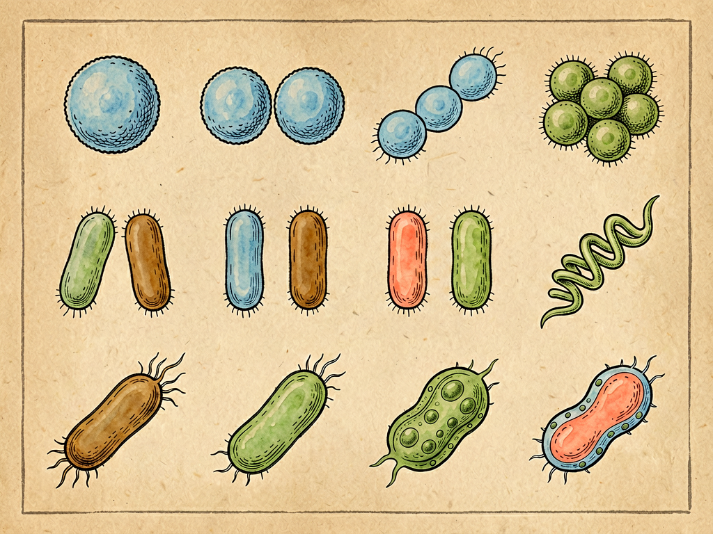

## 第十章 细菌的形态

---

### 📍 本章导航
**核心主题**：细菌不是一团模糊的"小虫"，它们有不同的形状、大小和结构，每一种形态都是亿万年进化出来的生存智慧——形态不是外貌，是功能，是武器，是生存策略  
**你将发现**：
- 350年前列文虎克用自己磨的镜片，第一次看到了细菌，打开了微生物世界的大门
- 细菌有三大基本形状：像小球的球菌、像小棒子的杆菌、像弹簧的螺旋菌
- 葡萄球菌一串一串像葡萄，链球菌连成链，双球菌两个抱在一起——排列方式能告诉我们它是什么菌
- 细菌的"装备"：荚膜是盔甲，鞭毛是马达，菌毛是钩子，芽孢是休眠的诺亚方舟
- 没有细胞壁的支原体，青霉素杀不死它，因为青霉素就是专门拆细胞壁的
- 革兰氏染色：染成紫色的是"穿厚盔甲"的阳性菌，染成红色的是"穿薄雨衣"的阴性菌
- 光学显微镜最多放大1000倍，电子显微镜能放大100万倍，能看到病毒和分子结构

**阅读建议**：读完这一章，你就有了细菌世界的"人脸识别"能力——下次再看到化验报告，就能看懂"革兰氏阳性球菌"是什么意思了。

---

### 🖋️ 经典原文

前两章我们讲了细菌住在哪里、在哪里吃饭，今天这一章，我们来给细菌"画像"——看看它们到底长什么样子。

很多人印象里，细菌就是显微镜下一堆模模糊糊的小点点，没什么区别。其实完全不是——细菌的形状多种多样，而且每一种形状都不是随便长的，都是为了适应特定的生存环境、特定的生活方式演化出来的。**形态不是"外貌"，是细菌的生存策略，是它们的武器，是它们的"职业装"**。

但在讲细菌长什么样之前，我们得先感谢一样东西——**显微镜**。如果没有显微镜，人类永远都看不见细菌，也就永远不知道有这样一个微观世界存在。
第一个真正看见细菌的人，是荷兰的一个布商，叫安东尼·范·列文虎克（Antonie van Leeuwenhoek）。他生活在350年前，没上过大学，也不是什么职业科学家，但他有一个特别的爱好——磨镜片。他一辈子手工磨了500多片透镜，造出了400多台显微镜，最好的一台能放大270多倍——这在当时是全世界最厉害的。
他用自己磨的镜子，看了各种各样的东西：看雨水的时候，他发现里面有许许多多游动的"小动物"；看自己的牙垢的时候，他发现牙垢里也有无数各种各样的"小虫子"在动；他还看了血液、精液、池水、醋……1674年，他把自己的发现写了一封信寄给英国皇家学会，全世界第一次知道：原来还有一个肉眼看不见的微型世界存在。
列文虎克的发现，彻底打开了微生物学的大门。后来显微镜不断改进：光学显微镜能放大到1000-2000倍，能看清细菌的形状；20世纪发明的电子显微镜能放大到100万倍，连病毒、细菌内部的结构、甚至生物大分子都能看清；今天我们还有荧光显微镜、共聚焦显微镜、原子力显微镜，不但能看清死的细菌，还能看活细菌内部的活动——它们怎么动、怎么分裂、怎么和宿主细胞互动。
**技术的边界，就是科学的边界**。能看到哪里，科学才能走到哪里。

现在我们来说细菌的形状。尽管细菌有千万种，但它们的基本形状只有三大类：**球菌、杆菌、螺旋菌**，正好比生物界的"三国鼎立"。

第一类是**球菌**，也就是球形的细菌，像一个个小圆球，直径一般0.5-2微米。别看都是圆球，它们的"排兵布阵"方式不一样，名字也不一样：
- 有的球菌单独一个生活，叫单球菌；
- 有的两个两个抱在一起，叫双球菌——比如引起肺炎的肺炎链球菌、引起脑膜炎的脑膜炎双球菌、引起淋病的淋球菌，都是双球菌；
- 有的连成一长串，像项链一样，叫链球菌——引起扁桃体炎、风湿热、猩红热的化脓性链球菌就是这样，它们连成链能紧紧粘在喉咙黏膜上，不容易被冲走；
- 有的堆成一团，像一串葡萄，叫葡萄球菌——最有名的就是金黄色葡萄球菌，皮肤上长疖子、伤口化脓、食物中毒，很多都是它干的，一团一团聚在一起，像安营扎寨一样。
球菌为什么是圆的？因为球形是相同体积下表面积最小的形状，最省能量，也最耐挤压、耐干燥，特别适合寄生在宿主身上——所以我们身上的很多正常菌群和致病菌都是球菌。

第二类是**杆菌**，也就是杆状、棒状的细菌，像一根根小棍子，长1-10微米，宽0.3-1微米。杆菌是细菌里种类最多的，形状变化也最大：
- 有的短短的，几乎像球菌，叫短杆菌，比如引起流感继发感染的流感嗜血杆菌；
- 有的长长的，像一根细棒，比如引起结核病的结核分枝杆菌；
- 有的一头膨大，像一根鼓槌，那就是破伤风梭菌——膨大的地方就是它的芽孢；
- 有的末端膨大像一根棒子，叫棒状杆菌，比如引起白喉的白喉杆菌；
- 有的会分叉，像树枝一样，叫分枝杆菌，结核菌和麻风菌都是这一类；
- 还有的几个杆菌连在一起成链状，比如炭疽杆菌。
我们熟悉的很多致病菌都是杆菌：大肠杆菌、伤寒杆菌、痢疾杆菌、白喉杆菌、破伤风杆菌、肉毒杆菌、结核杆菌……为什么杆菌这么多？因为杆状的表面积比球形大，吸收营养更快，代谢更活跃，分裂繁殖也快——特别适合快速生长、到处扩散。

第三类是**螺旋菌**，就是弯弯曲曲像弹簧一样的细菌。根据弯曲的程度，又分几种：
- 只有一个弯，像逗号一样的，叫弧菌——最有名的就是霍乱弧菌，它就是靠这个逗号形状在水里快速游动；还有吃海鲜容易中招的副溶血弧菌；
- 有两三个弯，螺旋比较松的，叫螺菌；
- 有很多细密的螺旋，像弹簧一样软的，叫螺旋体——引起梅毒的梅毒螺旋体、通过老鼠传播的钩端螺旋体都是这一类。
螺旋形有什么好处？这种形状特别适合在粘稠的液体里钻动——比如霍乱弧菌能在肠道粘液里快速游动，螺旋体能钻透人的黏膜和皮肤，像钻头一样。

除了这三种基本形状，细菌还有各种"装备"，就像士兵穿盔甲、拿武器一样：
第一件装备是**荚膜**，就是我们上一章说过的"雨衣"，是包在细胞壁外面一层黏糊糊的多糖。有荚膜的细菌，就像穿了盔甲的战士，我们的白细胞抓不住、吞不下，毒力特别强——肺炎双球菌如果失去了荚膜，就完全不会致病了。
第二件装备是**鞭毛**，是从细菌身上伸出来的长长的蛋白质丝，像船的螺旋桨一样高速旋转，每分钟能转几万转，推动细菌在水里游。有的细菌只有一根鞭毛，有的一头一丛，有的浑身都是鞭毛。霍乱弧菌靠一根鞭毛，每秒能游自己身长50倍的距离，比人游泳快多了。它们能靠鞭毛"闻"到营养物质的方向，游过去吃东西，也能"闻"到有毒物质的方向，赶紧逃跑——这叫"趋化性"。
第三件装备是**菌毛**，比鞭毛短、细、多，像细菌身上长的一层小绒毛，主要功能不是运动，是"粘"——菌毛末端有粘性，能牢牢粘在我们的细胞上，不会被冲走。淋球菌就是靠菌毛粘在尿道黏膜上，才不会被尿冲出去，引起淋病。还有一种特殊的"性菌毛"，两个细菌靠它连在一起，交换基因——这是细菌传播耐药基因的秘密通道。
第四件装备最厉害，叫**芽孢**——这不是用来繁殖的，是细菌在遇到恶劣环境时，把自己浓缩成一个小小的休眠体，外面包上厚厚的壁，新陈代谢几乎停止，进入"假死"状态。芽孢有多顽强？能在100度的沸水里活几个小时，能在干燥环境里活几十年、几百万年，普通的消毒剂、辐射都杀不死它，要121度高压蒸汽灭菌20分钟才能保证杀死。我们熟悉的破伤风梭菌、肉毒梭菌、炭疽杆菌，都会形成芽孢——所以深的伤口被泥土污染了要打破伤风针，就是因为泥土里可能有破伤风的芽孢，进到缺氧的伤口里就会"苏醒"繁殖，产生毒素。

还有几种"特殊细菌"，长得和大家都不一样：
最特别的是**支原体**——它根本没有细胞壁，是世界上最小的能独立生活的细胞，直径只有0.1-0.3微米，形状也不固定，一会儿圆一会儿长。因为没有细胞壁，所以青霉素对它完全无效——青霉素本来就是靠拆细胞壁杀菌的，人家根本就没有细胞壁，你拆什么？引起我们"支原体肺炎"（就是以前说的"非典型肺炎"的一种）的就是它。
然后是**立克次氏体**和**衣原体**，它们都太小了，而且不能独立生活，必须躲在活细胞里面寄生，像病毒一样，但它们又有细胞结构，所以还是算细菌。引起斑疹伤寒的是立克次氏体，引起沙眼、性病的沙眼衣原体，还有引起肺炎的肺炎衣原体——这些都不能自己在体外培养，必须在细胞里才能活。
还有一类生物叫**古菌**，它们长得和细菌差不多，有球形、杆形、螺旋形，但它们的基因和生化机制和细菌完全不一样，和我们人类的关系反而更近——所以生物学家把它们单独分成一个"域"，和细菌、真核生物（动物植物真菌我们）并列。很多古菌都是"极端微生物"：有的能在100多度的热泉里生活，有的能在饱和盐水里生存，有的能在强酸强碱里活，有的产甲烷——它们是地球生命的活化石，告诉我们生命能有多顽强。

细菌长得什么样子，不是随便长的——**形态和功能永远是对应的，有什么功能就长什么形状，有什么形状就有什么本事**：
- 球形省能量、耐挤压，适合寄生和聚集，所以葡萄球菌、链球菌都是皮肤和黏膜上的常见化脓菌；
- 杆状表面积大、代谢快、繁殖快、适合运动和扩散，所以大部分致病菌和环境细菌都是杆菌；
- 螺旋形适合在粘稠液体里钻动，所以霍乱弧菌能在肠道粘液里快速移动，螺旋体能钻透皮肤黏膜；
- 有荚膜的能抗吞噬，有鞭毛的能运动，有菌毛的能粘附，有芽孢的能熬过极端环境——每一样"装备"都是有用的，没有多余的东西。

在医院里，细菌的形态是医生诊断的第一步。有一个最简单、最常用的染色方法叫**革兰氏染色**，是1884年一个叫革兰的医生发明的，到今天还在用：把细菌染完色之后，革兰氏阳性菌会变成紫色，革兰氏阴性菌会变成红色。为什么会不一样？因为阳性菌的细胞壁厚，结晶紫染料留在里面洗不掉；阴性菌细胞壁薄，外面还有一层外膜，染料容易被洗掉。
别小看这紫色和红色的区别——它们告诉医生是什么类型的细菌，该用什么抗生素：青霉素、头孢对革兰氏阳性菌效果好，但对很多革兰氏阴性菌效果就差；革兰氏阴性菌因为有外膜，更耐药，而且它们外膜上的脂多糖就是内毒素，死了之后放出来让你发烧、休克。
今天我们当然有更先进的方法——基因测序能精确鉴定细菌，甚至能测出它对什么药耐药。但直到今天，细菌形态观察和革兰氏染色，仍然是临床微生物室每天都在做的最基础、最快、最便宜的检查。科学不是越新越好，能用最简单的方法解决问题，就是最好的方法。

很多人喜欢说"以貌取人"不对——但在细菌的世界里，"以貌取菌"真的很有用。看到葡萄串一样的球菌，你就知道可能是葡萄球菌；看到长链的球菌，可能是链球菌；看到像鼓槌一样的杆菌，可能是破伤风；看到逗号一样的弧菌，可能是霍乱；看到红色细棒的抗酸菌，可能是结核。
形态学是所有生物学的起点——认识一个生物，从"它长什么样"开始；认识世界，从"看见"开始。列文虎克350年前透过一片小小的镜片，第一次看到细菌的时候，他打开的不只是一个微生物世界，更是一种观察世界的新方式：认真看、仔细看，哪怕是最微小的东西，里面也有一个完整的宇宙。

下一章，我们讲细菌的祖宗——生物的三元论。

---

> 📜 **科学史话：列文虎克——一个布商如何打开了微观世界**
>
> 安东尼·范·列文虎克（Antonie van Leeuwenhoek，1632-1723）是科学史上最传奇的业余科学家之一。他是荷兰代尔夫特的一个布商，一辈子没受过正规的科学教育，也不会说拉丁语（当时的科学语言），但他对磨镜片有一种近乎狂热的爱好。
>
> 当时的眼镜匠磨镜片，都是为了做眼镜或者放大镜，放大倍数也就几倍几十倍。但列文虎克磨镜片的方法是保密的，他能磨出极小、极薄的镜片，放大倍数达到270倍——这个记录保持了一百多年没人打破。
>
> 他用自己磨的镜片做了几百台简单的显微镜，其实就是一个小小的金属架子，上面装一片透镜，把要看的东西放在透镜前面的针上，调整螺丝对焦——和我们现在的显微镜比起来简单得像玩具，但就是这么简单的工具，让他看到了当时全世界所有科学家都没看到过的世界。
>
> 他什么都看：池塘水、雨水、井水、他自己牙垢、他腹泻时的粪便、他自己的精子、血液、肉、植物的种子……他看到了细菌，看到了原生动物，看到了红细胞，看到了精子，看到了酵母细胞——他是人类历史上第一个看到这些东西的人。
>
> 他把自己的发现写成信，一封一封寄给英国皇家学会。一开始学会的那些大学教授根本不相信——一个没读过书的布商，怎么可能看到什么"小动物"？直到他们自己按照列文虎克说的方法做了显微镜，亲眼看到了那些游动的小生命，才震惊了。列文虎克因此成了英国皇家学会的会员，成了全世界闻名的科学家。
>
> 列文虎克活了90岁，一辈子都在磨镜片、观察、写信。他有一句名言："我只是在好奇的时候，坚持观察而已。"
>
> 很多人觉得科学需要昂贵的设备、高深的学历，但列文虎克告诉我们：**真正重要的从来不是工具，而是眼睛后面那颗好奇的心**。只要你愿意认真看、仔细观察，哪怕用最简陋的工具，也能做出伟大的发现。

---

> 🔬 **科学更新：比我们想象的更奇特——细菌世界的"异类"和新发现**
>
> 过去几十年，我们发现细菌的形态和生存方式，比课本上讲的要奇特得多，不断刷新我们对生命的认知：
>
> 第一，**最大的细菌肉眼可见**。我们一直以为细菌都是微米级的，肉眼看不见。但2022年科学家在加勒比海的红树林里发现了一种巨大的细菌——华丽硫珠菌（*Thiomargarita magnifica*），它的长度能达到2厘米！和你睫毛一样长，肉眼清清楚楚就能看到。它比普通细菌大了5000倍，相当于我们遇到了一个比珠峰还高的人。更奇特的是，它的遗传物质不像其他细菌那样散在细胞里，而是有膜包着，像真核生物的细胞核一样——这颠覆了我们对细菌和真核生物边界的认知。
>
> 第二，**细菌也有"骨架"，也会"走路"**。以前我们以为细菌没有细胞骨架，形状是细胞壁撑起来的。现在发现细菌也有类似肌动蛋白、微管蛋白的骨架蛋白，维持形状、帮助分裂。而且有些没有鞭毛的细菌，也能在固体表面"走路"——它们靠菌毛一伸一缩拉着自己前进，或者像支原体那样靠细胞变形蠕动。
>
> 第三，**细菌会"变形"应对压力**。很多细菌在遇到抗生素、免疫系统攻击的时候，会改变自己的形状——有的变长，有的变圆，有的变成L型（没有细胞壁的形态），躲过攻击。比如很多抗生素能杀死正常形状的细菌，但杀不死L型细菌，等抗生素停了，它们再变回原来的形状，重新繁殖——这可能是慢性感染反复发作的原因之一。
>
> 第四，**生物膜里的细菌会"分工"，形状不一样**。我们之前讲过生物膜是细菌的城市，现在发现，同一个细菌在生物膜里不同位置，会变成不同的形状、表达不同的基因——有的负责附着，有的负责繁殖，有的负责释放毒素，有的会长出鞭毛出去"开拓新殖民地"，就像多细胞生物的细胞分化一样。
>
> 第五，**古菌就在我们身边**。以前我们以为古菌都只生活在温泉、盐湖、深海热泉这些极端环境里，但现在发现，我们的肠道里、皮肤上、土壤里、海洋里，到处都有古菌——产甲烷古菌在我们肠道里帮我们消化食物，产甲烷；还有很多古菌就在我们身边，只是我们以前没注意到它们。它们不是什么"古老的活化石"，而是今天地球生态系统里非常重要的一部分。
>
> 列文虎克第一次看到细菌350年了，我们仍然在不断发现新的细菌、新的形态、新的生存方式。微生物世界永远有惊喜在等着我们。

---

> 🧪 **动手试一试：在家做你的第一个显微镜观察**
>
> 你不需要买昂贵的专业显微镜，现在几百块钱就能买到学生用的光学显微镜，放大400-1000倍，足够看到细菌和细胞了。你可以试试观察这些东西，真的会震撼到你：
>
> 1. **观察牙垢里的细菌**
>    早上起来没刷牙之前，用牙签轻轻刮一点牙齿缝里的牙垢，涂在载玻片上，加一滴清水，盖上盖玻片，放在显微镜下先用低倍镜找，再换高倍镜看。你会看到无数各种各样的细菌：球菌、杆菌、螺旋菌，有的还在动——这就是你嘴里的微观世界。
>
> 2. **观察池塘里的水**
>    去小区池塘或者湖里取一点水，最好带点水草或者水底的淤泥，放在显微镜下看。你会看到一个热闹的微型动物园：像草鞋一样转着跑的草履虫、像弹簧一样伸缩的钟虫、长长的像虫子一样的颤藻（蓝细菌）、各种游来游去的原生动物——一滴水就是一个完整的生态系统。
>
> 3. **观察酸奶里的乳酸菌**
>    取一点原味酸奶，稀释一下涂在玻片上看，你会看到大量细细的短杆菌，那就是保加利亚乳杆菌和嗜热链球菌——就是它们把牛奶变成了酸奶。
>
> 4. **观察酵母细胞**
>    把干酵母用温水化开，加一点糖放半小时，取一点放在显微镜下看，你会看到一个个椭圆形的酵母细胞，有的还在出芽繁殖——做面包、酿酒都是靠它们。
>
> 当你第一次通过显微镜看到这些游动的小生命的时候，你会理解350年前列文虎克的那种震撼：原来我们身边，还有这样一个我们完全看不见的世界，一直在那里，生机勃勃，热热闹闹。
>
> 这就是科学给你的礼物——**多了一只看世界的眼睛**。

---

### 💬 读后思考与讨论

1. 列文虎克是个布商，没受过正规科学教育，却做出了划时代的发现。你觉得做科学研究，学历/设备/好奇心，哪个更重要？
2. "形态永远和功能对应"——不只是细菌，这个道理在宏观生物身上也成立吗？举几个例子（比如鸟的翅膀、鱼的形状、长颈鹿的脖子）。
3. 为什么青霉素能杀死细菌却对我们人副作用小？但它又为什么杀不死支原体？利用"差异"解决问题的思路对你有什么启发？
4. 为什么科学家直到2022年才发现2厘米长的巨大细菌？这么大的东西以前为什么没人注意到？这告诉我们什么关于"已知"和"未知"的道理？
5. 技术进步拓展了我们"看见"的能力——从光学显微镜到电子显微镜到望远镜到射电望远镜，每一次"看见"都带来科学革命。你觉得下一次"看见"的革命会是什么？会让我们发现什么？

### 🔗 关联阅读
- 第二部第八章：《细菌的衣食住行》→ 细菌的细胞结构
- 第二部第十一章：《细菌的祖宗——生物的三元论》→ 生命的三域分类和生物进化
- 第二部第十四章：《细菌学的第一课》→ 怎么研究细菌，细菌学的基本方法
- 跨章节思考：从列文虎克的单透镜到今天的冷冻电镜，"看见"的能力如何推动科学进步？还有哪些东西是我们今天"看不见"，但未来可能会看见的？
