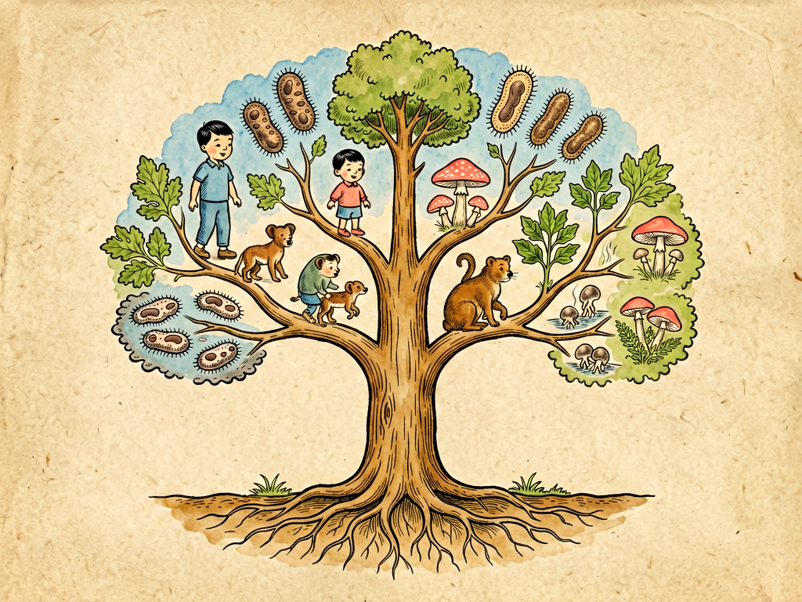

## 第十一章 细菌的祖宗：生物的三元论

---

### 📍 本章导航
**核心主题**：细菌不是什么"低等的小东西"，它们是地球生命的老祖宗——我们和细菌有共同的祖先，我们细胞里的线粒体本来就是细菌，所有生命在35亿年前都是一家  
**你将发现**：
- 35-40亿年前，所有生命有一个共同祖先叫LUCA，它生活在深海热泉里
- 生物分类从"动物/植物"两界，变成了今天的"细菌/古菌/真核生物"三域——这是20世纪生物学最伟大的革命之一
- 古菌长得像细菌，但基因和我们更亲，它们能在100度以上的热泉里生活
- 你细胞里的线粒体，本来是20亿年前被吞进去的一个细菌——它至今还有自己的DNA
- 人类和大肠杆菌有大约30%的基因是一样的，我们确实是远房亲戚
- 细菌有CRISPR免疫系统，比人类的获得性免疫早了几十亿年——现在我们用它来编辑基因
- 没有"高等"和"低等"生物之分，所有生命都是演化35亿年的成功者

**阅读建议**：读完这一章，你对"人是什么""生命是什么"的理解会彻底改变。

---

### 🖋️ 经典原文

前几章我们讲了细菌长什么样、在哪里吃饭、怎么生活，今天我们来问一个根本问题：**细菌是从哪里来的？它们在生命世界里，到底处于什么位置？我们人类和细菌，到底是什么关系？**

很多人觉得细菌是"低等生物""小东西""病菌"，是和我们完全不同的异类。但事实完全不是这样——所有地球生命，从细菌到大象，从真菌到人类，从大树到小草，都来自同一个共同的老祖宗，我们都是35亿年前那个第一个细胞的后代。细菌不是外来的入侵者，它们是我们的远房亲戚，是地球生命的老住户，甚至我们自己的细胞里，都住着细菌的后代。

要讲清楚这件事，我们得从生物分类说起。
最早给生物分类的是18世纪的瑞典科学家林奈，他把所有生物分成两界：**动物界**和**植物界**——能动的、要吃东西的是动物，不动的、能晒太阳造营养的是植物。这个分类简单好懂，用了两百年，但问题是：细菌算什么？真菌算什么？蘑菇不会动，但它也不会光合作用，它不是植物啊。
后来到19世纪，科学家加了一个"原生生物界"，把所有单细胞的小东西都放进去，变成三界；到20世纪60年代，惠特克提出五界系统：动物、植物、真菌、原生生物、原核生物（细菌）——第一次把没有细胞核的细菌单独分出来，承认了它们的独立地位。

但真正的革命发生在1977年。一个叫卡尔·沃斯（Carl Woese）的美国科学家，他没有看生物长什么样，而是直接比较所有生物都有的一个基因——16S核糖体RNA的序列。这个基因是所有细胞用来制造蛋白质的"装配机"，从生命诞生起就几乎没变过，是记录生命演化历史的"分子时钟"。
沃斯比来比去，发现了一个震惊世界的结果：有一类"细菌"——就是那些生活在温泉、盐湖、沼气池里的极端微生物，它们的rRNA序列和其他细菌差得特别远，甚至和细菌的差异，比和我们人类的差异还大！
原来，我们一直以为的"细菌"，其实是两个完全不同的生命大类：一类是我们熟悉的真细菌（就是我们平时说的细菌），另一类是古菌——它们长得像细菌，没有细胞核，但它们的基因复制、转录、翻译机制，和真核生物（也就是我们）更像。
沃斯提出，所有地球生命应该分成三个"域"，这就是**三域系统**——也就是本章标题说的"生物三元论"：
- 第一个域是**细菌域**：就是我们熟悉的大肠杆菌、葡萄球菌、结核菌、蓝细菌这些"真细菌"；
- 第二个域是**古菌域**：产甲烷菌、嗜热菌、嗜盐菌这些极端微生物，它们是最古老的生命分支；
- 第三个域是**真核域**：所有有细胞核的生物——动物、植物、真菌、原生生物，包括我们人类。

这三个域，就是生命之树的三根主枝。所有这三个域的生物，都有一个共同的祖先，科学家叫它**LUCA**——"最后普遍共同祖先"（Last Universal Common Ancestor）。LUCA生活在大约35亿到40亿年前的地球，大概是深海热泉附近，那里有高温、有氢气、有二氧化碳、有矿物质，不需要氧气（那时候地球还没有氧气）。LUCA不是第一个生命，但它是所有现存生命的最后共同祖先——它之后，生命分成了两支：一支变成了细菌，另一支又分成了古菌和真核生物的祖先。

很多人觉得古菌是"古老的活化石"，只生活在极端环境里。现在发现不是——古菌就在我们身边，海洋里、土壤里、我们的肠道里，都有古菌。我们肠道里最常见的产甲烷古菌，帮我们消化多糖，产生甲烷（就是屁里能点燃的那种气体）。古菌不是什么"边缘生物"，它们是地球生态系统里非常重要的一部分。

讲完了三域，我们来讲一个更惊人的故事：**真核生物是怎么来的？**
你可能知道，我们的细胞和细菌细胞最大的区别是：我们有细胞核，有各种细胞器——比如线粒体（负责发电）、植物还有叶绿体（负责光合作用）。但你知道吗？线粒体和叶绿体，根本就不是我们细胞"自己长出来"的——它们本来是独立生活的细菌！
这就是**内共生学说**，是20世纪最伟大的生物学发现之一，由林恩·马古利斯（Lynn Margulis）在1970年代系统提出：大约20亿年前，一个比较大的、类似古菌的宿主细胞，吞了一个小小的α-变形菌（一种需氧细菌），但没有把它消化掉——这个小细菌在大细胞里活了下来，帮大细胞利用氧气产生能量；大细胞给小细菌提供营养和保护。这种合作太成功了，它们就永远在一起了：这个小细菌慢慢演化成了**线粒体**。
后来，有一些这样的"合体细胞"，又吞了蓝细菌（能光合作用的细菌），同样没有消化，变成了**叶绿体**——这就是植物的起源。
这个学说听起来像天方夜谭，但证据确凿：
- 线粒体和叶绿体都有自己的DNA，是和细菌一样的环状DNA，不是我们细胞核里的线性染色体；
- 它们有自己的核糖体，大小和细菌的核糖体一样，和真核细胞质里的核糖体不一样；
- 它们有双层膜——里面一层是细菌自己的细胞膜，外面一层是当初吞进去的时候宿主细胞的囊泡膜；
- 它们像细菌一样二分裂繁殖，不和细胞周期同步，我们细胞没法"从零造出线粒体"——所有线粒体都是原来的线粒体分裂来的，你的线粒体全部来自你妈妈的卵子，是妈妈传给你的。
换句话说：**你身体里每一个细胞里的每一个线粒体，都是20亿年前那个细菌的后代**。你不是一个单一的生物，你是古菌宿主和细菌内共生形成的"合体生物"——你是几十亿年生命合作的产物。
我们的细胞，本质上就是一个"细菌共和国"。

那细菌呢？细菌是地球上最古老、最成功、最多样的生命。它们35亿年前就出现在地球上了——它们见证了地球几乎全部的历史：
- 25亿年前，蓝细菌发明了光合作用，释放氧气，导致了"大氧化事件"——大气里从没有氧气变成有21%的氧气，毒死了当时大部分厌氧生物，也为后来复杂生命的出现铺平了道路；
- 20亿年前，它们中的一员和古菌合作，诞生了真核生物；
- 5.4亿年前寒武纪生命大爆发，动物出现，细菌就在动物身上和身边；
- 6500万年前恐龙灭绝，细菌活下来了；
- 20万年前智人出现，细菌早就遍布地球每一个角落——从100度的热泉到南极冰下几公里，从地下几公里的岩石里到平流层的高空，哪里都有细菌。
细菌有35亿年的演化历史，比人类长近2000倍。它们演化出了我们能想到、想不到的所有生存技能：
- 它们能靠吃石头、吃硫磺、吃铁、吃石油、甚至靠辐射、靠电能活着；
- 它们能形成芽孢熬过极端环境，能在沸水里活几个小时，能在太空真空环境里活几年；
- 它们会互相交流（群体感应），会盖房子（生物膜），会互相帮助，会交换基因；
- 它们有自己的免疫系统——CRISPR系统，能记住入侵过的病毒，下次病毒再来就能精准切割它的DNA——这比我们人类的获得性免疫系统早了几十亿年，现在我们用CRISPR来做基因编辑，这是细菌给我们的技术礼物。
细菌演化得有多快？它们20-30分钟繁殖一代，一天就能繁殖72代——相当于从人类商朝到现在的时间。它们还能在不同细菌之间随便交换基因（水平基因转移），不需要像我们这样生孩子才能传基因，耐药基因几天就能传遍全世界的细菌。

很多人说细菌是"低等生物"，人类是"高等生物"——这是错的。**演化没有高低之分，只有适应不适应**。你不能说一个活了35亿年、遍布地球每个角落、什么极端环境都能活、总重量比所有动植物加起来还多的生物是"失败者"。事实上，细菌是地球上最成功的生命，人类才是新来的。
更有意思的是，我们和细菌的亲缘关系，比你想象的近得多：
- 人类和黑猩猩的基因相似度是98.8%；
- 人类和小鼠的基因相似度是85%；
- 人类和斑马鱼的基因相似度是70%；
- 人类和果蝇的基因相似度是60%；
- 甚至人类和大肠杆菌的基因相似度，都有大约30%。
我们有三分之一的基因，和细菌是一样的——这些基因管着最基础的生命活动：DNA复制、能量代谢、蛋白质合成、物质运输，这些机制从LUCA那个时候就没变过，从细菌到人类都在用。我们和细菌，用的是同一套遗传密码，同一种能量货币ATP，同样的中心法则（DNA→RNA→蛋白质）——生命在最基础的层面，是完全统一的。

理解了生物三元论，理解了共同祖先，理解了内共生，你会发现一个全新的生命观：
第一，**人类不是地球的中心，也不是演化的终点**。我们只是生命之树上一根小小的枝条，和其他所有生物一样，都是LUCA的后代。地球不是"人类的地球"，是所有生命共同的地球。
第二，**生命不只是竞争，更是合作**。以前讲演化总说"物竞天择适者生存"，但如果没有20亿年前那次古菌和细菌的合作，就不会有真核生物，不会有植物动物，不会有我们。竞争和合作，共同推动了生命演化。
第三，**没有真正的"低等生物"**。每个能活到今天的物种，都是演化的成功者，都有自己的生存智慧。细菌活了35亿年，经历了五次大灭绝都活下来了，它们一点都不"低等"。
第四，**科学永远在进步，没有绝对真理**。从林奈的两界到海克尔的三界，到惠特克的五界，再到沃斯的三域，生物分类变了一次又一次——每次变化都不是说之前的科学家"错了"，而是我们有了新的证据、新的技术，看到了更接近真相的世界。科学就是这样，永远在自我修正、永远在进步。
第五，**我们和细菌不是敌人，是远房亲戚，是共生伙伴**。我们身体里的细菌比我们自己的细胞还多，它们帮我们消化食物、合成维生素、训练免疫系统、抵抗致病菌。没有细菌，我们根本活不下去。

很多人科普细菌，总喜欢说"细菌可怕，要杀菌、消毒、抗菌"。但我要告诉你：细菌是我们的老祖宗，是我们细胞的一部分，是我们的共生伙伴，是地球生态系统的基础。当然，我们要提防致病菌，要讲卫生，要预防传染病，但我们永远不可能、也不需要杀光所有细菌。
理解我们从哪里来，才能理解我们是谁。当你下次洗手的时候，当你吃酸奶的时候，当你生病吃抗生素的时候，记得：你洗掉的、吃下的、杀死的，都是和你有同一个35亿年前老祖宗的远房亲戚。我们和它们，在这个星球上已经共处了几十亿年，未来还会一直共处下去。
认识细菌，就是认识我们自己。

下一章，我们讲清水和浊水。

---

> 📜 **科学史话：卡尔·沃斯——一个"异类"科学家如何重写了生命之树**
>
> 1977年卡尔·沃斯提出三域系统的时候，整个生物学界几乎都在反对他。
>
> 在此之前，大家都理所当然地认为：世界上的生物分成原核生物（细菌，没有细胞核）和真核生物（有细胞核）两大类，这是写在教科书里的常识。沃斯一个默默无名的微生物学家，说原核生物其实应该分成完全不同的两大类——细菌和古菌，这等于直接告诉全世界：你们教了几十年的教科书是错的，生命之树要重新画。
>
> 很多权威生物学家嘲笑他，说他的结论"太荒唐"，说他"不懂分类学"，说他用rRNA分类是"旁门左道"。他的论文被顶级期刊拒稿，他申请经费被驳回，同行开会都不邀请他。在最困难的时候，只有他自己实验室的几个学生和合作者相信他。
>
> 但沃斯没有放弃。他一个一个物种测rRNA序列，积累数据，慢慢证明古菌确实在分子层面和细菌完全不同。时间一年一年过去，越来越多的实验室重复出了他的结果，越来越多的证据支持他的结论——古菌确实是独立的生命域，和细菌、真核生物并列。
>
> 20年之后，到1990年代末，基因组测序技术成熟了，科学家测了几百种生物的全基因组，结果完全证实了沃斯的结论——三域系统是对的。那个曾经被嘲笑的"异端"，成了改写生物学教科书的人。2003年，沃斯获得了生物学界最高奖之一的克拉福德奖，他被称为"微生物学的达尔文"。
>
> 沃斯的故事告诉我们什么？
> 第一，科学从来不看权威，看证据。哪怕所有人都反对你，只要你的证据是对的，真相最终会胜利。
> 第二，真正革命性的科学发现，一开始往往是"异端"，因为它挑战了大家习以为常的常识。
> 第三，技术进步会带来科学革命——如果没有RNA测序技术，沃斯永远不可能发现古菌，我们永远也不会知道生命之树真正的样子。
>
> 卡尔·沃斯2012年去世了，他留给我们的不只是三域系统，更是一种科学精神：永远不要怕挑战常识，永远相信证据，永远保持好奇。

---

> 🔬 **科学更新：生命之树的最新图景——我们其实是古菌的后代？**
>
> 沃斯提出三域系统已经快50年了，随着基因组学的发展，我们对生命之树的认识还在不断更新：
>
> 第一，**真核生物的起源有了新答案**。最近十几年的研究发现，真核生物的宿主细胞不是"类似古菌"，它*就是*古菌——具体来说，是属于阿斯加德古菌（Asgard archaea）的一个分支。2015年之后，科学家在深海沉积物里发现了阿斯加德古菌，它们的基因组里有很多以前认为只有真核生物才有的基因，比如细胞骨架基因、膜运输基因——真核生物就是从这类古菌演化来的，然后在演化早期吞了α-变形菌变成线粒体。所以今天的生命之树其实只有两个"总枝"：细菌域，和古菌+真核生物共同的一枝——我们人类，其实是"长得比较复杂的古菌"。
>
> 第二，**水平基因转移比我们想象的普遍得多**。以前我们画生命之树，像一棵分叉的树，基因只能从上往下传给后代。但现在发现，细菌和古菌之间，甚至细菌和真核生物之间，都在频繁交换基因——生命之树更像一张网，而不是一棵树。我们人类基因组里也有几百个来自细菌和病毒的基因，都是演化过程中"横向转移"过来的。
>
> 第三，**线粒体夏娃和Y染色体亚当之外，我们还有更多祖先**。我们以前知道，线粒体只能母系遗传，所有现代人的线粒体都来自十几万年前非洲的一个女性（"线粒体夏娃"），Y染色体来自一个男性（"Y染色体亚当"）——但别忘了，我们的线粒体本身，就是20亿年前那个α-变形菌的后代。从某种意义上说，我们所有人都有一个20亿岁的"细菌老祖母"。
>
> 第四，**LUCA比我们想象的更复杂**。以前大家觉得LUCA是一个很原始、很简单的细胞，但最新研究发现，LUCA已经有了几百个基因，有完整的DNA复制、转录、翻译系统，有ATP合成酶，有细胞膜——它已经是一个相当复杂的细胞了。在LUCA之前，生命可能已经演化了几亿年，只是那些更早期的生命形式都没有留下来。
>
> 第五，**地球上可能存在"暗生物圈"**。科学家估计，我们现在能人工培养的微生物还不到1%，剩下99%都没法在实验室培养，我们只知道它们的基因序列，不知道它们长什么样、怎么生活——这些就是"微生物暗物质"，里面可能藏着生命起源、真核起源、极端生命的很多秘密。我们对生命的认识，可能还只是冰山一角。
>
> 生命比我们想象的更奇妙，也更团结。我们不是独立的个体，而是亿万年生命合作的产物。

---

> 💡 **现实连接：为什么演化和三域理论对普通人重要？**
>
> 你可能会说：三域系统、内共生、LUCA，这些听起来很高深，和我有什么关系？其实关系比你想象的大：
>
> **1. 它解释了为什么抗生素有效，也解释了为什么抗生素会有副作用**
> 我们能吃抗生素杀死细菌，是因为细菌和我们的细胞不一样——比如青霉素攻击细菌的细胞壁，我们没有细胞壁，所以对我们毒性小；但有些抗生素攻击的是细菌的核糖体（比如红霉素、四环素），而我们线粒体里的核糖体和细菌核糖体是一样的，所以高剂量的时候，这些抗生素也会影响我们线粒体的功能，产生副作用。理解了内共生，你就理解了抗生素副作用的来源。
>
> **2. 它让我们理解人类疾病**
> 很多人类疾病和线粒体功能异常有关——因为线粒体本来就是细菌，它的DNA突变率比细胞核DNA高很多，神经退行性疾病、代谢病、衰老、甚至癌症，都和线粒体功能异常有关。理解了线粒体的细菌起源，我们才能更好地理解和治疗这些疾病。
>
> **3. 它是现代生物技术的基础**
> 我们今天用的PCR技术（核酸检测、基因测序都用它），酶来自嗜热古菌；CRISPR基因编辑技术，来自细菌的免疫系统；限制酶（基因工程的"剪刀"）来自细菌；很多抗生素来自细菌和真菌——这些生物技术，全部来自我们对微生物的研究。没有微生物学，就没有现代生物技术，就没有今天的生物医药。
>
> **4. 它改变我们和世界的关系**
> 理解了我们和细菌的亲缘关系，理解了内共生，你就不会再把细菌全部当成敌人，也不会再觉得人类是"万物之灵"高高在上。这种生命观会让你更谦卑、更理性，也会让你更理解生态平衡的重要性——我们和所有生命共享同一个星球，共享同一个起源，我们是命运共同体。
>
> 科学不只是实验室里的知识，它是一种世界观。知道我们从哪里来，知道我们和其他生命的关系，会改变你看待世界的方式。

---

### 💬 读后思考与讨论

1. 你细胞里的线粒体本来是20亿年前的细菌——知道这个事实之后，你对"自我"的认知有变化吗？你觉得"一个生物"的边界在哪里？
2. 沃斯提出三域理论的时候，几乎整个学术界都反对他，但最后他被证明是对的。历史上还有哪些这样"当时被嘲笑，后来被证实"的科学发现？这告诉我们什么是科学精神？
3. 传统讲演化总是强调"竞争"，但内共生告诉我们"合作"同样重要——你生活中有没有"合作比竞争更重要"的例子？
4. "没有高等生物和低等生物之分，所有活到今天的生物都是成功者"——你同意这个说法吗？为什么？
5. 如果有一天我们发现了外星生命，它可能会有和我们不一样的遗传密码、不一样的能量系统——你觉得它会和地球生命有共同的起源吗？我们怎么判断什么是"生命"？

### 🔗 关联阅读
- 第一部第一章：《我的名称》→ 细菌的发现历史
- 第二部第十章：《细菌的形态》→ 细菌的形态和特殊细菌
- 第二部第十四章：《细菌学的第一课》→ 微生物学研究方法
- 第三部第二十三章：《谈寿命》→ 从演化角度看寿命
- 跨章节思考：从内共生到人体微生物组，"共生"概念如何改变了我们对生物个体的认知？我们是独立的"人"，还是一个由人和微生物共同组成的"超级有机体"？
