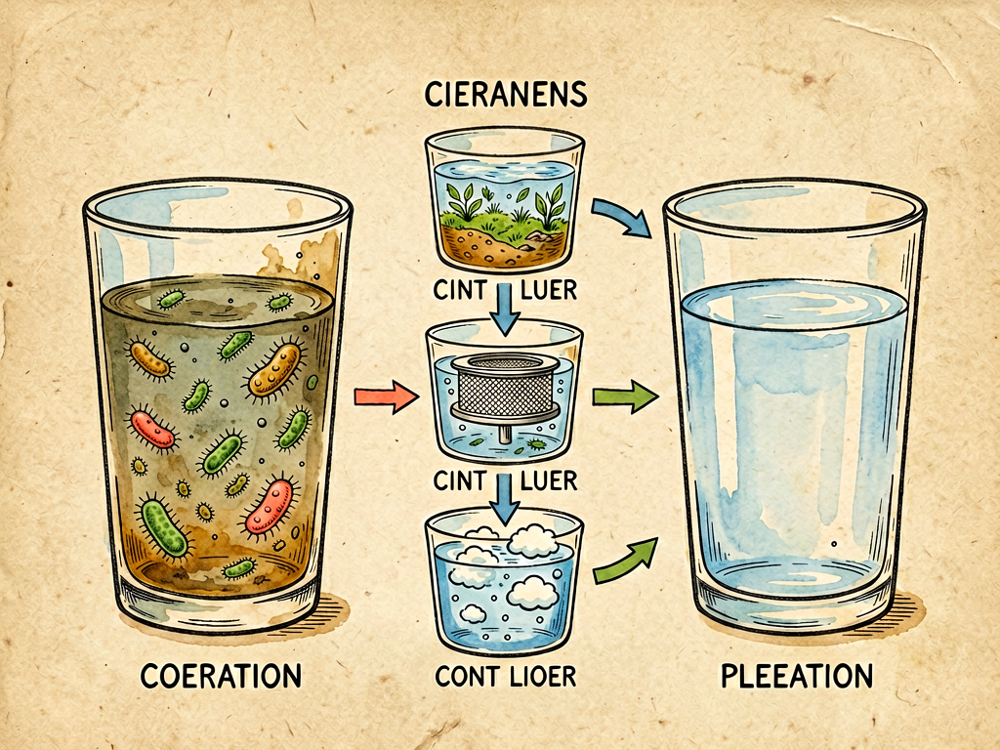

## 第十二章 清水和浊水

---

### 📍 本章导航
**核心主题**：肉眼看见的"清水"不一定干净，肉眼看见的"浊水"不一定危险——水里的细菌、病毒、寄生虫，你根本看不见，水安全是公共卫生的基石  
**你将发现**：
- 看起来清澈透明的山泉水、井水，可能含有霍乱、伤寒、痢疾病菌，喝了会死人
- 1854年伦敦霍乱，就是一口被污染的水井杀死了上万人，拆掉水泵把手疫情就结束了
- 1908年芝加哥开始用氯消毒自来水，这是20世纪最伟大的公共卫生发明，让城市人均寿命提高了15年
- 我们国家的"两管五改"（管水管粪、改水井改厕所等），让几亿人免于水传传染病
- 全球每年有50万人死于不安全的水导致的腹泻——大部分是5岁以下的孩子
- 硬水（水垢多）不伤害健康，真正危险的是看不见的细菌、病毒和寄生虫
- 家里最有效的水消毒方法就是煮沸——烧开1分钟，能杀死几乎所有病原体

**阅读建议**：读完这一章，你再也不会随便喝生水、喝看起来"干净"的山泉水了。

---

### 🖋️ 经典原文

上一章我们讲了细菌的祖宗，知道了所有生命都来自同一个祖先。今天这一章，我们来讲讲和生命最息息相关的东西——**水**。

人不吃饭能活几周，但不喝水几天就会死。水占我们身体重量的60%-70%，我们的细胞泡在水里，营养靠水运输，代谢废物靠水排出，体温靠水调节——没有水，就没有生命。但水同时也是细菌、病毒、寄生虫最喜欢的"高速公路"，它们借着水快速传播，从一个人身上到另一个人身上，从一个地方到另一个地方。历史上杀死人最多的瘟疫——霍乱、伤寒、痢疾，都是水传播的。

很多人判断水干不干净，就靠眼睛看：看起来清、透明、没有颜色没有味道，就是干净的；看起来浑浊、有颜色有味道，就是脏的。但我要告诉你：**眼睛是最靠不住的。清有真假，浊有善恶——肉眼看到的清，不一定是真干净；肉眼看到的浊，也不一定就危险。**

先说说**清水的假象**。
一杯水看起来清澈透明，无色无味，你觉得很干净，但这里面可能有什么？
- 有**细菌**：霍乱弧菌、伤寒杆菌、痢疾杆菌、大肠杆菌、沙门氏菌……这些细菌都很小，一个微米大小，你肉眼根本看不见。一杯看起来干净的水里，如果每毫升有1万个细菌，水还是完全透明的，但这杯水已经足以让你生病；
- 有**病毒**：甲肝病毒、戊肝病毒、诺如病毒、轮状病毒、脊髓灰质炎病毒……病毒更小，只有几十纳米，1000个病毒排成一排才有一个细菌那么长，你更看不见；
- 有**寄生虫卵或者包囊**：贾第虫、隐孢子虫、阿米巴原虫、血吸虫……这些寄生虫的卵或者包囊在水里，肉眼看不见，喝进去就会在你身体里长起来；
- 有**化学污染物**：重金属（铅、汞、砷、镉）、农药、化肥、工业废水、消毒剂副产物……这些东西溶解在水里，完全透明，你看不见也尝不出来，但长期喝会慢性中毒、致癌。
历史上无数次瘟疫，都是看起来清清的井水、河水引起的。1854年伦敦霍乱，那口水井的水看起来完全清澈透明，周围的人都喝它，结果10天死了500多人——直到约翰·斯诺医生拆掉了水泵把手，人们不喝这口井的水了，疫情才停下来。那时候大家还不知道细菌致病理论，斯诺医生靠调查统计就找到了原因，比科赫发现霍乱弧菌早了30年。
中国以前农村很多水井，看起来水清亮亮的，很好喝，但井口离粪坑、垃圾堆很近，一下雨粪水就渗到井水里，喝了就容易得痢疾、伤寒、甲肝。过去说"井水不犯河水"，其实地下水是通的，表面看起来干净，里面早就被污染了。
哪怕是今天的自来水，看起来很清，也不是绝对无菌的——自来水厂消毒之后，会保持一点点余氯，就是为了抑制管网里细菌生长，只要细菌总数在安全标准以下，就可以喝。我们建议烧开了再喝，就是为了二次保险。瓶装矿泉水、纯净水，看起来很干净，但如果瓶子开封放了几天，或者装水的桶不干净，也会有细菌滋生。

反过来，**浊水也不一定就危险**。
水看起来浑浊，原因有很多种：
- 可能是**泥沙、黏土颗粒**：黄河水看起来黄浊浊的，就是泥沙多，沉淀一下、过滤一下，烧开了喝并不会生病；
- 可能是**腐殖质**：就是树叶、草根腐烂之后的天然有机物，让水看起来黄黄的、像茶水一样，山泉水经常是这个颜色，这种物质一般不致病；
- 可能是**藻类**：池塘、湖里的水看起来绿绿的，是藻类繁殖，有些蓝藻会产生毒素，但大部分藻类本身不致病；
- 当然，如果是被生活污水、工业废水、医院污水污染的浊水，那就真的危险了——里面有粪便、细菌、病毒、化学毒物，绝对不能碰。
自然界里的水本来就不是完全透明的——山泉水有一点点黄，河水有泥沙，海水有浮游生物，这些"浊"是自然的，不一定危险。真正危险的不是泥沙和腐殖质，是你看不见的病原体和化学污染物。有个词叫"山清水秀"，但山清水秀的地方，水里也可能有血吸虫、有钩端螺旋体，不能随便喝生水。

水会不会传播疾病，不是看它清不清，是看它有没有被污染，有没有致病的细菌、病毒、寄生虫。那怎么判断呢？靠科学检测，不是靠眼睛看。公共卫生上判断水有没有被粪便污染，最重要的指标是**大肠杆菌**——因为大肠杆菌只生活在人和温血动物的肠道里，水里如果检出大肠杆菌，就说明这水被粪便污染了，就可能有霍乱、伤寒、痢疾这些致病菌。我国饮用水标准是：**每100毫升水里，大肠杆菌数必须是0**，这才是安全的。
其他指标也很重要：
- **浊度**：水的浑浊程度，标准是低于1NTU——不是因为浊度本身有毒，是因为细菌病毒会躲在悬浮物颗粒里面，消毒剂杀不到它们，浊度越高消毒效果越差；
- **余氯**：自来水消毒之后剩下的氯，标准是0.05-0.5mg/L——保持这点余氯，就能防止管网里细菌重新繁殖；
- **pH值**：6.5-8.5之间，太酸太碱都不好；
- **硬度**：就是水里钙镁离子的含量，硬水烧了会有水垢——很多人觉得硬水会导致结石，其实没有科学证据，硬水对健康无害，只是口感不好、容易水垢而已。

人类为了喝上安全的水，花了几千年时间。
古代人最简单的办法就是**把水烧开**——煮沸能杀死几乎所有细菌、病毒、寄生虫包囊，这是最古老、最有效、最便宜的家庭消毒方法，直到今天还是最好用的。古代人还会用沙子过滤、用明矾沉淀、把水装在铜器里、放在太阳底下晒——这些方法虽然原始，但都有一定效果。
真正的革命发生在19世纪末20世纪初。在那之前，欧洲城市人均寿命只有三四十岁，很大原因就是水传传染病——霍乱隔几年就流行一次，一次死几万人。1908年，美国芝加哥第一次在自来水里加氯消毒，这是人类历史上第一次大规模给水消毒。这个方法太有效了，很快推广到全世界——氯消毒之后，霍乱、伤寒这些水传传染病在城市里几乎绝迹了，欧美城市的人均寿命在短短几十年里提高了15岁以上，比任何疫苗、任何药物贡献都大。有公共卫生学家说：**自来水加氯消毒，是20世纪最伟大的公共卫生发明。**
今天自来水厂的标准处理流程是：
1. 取水：从江河、湖泊、水库取原水；
2. 混凝沉淀：加明矾之类的混凝剂，让水里的悬浮物颗粒粘在一起沉下去；
3. 过滤：用沙子、活性炭过滤，去掉剩下的悬浮物、大部分细菌和寄生虫；
4. 消毒：加氯、或者用臭氧、紫外线，杀死剩下的病原体；
5. 通过管网输送到千家万户，保持一定余氯防止二次污染。

我们国家在水安全上也走过很长的路。解放以前，霍乱、伤寒、痢疾、血吸虫病流行，老百姓喝不上干净水，人均寿命只有35岁。1952年开始爱国卫生运动，最核心的就是"两管五改"：管水、管粪；改水井、改厕所、改畜圈、改炉灶、改环境。那时候全国上下一起打水井、修厕所、管理粪便、喝开水，几亿人的健康水平迅速提高。特别是血吸虫病，以前在长江流域12个省流行，"千村薜荔人遗矢，万户萧疏鬼唱歌"，经过几十年的治理，现在大部分地区已经消灭了血吸虫病。
今天我们有南水北调解决北方缺水，有农村安全饮水工程让99%以上的农民喝上了安全的自来水，有"河长制"管理每一条河流——但水安全的弦永远不能松。直到今天，全球每年还有大约50万人死于不安全饮用水导致的腹泻，其中大部分是5岁以下的孩子。在很多发展中国家，还有几亿人喝不上安全的饮用水，水传疾病仍然是最大的健康杀手之一。

水有两面性：它是生命之源，能养活人；它也是疾病的载体，能杀死人。是福是祸，全看我们怎么管理它。
对我们普通人来说，喝水其实很简单，记住几条原则就行：
1. **不喝生水**——不管是自来水、井水、山泉水、河水，看起来再干净，也要烧开了再喝。煮沸1分钟，就能杀死几乎所有致病菌、病毒和寄生虫包囊，这是最保险的方法；
2. **不要相信"山泉水无污染"**——山里的泉水看起来清澈甘甜，但可能被野生动物粪便污染，有贾第虫、隐孢子虫、钩端螺旋体，喝了会拉肚子、甚至得更严重的病；
3. **桶装水开封之后要尽快喝**，不要放太久，饮水机要定期清洗；
4. **不要用饮料代替水**——最健康的饮品就是白开水；
5. **节约用水、保护水源**——水不是取之不尽用之不竭的，保护河流、湖泊、地下水，就是保护我们自己的健康。

很多人花很多钱买各种"高端水""碱性水""矿物质水""富氧水"，其实都是营销概念——水就是H₂O，干净、安全、烧开了喝，就是最好的水。水的功能是补水，不是补营养——补营养靠吃饭，不是靠喝水。
水是生命最基础的需求，也是公共卫生最基础的防线。喝一杯干净的开水，这件在我们今天看起来理所当然的小事，是人类花了几千年、死了无数人才换来的文明成果。不要小看这一杯开水，它里面装着的，是整个现代公共卫生的智慧。

下一章，我们讲地球的繁荣与土壤的劳动者。

---

> 📜 **科学史话：氯消毒——一个简单发明如何拯救了几千万人生命**
>
> 19世纪的欧美城市，是在粪便和污水里泡着的。
>
> 那时候没有下水道系统，家家户户的粪便、污水直接倒在街上、倒进河里，而城市的饮用水就取自同一条河。伦敦的泰晤士河臭了几十年，1858年夏天"大恶臭"（Great Stink）的时候，议会大厦都没法开会——因为河水太臭了。每隔几年霍乱就爆发一次，一次死几万人，1854年伦敦霍乱、1892年汉堡霍乱，都是水被污染导致的。
>
> 大家知道水不干净，也想了很多办法过滤，但细菌还是杀不死。19世纪末细菌致病理论确立之后，人们开始找给水消毒的方法。漂白粉（次氯酸钙）是19世纪初发明的，一开始用来消毒垃圾、污水、伤口，但没有人想到把它加到自来水里——因为大家觉得，往喝的水里加"化学药品"，太可怕了，会不会中毒？
>
> 1908年，美国新泽西州泽西市的自来水公司，第一次在水里加了微量的氯来消毒。这个方法成本极低，效果却惊人——加氯之后，泽西市的伤寒死亡率一下子下降了90%！其他城市纷纷效仿，芝加哥、纽约、伦敦、巴黎……短短十几年时间，氯消毒就普及到了全世界所有现代化城市。
>
> 加氯消毒的效果有多惊人？我们看一组数据：
> - 1900年，美国每10万人中有100人死于伤寒；到1940年，这个数字降到了每10万人1人以下；
> - 1900年美国人均寿命是47岁，1950年是68岁——这21年的寿命增长，至少有一半来自安全饮用水和污水处理，贡献比所有抗生素加起来还大；
> - 有经济学家统计，自来水消毒的投资回报率是1:100——每花1块钱在水消毒上，能省100块钱的医疗费用和生产力损失。
>
> 今天我们拧开水龙头就有干净的自来水，觉得这是理所当然的，但这是人类文明最伟大的成就之一。一个简单的氯消毒，就把困扰人类几千年的水传瘟疫基本消灭了，拯救了几千万甚至上亿人的生命。
>
> 公共卫生的伟大，就在于它做的是"上医治未病"——你甚至感觉不到它的存在，但它在默默保护你不生病。在自来水普及的今天，很多人已经忘了霍乱、伤寒是什么样子——不是这些病菌消失了，是我们用最简单的技术，把它们挡在了水龙头外面。

---

> 🔬 **科学更新：关于饮用水的几个新认知和误区**
>
> 关于喝水，这些年有很多新研究，也有很多谣言和误区：
>
> **第一，"千滚水""隔夜水"致癌是谣言**。很多人说水反复烧开、隔夜了会产生亚硝酸盐，致癌。实际上，反复烧开的水亚硝酸盐含量确实会略有升高，但远远低于国家标准，比你吃一口咸菜、一根火腿肠摄入的亚硝酸盐少得多，完全不需要担心。
>
> **第二，硬水不会导致肾结石**。很多人觉得水垢多的水喝了会得结石，这是想当然。水垢是钙镁离子，喝进去会被胃酸分解，或者被身体吸收一部分，多余的会排出去，不会变成肾结石。肾结石的主要原因是喝水太少、代谢问题、饮食结构，和硬水无关。实际上，有研究发现喝硬水的地区心血管疾病发病率反而更低一点，因为钙镁对心血管有好处。
>
> **第三，"碱性水"不能治病，也不能改变酸性体质**。这是彻头彻尾的营销骗局。人体血液的pH值被精确控制在7.35-7.45之间，你喝什么水都改变不了——如果血液pH值偏酸偏碱，那是酸中毒碱中毒，是要死人的，靠喝水不可能改变。胃酸是强酸性的，pH1-3，你喝进去的碱性水，一到胃里就被胃酸中和了，根本到不了血液里。
>
> **第四，矿泉水不比白开水更健康**。矿泉水里确实有矿物质，但含量非常低——你喝一瓶矿泉水补的矿物质，还不如吃一口蔬菜、一口肉多。喝水就是为了补水，不是为了补营养。合格的自来水烧开了喝，和矿泉水、纯净水一样健康，不要被营销忽悠花冤枉钱。
>
> **第五，桶装水不一定比自来水干净**。桶装水如果桶不干净、开封太久、饮水机长期不清洗，里面的细菌可能比自来水还多。现在很多城市的自来水水质已经很好了，烧开了喝完全没问题。
>
> **第六，最危险的水不是有味道有颜色的水，是"看起来没问题"的水**。细菌、病毒、很多化学污染物都是无色无味的，它们才是最危险的。不要用鼻子、眼睛判断水干不干净，要相信科学检测。
>
> **第七，洗手比喝水还重要**。水传疾病不只是喝进去的，很多是你手摸了被污染的东西，再摸嘴、摸鼻子、摸眼睛感染的——所以饭前便后洗手，和喝开水一样重要。
>
> 记住：最好的水，就是合格的自来水，烧开了喝——简单、便宜、安全、健康。

---

> 🧪 **动手试一试：你家的水干净吗？几个简单的家庭小实验**
>
> 不需要专业仪器，你在家就能做几个简单的小测试，了解你家的水：
>
> 1. **看和闻**
>    接一杯自来水，放在透明玻璃杯里，对着光看：应该是无色透明的，没有悬浮颗粒，没有颜色；闻一下，应该没有异味（刚接的水可能有一点点氯味，放几分钟就没了，这是正常的）。如果水有颜色、有异味、有悬浮物，说明可能有问题。
>
> 2. **测硬度（看水垢）**
>    把水烧开，倒在透明玻璃杯里放凉：如果杯底有白色沉淀（水垢），就是硬水；没有或者很少，就是软水。硬水不影响健康，只是烧水会有水垢，用肥皂不起泡而已。
>
> 3. **测pH值**
>    药店或者网上几块钱就能买到pH试纸，接一杯水，把试纸放进去比色就行——正常饮用水pH在6.5-8.5之间，稍微偏酸偏碱一点都没关系。
>
> 4. **余氯测试**
>    同样网上十几块钱就能买到余氯测试剂，接一杯刚放出来的自来水，滴几滴试剂，对比颜色就能看出余氯含量——在0.05-0.5mg/L之间就是正常的。如果没有余氯，说明管网可能有问题，细菌容易滋生。
>
> 5. **TDS笔测试（可选）**
>    几十块钱的TDS笔能测水里总溶解固体的量——自来水一般在100-300ppm之间，矿泉水可能更高，纯净水在10ppm以下。但注意：TDS不代表水质好坏，它只是测溶解固体多少，TDS高一点低一点和健康没关系，不要被卖净水器的忽悠。
>
> 当然，这些都是简单的家庭测试，真正的水质检测需要专业仪器测几十上百项指标——但这些小实验，足够让你对每天喝的水有个基本了解，不会被各种营销忽悠。

---

### 💬 读后思考与讨论

1. "看起来清澈的水不一定干净，看起来浑浊的水不一定危险"——生活中还有哪些类似"靠眼睛判断靠不住"的例子？我们怎么避免被表面现象迷惑？
2. 氯消毒是20世纪最伟大的公共卫生发明之一，但现在很多人害怕"化学物质"，觉得水里加氯不健康，甚至追求"无添加"的天然水。你怎么看待"天然"和"科学处理"的关系？
3. 约翰·斯诺在不知道细菌存在的情况下，靠调查和逻辑推理就找到了霍乱的源头，拆掉水泵把手就控制了疫情。这个故事告诉你，解决问题一定需要知道"根本原因"吗？
4. 直到今天，全球每年还有50万人死于不安全的水，其中大部分是孩子。为什么在技术已经不是问题的今天，还有这么多人喝不上干净水？水安全是技术问题，还是社会问题？
5. "喝一杯干净的开水，是人类花了几千年才换来的文明成果"——你身边有哪些"理所当然"的小事，其实是文明发展到今天才有的？你能体会到它们的珍贵吗？

### 🔗 关联阅读
- 第二部第九章：《细菌的大菜馆》→ 水是细菌的液态餐厅
- 第二部第十六章：《凶手在哪儿》→ 流行病学怎么追踪传染源
- 第三部第十八章：《水的改造》→ 污水处理和水资源利用
- 第三部第三十章：《痰》→ 疾病的其他传播途径
- 跨章节思考：公共卫生的本质是什么？为什么"上医治未病"的公共卫生措施，往往比治疗疾病的药物贡献更大，却更容易被人忽视？
