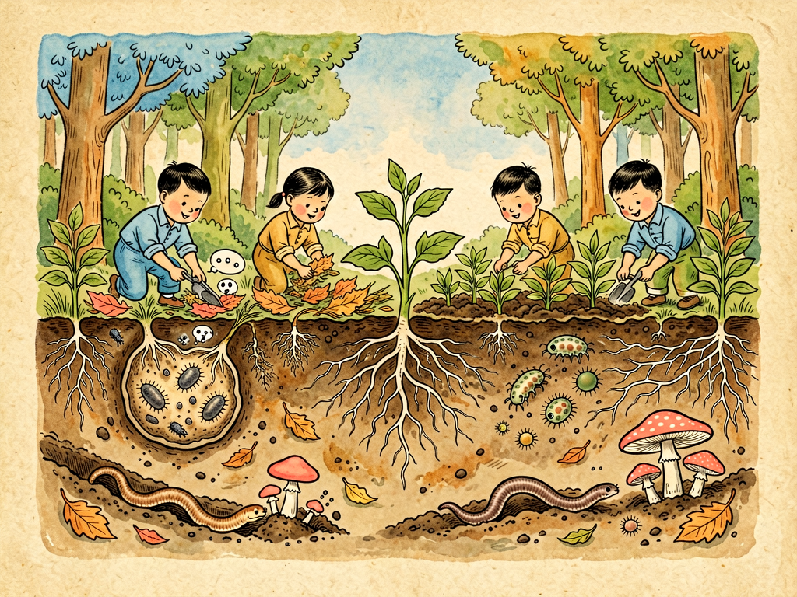

## 第十三章 地球的繁荣与土壤的劳动者

---

### 📍 本章导航
**核心主题**：你看到的森林草原、飞禽走兽、人类文明，都只是地球生命的冰山一角——真正支撑整个地球繁荣的，是土壤里看不见的亿万细菌，它们是地球最勤劳的劳动者，已经默默工作了35亿年  
**你将发现**：
- 1克普通花园土壤里，有10亿个细菌、100万个真菌、1万个原生动物，还有几千个不同物种——比一个特大城市人口还多，比整个动物园物种还丰富
- 如果没有细菌分解动植物尸体，地球早就被几十米厚的枯枝落叶、动物尸体堆满了，所有碳氮磷硫都锁在死物里，新生命再也长不出来
- 空气中78%是氮气，但植物不能直接用——根瘤菌能把氮气变成氮肥，它们每年固定2亿吨氮，比全世界所有化肥厂产量加起来还多
- 森林里的树不是独立生长的——地下的菌根真菌把所有树连在一起，形成"树联网"，大树给小树传营养，甚至能传递危险信号
- 土壤是地球最大的碳库，存的碳比大气和所有植物加起来还多2-3倍——土壤微生物一个小变化，就能显著影响全球气候
- 每年土壤给人类提供的生态服务（净化水、循环养分、固碳、供给粮食）价值23万亿美元，比全球所有国家GDP总和还高
- 微生物已经在地球上活了35亿年，人类才出现几百万年——我们不是地球的主人，只是后来的客人
- 现在全球33%的土壤已经退化，保护土壤里的微生物劳动者，就是保护我们自己的饭碗和未来

**阅读建议**：读完这一章，你再低头看脚下的泥土，眼神会完全不一样。

---

### 🖋️ 经典原文

上一章我们讲了水，知道了水是细菌的高速公路，也是生命的源泉。今天我们再往前走一步，低头看看我们脚下的**土壤**——这是地球最神奇、最被忽视的地方。

我们抬头能看到参天大树、森林草原，能看到飞禽走兽、鱼虫花鸟，能看到城市乡村、人类文明——我们觉得这就是地球的繁荣。但我要告诉你：这些都只是冰山露出水面的一角。真正支撑这一切繁荣的基础，在我们脚下的泥土里，在那些你看不见的微生物身上。它们是地球最勤劳的劳动者，已经默默无闻地工作了35亿年，没有它们，就没有我们看到的一切。

先给你说一个数字：**1克普通的花园土壤，就是你指尖捏起那么一点点土，里面有大约10亿个细菌——比整个中国的人口还多；有大约100万个真菌，1万个原生动物，还有几千个不同的物种。** 1平方米健康土壤的表层，里面的生物多样性，比整个地上的动物园还丰富。土壤不是死的泥土，是活的——是一个熙熙攘攘、拥挤不堪、日夜不停工作的地下城市。

土壤是怎么来的？地球刚形成的时候，到处都是光秃秃的岩石，没有土。岩石经过风吹日晒雨淋，热胀冷缩，慢慢碎裂成小石子、沙子，这是物理风化；水、二氧化碳、氧气慢慢腐蚀岩石，这是化学风化；但最关键的是生物风化——最先登陆的地衣、细菌、真菌，它们分泌有机酸腐蚀岩石，它们死了之后留下有机质，一点点积累，经过几百年、几千年、几万年，才慢慢形成了土壤。**土壤形成的速度极慢，1厘米厚的土壤，需要几百年甚至上千年才能形成；但你冲走它，只需要一场大雨。**

你挖开土壤看，它是一层一层的，像千层饼一样：最上面是落叶层，是刚掉下来的树叶、枯草、动物尸体，这是分解者的食堂；往下是腐殖质层，黑色的，是分解完的有机质，这是土壤最肥沃的部分，农民叫它"黑黄金"；再往下是淋溶层、淀积层，是矿物质沉积的地方；最底下是母质层和基岩。每一层都住着不同的微生物，干着不同的活。

那这些土壤里的细菌劳动者，每天都在干些什么工作呢？它们是真正的"全能工人"，地球上每一种元素的循环，都离不开它们。
首先最重要的工作，是**分解**——它们是地球的清道夫。
地球上每一刻都有动植物死亡：树叶落了，草枯了，动物死了，人类也会留下生活垃圾和排泄物。如果这些东西一直堆着不分解，会怎么样？用不了几百年，地球表面就会被几十米厚的枯枝落叶、动物尸体堆满，所有的碳、氮、磷、硫都锁在这些死东西里面，新的植物得不到养分，就再也长不出来了，整个生命系统就崩溃了。
而细菌和真菌就是干这个活的：腐生细菌分解糖类、蛋白质、脂肪；纤维素分解菌能分解木头、秸秆里的纤维素——这是最顽固的有机物之一，除了细菌真菌，几乎没有动物能消化它；木质素分解菌能分解木质素，就是让木头变硬的东西；还有几丁质分解菌，分解昆虫的外壳和真菌的细胞壁。它们把所有复杂的有机物，一点点拆成最简单的无机物：二氧化碳、水、氨、硫酸盐、磷酸盐——这些又重新变成植物的养分，被植物吸收，长出新的叶子、新的果实，再被动物吃掉，如此循环往复。
我们说"落红不是无情物，化作春泥更护花"——让落红化作春泥的，不是什么神奇的力量，就是土壤里这些看不见的细菌。它们是生命循环的连接点，让死亡不是终点，而是新生命的起点。

第二项工作，是**固氮**——它们是地球的天然氮肥厂。
空气里78%是氮气，可以说氮是取之不尽用之不竭的。但你知道吗？植物和动物根本不能直接利用空气中的氮气——氮气分子是两个氮原子紧紧绑在一起，太稳定了，没有什么生物能拆开它。除了——固氮菌。
固氮菌有个特殊的酶，叫固氮酶，能在常温常压下把空气中的氮气拆开，变成氨，也就是氮肥，供植物吸收利用。这些固氮菌，有些是自生自灭的，在土壤里自己固氮；有些更聪明，和豆科植物合作，住进植物根上长的小瘤子（根瘤）里，植物给它们提供糖分当食物，它们给植物提供氮肥——这是完美的互惠共生。
你看大豆、豌豆、花生这些豆科植物，不用施氮肥也能长得很好，就是根瘤里的细菌在给它们打工。农民种了几百年地，知道种一季大豆之后土地会变肥，就是这个道理，但他们不知道背后是细菌在干活。
全球每年生物固氮大约2亿吨——比全世界所有化肥厂生产的氮肥加起来还多。如果没有这些固氮菌，就算我们有再多的磷钾肥，植物也会因为缺氮长不好，整个地球都会是一片贫瘠。发明合成氨化肥的哈伯-博施法是1909年才有的，在那之前的几十亿年里，所有陆地植物的氮素养分，几乎全靠固氮菌提供。

接下来是氮循环的其他环节：氨化细菌把动植物尸体里的有机氮变成氨；硝化细菌把氨变成亚硝酸盐，再变成硝酸盐——这是植物最喜欢吸收的氮形态；反硝化细菌在缺氧的地方，又把硝酸盐变回氮气，放回空气里。从空气到土壤，到植物到动物，再回到空气——整个氮循环，每一步都是细菌在干活，少了哪一种菌，整个循环就断了。
不只是氮，其他所有元素也一样：
- 磷是DNA、细胞膜、能量物质ATP的核心成分，土壤里大部分磷是不溶于水的，植物吸收不了——磷细菌能把不溶性磷变成可溶性磷，给植物用；
- 硫是蛋白质的必需成分，硫细菌、硫酸盐还原菌推着硫在全球循环；
- 铁、锰、铜、锌这些微量元素，也都是靠细菌氧化还原，才能被生物利用；
- 碳就更不用说了：光合细菌和蓝细菌能固定二氧化碳，产甲烷古菌能产生甲烷，甲烷氧化菌又能吃掉甲烷，分解者把有机物里的碳变回二氧化碳——整个碳循环，一半以上的工作是微生物干的。

你以为森林里的树都是各长各的，互相竞争阳光和养分？不是的。地下有一张巨大的"互联网"——**菌根网络**。90%以上的陆生植物，根上都长着菌根真菌，这些真菌的菌丝比树根细得多，能伸到树根够不到的地方，帮植物吸收磷、氮和水分，植物反过来给真菌提供光合作用制造的糖分。
更神奇的是，这些菌丝不是只连一棵树，它们会把整片森林里的树都连在一起：大树会通过菌丝给小树传营养，尤其是那些长在树荫下、晒不到太阳的小树，要是没有大树通过菌根给它们送糖，根本活不下来；如果有一棵树被虫子咬了，它会通过菌丝给其他树传化学信号，让其他树提前产生防御物质，准备好抗虫；甚至不同种类的树之间也能连在一起——桦树和冷杉会在不同季节互相交换糖分，夏天桦树给冷杉糖，冬天冷杉给桦树糖。
科学家把这个网络叫"树联网"（Wood Wide Web）——这是比我们人类互联网早出现了几亿年的地下网络，而编织这个网络的，就是真菌，以及和它们共生的细菌。

土壤还藏着一个和我们所有人都相关的大秘密：它是地球**最大的碳库**。
现在大家都关心气候变化、全球变暖，知道二氧化碳是温室气体，也知道植物通过光合作用吸收二氧化碳。但你知道吗？土壤里存的碳，比大气里的碳加上所有陆地植物存的碳加起来，还要多2-3倍——全球土壤一共存了大约1.5万亿吨有机碳，大部分是微生物分解有机质产生的腐殖质。如果这些碳因为土壤退化、温度升高被微生物分解释放到大气里，那全球变暖的速度会快好几倍；反过来，如果我们能让土壤多存碳，它就是对抗气候变化最有力的武器。
科学家算过，健康土壤提供的生态服务，每年价值大约23万亿美元——比全世界所有国家的GDP总和还高。它给我们种粮食，净化水，循环养分，固碳，调节洪水，养活所有陆地生物——这些服务都是土壤里的微生物免费给我们干的，我们从来没给它们发过工资。

但现在这些勤劳的劳动者，正在面临巨大的危机。
全球大约33%的土壤已经中度到重度退化了：
- 过度开垦、滥砍滥伐导致水土流失，每年有240亿吨表层土壤被冲走，这些土壤里的微生物也跟着没了；
- 过量使用化肥农药，杀死了土壤里大量有益微生物，土壤板结，肥力下降，越用化肥就越依赖化肥，形成恶性循环；
- 工业污染、重金属污染、塑料污染，毒死了土壤里的微生物；
- 沙漠化、盐碱化，让越来越多的土壤变成不毛之地。
很多农民现在发现，化肥越用越多，但产量不涨反降，病虫害越来越严重——就是因为土壤里的微生物生态被破坏了，土壤死了。
土壤死了会怎么样？长不出庄稼，留不住水，发洪水，闹旱灾，粮食减产，最后人类也活不好。我们总说"民以食为天，食以土为本"——没有健康的土壤，就没有粮食安全，就没有人类文明。

我们很多人觉得人类是地球的主人，细菌是渺小的、低级的、要被消灭的。但你仔细想想：微生物在地球上已经活了35亿年，它们见证了大陆漂移、恐龙灭绝、冰河时期；而我们人类，才出现了几百万年，有文明才不过几千年。它们才是地球真正的原住民，我们只是后来的客人。客人来到主人家里，应该学会尊重主人，和主人和平共处，而不是反客为主，把主人都杀光。
地球的繁荣，从来就不只是我们看到的那些大型动植物的繁荣。食物链的金字塔，顶端是老鹰、狮子、人类，但基座是这些看不见的微生物——基座稳了，金字塔才能立住；基座塌了，再高的金字塔也会轰然倒塌。我们以前只看见塔尖，看不见基座，觉得基座不重要，甚至觉得基座是肮脏的、有害的——这是人类的傲慢和无知。

那我们普通人能做什么？其实很简单：
1. **不要浪费粮食**——每一粒米、每一颗菜，都是从土壤里长出来的，都耗费了土壤微生物几百年积累的肥力；
2. **做好垃圾分类，厨余垃圾可以堆肥**——让有机质回到土壤里，而不是去填埋场产生甲烷；
3. **尽量选择有机农产品、少用农药化肥的农产品**——支持可持续农业，就是保护土壤微生物；
4. **爱护花草树木，不要随意破坏土壤**——不要乱扔垃圾，不要把化学污染物倒在土里；
5. **多了解土壤和微生物的知识**——知道它们的重要性，才会发自内心地尊重它们、保护它们。

下次你走在路上，低头看看脚下的泥土，不要觉得它脏、它普通。那里面藏着一个比我们人类文明更古老、更复杂、更伟大的世界，藏着一群默默工作了35亿年的劳动者。我们吃的每一口饭，喝的每一口水，呼吸的每一口空气，都和它们有关。地球的繁荣，不是人类创造的，是这些看不见的小生命，用了35亿年时间，一点点建设起来的。
学会敬畏脚下的土壤，学会尊重这些微小的劳动者，这才是人类作为地球客人应有的态度。

下一章，我们讲细菌学的第一课。

---

> 📜 **科学史话：从"腐殖质理论"到根瘤菌发现——人类用了多久才懂土壤？**
>
> 人类种了一万年农业，但真正懂土壤微生物，才不过一百多年时间。
>
> 古代农民早就知道，种了豆科植物之后土地会变肥，也知道腐烂的粪便、秸秆能当肥料，但没有人知道为什么。19世纪之前，欧洲流行"腐殖质理论"，说植物吃的是土壤里的腐殖质，土壤肥力就是腐殖质多少——这个理论听起来很有道理，但其实是错的。
>
> 直到1840年，德国化学家李比希提出了"矿质营养学说"，证明植物生长需要的是氮、磷、钾等矿物质，不是腐殖质本身——腐殖质只是这些矿物质的来源。但还是没人知道，这些矿物质是怎么来的，为什么豆科植物能自己"造肥"。
>
> 1888年，德国科学家赫尔利格尔和维尔法斯发现，豆科植物只有在根上长根瘤的时候才能固氮，如果把土壤灭菌了，根瘤长不出来，豆科植物就不能固氮了。他们猜测，根瘤里有活的微生物。
>
> 同一年，荷兰科学家贝杰林克——就是我们之前讲过的第一个发现病毒的科学家——成功从根瘤里分离出了固氮细菌，命名为根瘤菌（Rhizobium）。这是人类第一次知道，原来细菌能做这么神奇的事情——把空气里的氮气变成植物能利用的氮肥。
>
> 之后几十年里，科学家们陆续发现了硝化细菌、反硝化细菌、硫化细菌、磷细菌……一点点揭开了土壤里这个秘密世界的面纱。19世纪末20世纪初，俄国科学家维诺格拉茨基发现了化能自养细菌——就是不需要阳光，靠氧化无机物获得能量的细菌，彻底改变了我们对生命代谢方式的认知。他被称为"土壤微生物学之父"。
>
> 但即使到今天，我们对土壤微生物的了解仍然非常少。土壤里99%以上的微生物，我们还不能在实验室里培养，不知道它们在干什么——它们的基因能测出来，但我们不知道它们的功能。1克土壤里有几千种微生物，我们能叫出名字的不到1%。
>
> 我们对脚下这片土地的了解，可能还不如我们对火星表面的了解多。这一片养活了所有人类的土壤，仍然藏着无数的秘密，等着我们去发现。

---

> 🔬 **科学更新：最近30年关于土壤微生物的新发现**
>
> 最近几十年，DNA测序技术和宏基因组学的发展，让我们对土壤微生物的认知发生了革命性的变化：
>
> **第一，"树联网"真的存在，而且比我们想象的更复杂**。90年代科学家发现菌根网络之后，最近20年的研究越来越多：森林里的菌根网络能连接数百棵树，传输距离可以超过几百米；不仅能传碳、氮、磷这些营养，还能传水分、化学信号、报警信号；甚至母树会优先给和自己亲缘关系近的小树传营养，帮助后代存活——这完全颠覆了我们之前"植物都是独立竞争"的认知。
>
> **第二，土壤微生物和气候变化是双向作用的**。以前我们觉得温度升高，微生物分解加快，释放更多二氧化碳，会形成正循环让全球变暖更快。但最近研究发现，长期温度升高之后，土壤微生物会适应，分解速度并不会一直加快；而且不同地方的土壤反应不一样——湿地、泥炭地的土壤存碳量特别大，如果温度升高、水位下降，这些地方的微生物会把积累了几千年的碳分解出来，释放大量二氧化碳和甲烷，这才是最危险的。
>
> **第三，土壤微生物会"吃塑料"**。最近几年科学家陆续发现，有一些土壤细菌和真菌能分解PET塑料、聚氨酯塑料，甚至能吃聚乙烯——这些以前我们以为要几百年才能降解的塑料，有些微生物几个月就能吃完。未来也许我们能培育或者改造这些微生物，用来解决塑料污染问题。
>
> **第四，土壤微生物能影响地上植物的健康，甚至能"治病"**。健康的土壤微生物组能帮助植物抵抗病虫害，甚至能帮植物抗旱、抗盐碱、抗重金属。现在很多农药其实是在杀死这些有益微生物，反而让植物更容易生病——新一代的生物农药和菌肥，就是用有益微生物来保护植物，而不是用化学毒物杀死一切。
>
> **第五，人类的肠道菌群和土壤菌群是连在一起的**。我们小时候玩土，会接触土壤里的微生物，这些微生物能训练我们的免疫系统，减少过敏、哮喘和自身免疫病——这就是"卫生假说"的一部分：太干净了，不接触微生物，免疫系统反而会出问题。现在有研究发现，让孩子接触自然土壤，反而更健康。
>
> 最有意思的是：我们现在才发现，中国传统农业里很多老办法，其实是非常符合微生物学原理的——比如轮作、休耕、施农家肥、种豆科植物养地、秸秆还田——这些做法的本质，都是在培养健康的土壤微生物群落，让土壤永远保持肥力。我们用了几千年的经验，现代科学最近几十年才搞明白背后的原理。
>
> 有时候你不得不佩服古人的智慧，虽然他们不知道细菌是什么，但他们通过几千年的观察和实践，摸到了和微生物和平共处的方法。

---

> 🌱 **现实连接：我们每个人都能做的"土壤保护"小事**
>
> 保护土壤不需要你去当科学家、去种树，在日常生活里就能做：
>
> 1. **厨余垃圾堆肥**：家里的菜叶、果皮、剩饭、茶渣，不要扔去垃圾桶——可以在家里用堆肥桶堆肥，或者扔到小区的厨余垃圾桶里，最后会变成有机肥回到土壤。如果扔去填埋场，它们会在厌氧条件下产生甲烷，温室效应是二氧化碳的28倍。
>
> 2. **不要往下水道、土里倒化学药品**：废油、油漆、消毒液、过期药品、农药，这些东西会杀死土壤和水里的微生物，要扔到专门的有害垃圾桶里。
>
> 3. **尽量不使用除草剂、杀虫剂**：家里种花种菜，尽量用物理方法、生物方法防虫除草，不要用烈性农药，这些农药会杀光土壤里的有益微生物，最后虫子反而越来越多。
>
> 4. **节约用纸、少用一次性木制品**：纸和木材都是树做的，树是土壤最好的保护者——少用一张纸，就是少砍一棵树，就是在保护土壤。
>
> 5. **多走出去接触自然**：周末去公园、去郊外，让孩子玩土、玩沙子，不要怕脏——接触土壤里的微生物对免疫系统有好处，也能让你和孩子真实感受到土壤的重要性。
>
> 6. **支持可持续农业**：买菜的时候，可以选有机、绿色、生态种植的农产品，虽然贵一点，但这些农产品不用或者少用农药化肥，是在保护土壤。用脚投票，支持善待土地的农民，就是最好的保护。
>
> 7. **不要浪费食物**：全球每年浪费13亿吨食物，这些食物都需要土地来种，相当于白白浪费了30%的农业用地和大量的淡水资源，还产生了大量温室气体。光盘行动，就是对土壤最好的保护。
>
> 土壤不是无限的，它是我们最珍贵的不可再生资源——1厘米土壤需要几百年才能形成，但我们破坏它只需要一瞬间。保护土壤，不是为了地球，地球已经活了46亿年，什么灾难没见过——保护土壤，是为了我们人类自己，为了我们的子孙后代还能在这片土地上种出粮食，还能看到森林草原，还能活下去。

---

### 💬 读后思考与讨论

1. "人类不是地球的主人，只是后来的客人；微生物才是地球的原住民"——这个观点对你有什么触动？我们应该用什么样的态度对待其他生命、对待自然？
2. 我们总说"眼见为实"，但土壤里的细菌、菌根网络、地下生态系统，我们看不见，但它们才是地球繁荣的基础。生活中还有哪些"看不见但非常重要"的东西？我们怎么才能学会尊重和重视看不见的价值？
3. 中国传统农业的轮作、施农家肥、秸秆还田，用了几千年都能保持土壤肥力，而现代农业用化肥农药，几十年就把土壤搞退化了。这告诉我们什么？"先进"和"落后"的标准是什么？
4. "落红不是无情物，化作春泥更护花"——分解者让死亡成为新生命的起点。这种循环的世界观，和我们现在"用完就扔"的线性世界观，有什么本质不同？
5. 土壤每年给我们提供价值23万亿美元的免费服务，比全球GDP总和还高，但我们几乎从来没有为这些服务付费，也不珍惜它们。为什么人类总是会低估"免费的自然服务"的价值？

### 🔗 关联阅读
- 第一部第十三章：《清除腐物》→ 细菌作为分解者的核心作用
- 第一部第十四章：《土壤革命》→ 土壤里的物质循环
- 第一部第十五章：《经济关系》→ 微生物在农业中的应用
- 第三部第十七章：《土壤世界》→ 更多关于土壤的知识
- 跨章节思考：生态系统的本质是什么？为什么说"没有废物，只有放错地方的资源"？人类社会能不能像自然生态系统一样，实现无废物的循环？
