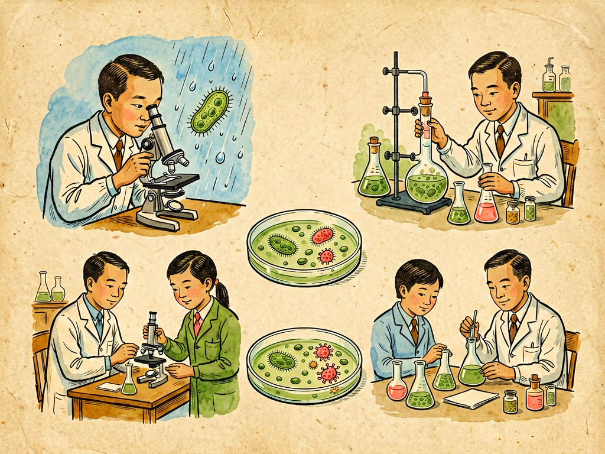

## 第十四章 细菌学的第一课

---

### 📍 本章导航
**核心主题**：细菌学这门科学是怎么诞生的？科学家是怎么研究那些看不见的小生命的？比具体知识更重要的是科学方法——观察、实验、实证、严谨，这套方法不仅能用来研究细菌，也能用来认识世界上的一切事物  
**你将发现**：
- 列文虎克只是个荷兰布商，没受过正规科学训练，但他靠自己磨的镜片第一个看见了细菌，打开了微生物世界的大门
- 巴斯德用一个简单的鹅颈瓶实验，就推翻了流行了几千年的"自然发生说"——证明肉汤不会自己长出细菌，细菌是从空气里来的
- 科赫发明了固体培养基和纯培养技术，还提出了"科赫法则"，第一次严格证明了某种细菌会导致某种疾病——这套逻辑直到今天还在用
- 青霉素的发现不是"幸运的意外"——弗莱明能发现青霉素，是因为他十几年一直在研究抗菌物质，机会只留给有准备的人
- 现在我们用的CRISPR基因编辑技术，最开始是细菌用来抵抗病毒的免疫系统——基础研究最后变成了改变世界的技术
- 科学最珍贵的不是结论，是方法：不看谁说的，只看证据是什么；不管"常识"怎么说，只相信严谨的实验结果
- 细菌学只有300多年历史，但它已经把人类平均寿命提高了30多岁——这就是科学的力量
- 细菌学还在快速发展，我们对细菌的了解可能还不到1%，还有无数秘密等着发现

**阅读建议**：读完这一章，你不仅会懂细菌学是怎么回事，更会明白什么是真正的科学精神，怎么用科学的方法思考问题。

---

### 🖋️ 经典原文

前面我们讲了水，讲了土壤，讲了细菌在整个地球生态里的作用。今天这一章，我们不讲具体的细菌知识，我们讲讲**细菌学这门科学本身**——它是怎么诞生的？科学家是怎么研究这些看不见的小生命的？我们凭什么相信这些知识是对的？
这是细菌学的第一课，也是科学方法的第一课。

你可能觉得，细菌这么小，看不见摸不着，研究它们肯定特别难。确实，在17世纪之前，人类根本不知道世界上有细菌这种东西存在。我们生了病，会觉得是"瘴气"，是"鬼神"，是"体液不平衡"，是"上火"——我们猜了几千年，都没猜到是这些看不见的小生命在搞鬼。
这不是因为古人笨，是因为我们没有工具，也没有正确的方法。科学的进步，往往是工具和方法先行——有了显微镜，我们才能看见细菌；有了正确的实验方法，我们才能证明细菌和疾病的关系。

细菌学的历史，得从列文虎克说起。
安东尼·范·列文虎克是荷兰的一个布商，没受过什么正规教育，也不是什么职业科学家，他最大的爱好就是磨镜片。他磨镜片的手艺特别好，能磨出放大200多倍的镜片，比当时所有的显微镜都清楚。
1674年的一天，他把一滴雨水放在自己磨的镜片底下，往里面一看，吓了一跳——水里面有好多小小的"动物"在游来游去，有的是球形的，有的是杆状的，有的是螺旋形的，还有的长着小尾巴飞快地跑。他又看了牙垢、看了井水、看了自己的粪便，到处都有这些小小的"微动物"。
他把自己看到的东西写信告诉了英国皇家学会，一开始大家都不相信——一个没上过学的布商，说他在水里看到了小动物？开什么玩笑。但列文虎克非常严谨，他反复观察，还找了很多人来一起看，最后皇家学会不得不承认：他说的是真的。
这是人类第一次看见细菌，距离今天不过350年。列文虎克被称为"微生物学之父"——不是因为他有多么高的学历，多么好的设备，而是因为他好奇心强，动手能力强，观察仔细，尊重事实。一个普通人，只要有好奇心，讲证据，也能做出伟大的科学发现。

但看见细菌只是第一步，接下来的200年里，大家都在争论一个问题：这些细菌是从哪里来的？
当时流行了几千年的说法叫"自然发生说"——认为生物可以从无生命的物质里自己长出来。比如腐肉里会长蛆，脏水里会自己长虫子，粮食放久了自己会长老鼠，肉汤放坏了会自己长出细菌——大家都觉得这是天经地义的，"常识"就是这样。
但有一个人不相信，他就是法国科学家巴斯德。
巴斯德设计了一个非常巧妙的实验，就是著名的**鹅颈瓶实验**：他把肉汤煮开放进一个烧瓶里，然后把烧瓶的脖子拉成S形的长弯管——空气可以通过弯管进去，但是细菌会落在弯管的底部，爬不上去。结果呢？这个烧瓶里的肉汤放了四年都没有变坏，一点细菌都没有长。然后他把弯管打断，让空气直接进去，结果肉汤几天就坏了，长满了细菌。
就这么一个简单的实验，彻底推翻了流行了几千年的自然发生说——证明细菌不是自己从肉汤里长出来的，是从空气里掉进去的。巴斯德有一句名言："在观察的领域里，机遇只偏爱有准备的头脑。"
这个实验告诉我们一个道理：**常识不一定是对的，"眼见为实"也不一定靠得住，只有严谨的对照实验，才能找出真正的原因。**

接下来，细菌学真正成为一门严谨的科学，靠的是德国医生科赫。
巴斯德证明了细菌不是自然发生的，但细菌和疾病到底是什么关系？当时很多人怀疑是细菌导致了传染病，但没有确凿的证据。科赫解决了这个问题。
科赫当时是个乡村医生，他在家里建了个简陋的实验室，研究炭疽病——一种牛羊得的传染病，也能传染人。他把生病牛羊的血注射到健康老鼠身上，老鼠也得了炭疽死了；然后他把细菌从老鼠身上分离出来，在体外培养了很多代，再注射到健康动物身上，还是能让动物得炭疽；最后他又从生病的动物身上分离出了同一种细菌。
他总结出了一套证明某种细菌导致某种疾病的法则，叫**科赫法则**：
1.  这种细菌必须在所有患病的生物体内都能找到，健康生物体内没有；
2.  必须能把这种细菌从生物体内分离出来，在体外培养成纯种；
3.  把纯种细菌接种到健康易感生物身上，必须能导致同样的疾病；
4.  从接种后生病的生物身上，必须能重新分离出同一种细菌。
这套法则非常严谨，逻辑上无懈可击——按这个流程走一遍，你就能100%确定就是这种细菌导致的疾病。科赫用这套法则，陆续找到了炭疽、结核、霍乱的致病菌，开创了医学细菌学。
科赫还发明了细菌学最重要的技术之一：**固体培养基纯培养**。一开始大家都是用液体培养基养细菌，多种细菌混在一起，根本没法研究。科赫一开始用明胶做固体培养基，后来他的助手Petri发明了培养皿，又用琼脂代替明胶——我们今天实验室里培养细菌还是用这个方法，100多年了没变过。把细菌稀释后涂在固体平板上，每一个细菌会繁殖成一个肉眼可见的菌落，每个菌落都是纯种的细菌——就这么一个简单的发明，把细菌学从"玄学"变成了真正的科学。
之后的100多年里，细菌学进入了黄金时代：
- 1884年，革兰发明了革兰氏染色法，把细菌分成革兰阳性和革兰阴性，直到今天还是细菌分类最基础的方法；
- 1928年，弗莱明发现了青霉素，之后弗洛里和钱恩把它提纯出来用到临床上，开启了抗生素时代，把人类平均寿命一下子提高了15年；
- 1928年格里菲斯做了肺炎双球菌转化实验，埃弗里1944年证明DNA是遗传物质——这个发现不仅是细菌学的，更是整个分子生物学的基础；
- 1953年DNA双螺旋结构发现之后，细菌学进入分子时代；
- 1983年PCR技术发明，我们能快速检测和识别细菌；
- 1995年第一个细菌基因组测序完成；
- 2010年文特尔团队合成了第一个人工合成的细菌基因组，创造了第一个"人造生命"；
- 最近几年，基于细菌免疫系统的CRISPR基因编辑技术发明，彻底改变了整个生命科学。

你看，从列文虎克看见细菌，到今天只有300多年历史，从科赫建立科学方法到今天才140年，但这门科学已经彻底改变了人类的命运——以前得了肺炎、结核、霍乱、伤寒就是等死，现在这些病大部分都能治了；以前生孩子因为产褥热死亡率高达10%，现在几乎没人因为这个死了；以前手术感染死亡率高得吓人，现在消毒无菌已经是常规操作。细菌学这一门学科，就让人类平均寿命从30多岁提高到了70多岁——这就是科学的力量。

那研究细菌，到底有哪些方法？其实说起来也不复杂，就是四件事：**观察、培养、实验、分类**。
第一是**观察**。最基础的就是用显微镜看——普通光学显微镜放大1000倍，能看到细菌的形态；电子显微镜放大100万倍，能看到细菌内部的结构；荧光显微镜能用荧光标记特定的结构，看活细菌的动态变化。除了看形态，还要看染色：革兰阳性染成紫色，革兰阴性染成红色；抗酸染色能把结核杆菌染成红色。还要看菌落：不同细菌在平板上长的菌落大小、颜色、形状、边缘都不一样，有经验的人看一眼菌落就大概知道是什么菌。
第二是**培养**。我们要把细菌从环境里分离出来，在体外养起来，才能研究它。不同细菌需要的营养不一样，有的需要血琼脂，有的需要特殊的营养，有的要氧气，有的不能有氧气，有的要37度，有的要高温。我们要配不同的培养基，控制不同的条件，把细菌养起来——能养出来，才能做后面的实验。直到今天，环境里99%的细菌我们还养不出来，这就是为什么我们对土壤、肠道里的很多细菌还了解很少。
第三是**实验**。光看和养还不够，还要做实验：生化实验看它能发酵什么糖、产不产酸、产不产气；药敏实验看它怕什么抗生素；动物实验看它有没有毒力；基因实验把它的基因突变掉，看会有什么变化，才能知道这个基因是干什么的——科学就是"大胆假设，小心求证"，每一个结论都要有实验证据支持。
第四是**分类**。我们要给细菌起名字，分类归类，知道谁和谁是亲戚，谁和谁有关系。以前分类靠形态、染色、生化反应，现在靠基因测序——测16S rRNA基因，就能准确知道它在进化树上的位置。

但比这些具体方法更重要的，是细菌学背后的**科学精神**，我把它总结成五个词：
第一个词是**客观**。不要先入为主，不要带偏见，不要被自己的期望、被"常识"、被权威影响，看到什么就是什么，实验结果是什么就是什么。很多人觉得"细菌都是坏的"，这就是偏见——实际上99%的细菌对人无害甚至有益，我们不能带着偏见去看问题。
第二个词是**严谨**。做实验一定要有对照，空白对照、阳性对照、阴性对照，少了对照结果就不可信；操作要严格无菌，不然污染了杂菌，结果就全错了；记录要真实完整，不能挑自己想要的结果记，和预期不一样的结果往往才是最重要的——青霉素就是从"污染了霉菌的失败实验"里发现的。
第三个词是**实证**。所有结论都要有证据，不猜测，不盲从权威，不相信"祖传秘方"，不相信"大家都这么说"。谁说的都不算，实验结果算，可重复的证据算。科学不看你是谁，只看你的证据够不够硬。
第四个词是**开放**。科学是会进步的，新的证据出来了，就要修正旧的理论，不要死抱着老观念不放。以前我们觉得细菌都是单细胞独立生活的，现在我们知道它们会通过群体感应互相交流，会形成生物膜，会互相协作——新发现推翻旧理论，这不是科学的弱点，这恰恰是科学最强大的地方：它有自我修正的能力。
第五个词是**共享**。科学发现要公开发表，让所有人都能验证、都能使用，科学知识要普及给大众，而不是藏着掖着当秘密。人类的科学知识是共同积累的，我们今天所有的成果，都是站在前人的肩膀上得到的。

这套精神不只是用来研究细菌的，它是所有科学通用的，也是我们日常生活中应该有的思考方式。遇到一个说法，不要急着相信，先问一问：证据是什么？有没有对照实验？有没有被重复验证？是谁说的？他有没有利益相关？有没有其他可能的解释？——这就是科学思维，它能帮你少交很多智商税，少上很多当，更准确地认识世界。

很多人觉得科学就是一堆要背的知识点——背细菌有多少种，背科赫法则有几条，背青霉素哪年发现的。但我要告诉你：**知识点会过时，会更新，但方法和精神是永恒的。** 背下来100个细菌的名字，不如学会怎么用对照实验判断因果；背下来所有发现的年份，不如养成实证和质疑的习惯。
学细菌学，最终不是为了当细菌学家，而是为了学会像科学家一样思考。

今天的细菌学，已经和100年前完全不一样了。我们现在知道，细菌不只是单个的小生命，它们会组成群落，会互相交流，会形成复杂的生态系统——我们人体肠道里的100万亿个细菌，组成了人体微生物组，影响着我们的消化、免疫、甚至情绪和大脑；我们能改造细菌，让它们给我们生产胰岛素、抗生素、生物燃料、可降解塑料；我们用细菌来处理污水、修复污染、生产食物；我们从细菌身上学到了CRISPR基因编辑技术，能精准修改任何生物的基因。
但我们知道的还是太少了。我们能培养的细菌不到环境里的1%，我们对细菌之间怎么交流、怎么协作、怎么和宿主互动，了解得还非常浅；细菌耐药性已经成为全球危机，每年70万人死于耐药菌感染，预计2050年会超过1000万——我们需要新的抗生素，新的治疗方法；气候变化、粮食安全、能源危机、环境治理，这些人类面临的大问题，很多都需要靠细菌学来解决。
细菌学是一门年轻的科学，它才300多岁，它还在快速成长，还有无数的秘密等着未来的人去发现——也许正在读这本书的你，就是未来发现这些秘密的人。

下一章，我们讲毒菌战争的问题。

---

> 📜 **科学史话：青霉素的发现——真的是意外吗？**
>
> 很多人都听说过青霉素发现的故事：1928年，弗莱明外出度假，忘了盖培养皿的盖子，回来之后发现培养皿被青霉菌污染了，青霉菌周围的葡萄球菌都被杀死了——于是他发现了青霉素，拿了诺贝尔奖，拯救了几千万人的生命。
>
> 听起来是不是特别幸运？好像是天上掉馅饼砸中了他。但实际上，这个"意外"能发生，一点都不偶然。
>
> 首先，在弗莱明之前，至少有20多个科学家都观察到过霉菌杀死细菌的现象，但他们都觉得这是"实验污染"，是失败的实验，直接把培养皿扔了——只有弗莱明没有忽略这个"异常"，他追着这个现象研究下去了。
>
> 其次，弗莱明不是第一次遇到这种事——他之前已经研究抗菌物质十几年了。第一次世界大战的时候，他在战地医院工作，亲眼看到很多士兵不是死于枪伤，而是死于伤口感染，而当时用的消毒剂不仅杀不死细菌，还会伤害人体的免疫细胞，反而让感染更严重。从那时候起，他就一直在找一种既能杀死细菌又不伤害人体的物质，他发现了溶菌酶（眼泪、唾液里的抗菌物质），一直在做相关研究。
>
> 他看到青霉菌周围没有葡萄球菌，第一反应不是"我培养皿污染了，扔了吧"，而是"这个霉菌会不会分泌了什么能杀死细菌的东西？"——他把青霉菌分离出来培养，发现它的培养液确实能杀死很多致病菌，而且对白细胞没有毒性，他把这个物质命名为青霉素。
>
> 但弗莱明不是化学家，他没法把青霉素提纯出来，青霉素真正用到临床上是十几年后的事——1940年，牛津大学的弗洛里和钱恩团队，在二战的炮火中提纯出了青霉素，证明它在人身上有效，然后和美国的制药公司合作，实现了大规模生产。二战的时候，青霉素救活了几百万受伤的士兵，人们叫它"神药"。1945年，弗莱明、弗洛里、钱恩三个人一起拿了诺贝尔奖。
>
> 巴斯德说的"机遇只偏爱有准备的头脑"，在青霉素的发现上体现得淋漓尽致。**没有什么真正的"意外发现"，只有准备好了的人，才能在偶然现象出现的时候抓住它。** 科学史上的很多重大发现，看起来是意外，背后都是成年累月的积累、观察和思考。
>
> 还有一个有意思的细节：弗莱明在诺贝尔奖领奖演讲的时候警告说，如果滥用青霉素，细菌很快就会产生耐药性。他说得一点都没错——青霉素用到临床才4年，就出现了耐药的葡萄球菌；今天，耐药菌已经成为全球最大的公共卫生危机之一。科学家不仅要能发现好东西，还要能预见它的问题——这才是真正的远见。

---

> 🔬 **科学更新：21世纪的细菌学——我们正站在新的革命门口**
>
> 进入21世纪之后，DNA测序技术和宏基因组学的发展，让细菌学进入了一个全新的时代，很多我们以前坚信的结论都被推翻了，大量新发现正在改写我们对细菌的认知：
>
> **第一，细菌不是"孤独的单细胞生物"，它们是社会性的**。最近30年我们发现，细菌会分泌信号分子，感知周围同类的数量——当数量够多的时候，它们会统一行动，一起发光、一起产生毒素、一起形成生物膜，这叫"群体感应"。它们还有分工合作，会像多细胞生物一样形成有结构的生物膜，里面有不同功能的细胞，还有给营养和信号的通道——细菌的社会，比我们想象的复杂得多。
>
> **第二，基因可以在细菌之间"水平转移"，甚至跨物种转移**。以前我们以为基因只能从父母传给孩子，垂直传递。但细菌之间可以直接交换基因——通过接合、转化、转导，耐药基因就是这样快速在不同细菌之间传播的，一个细菌产生了耐药性，很快就能传给其他种类的细菌。这就是为什么耐药性发展得这么快，也是为什么细菌能快速适应环境。
>
> **第三，我们身上的细菌不是"客人"，是我们的一部分**。人体微生物组计划发现，我们身上的细菌细胞数量和我们自己的细胞差不多多，基因数量是我们自己基因的150倍。它们帮我们消化食物、训练免疫系统、合成维生素、抵抗病原菌，甚至影响我们的情绪和行为——没有它们我们根本活不了。我们不是一个独立的个体，是一个和细菌共生的"超级生物体"。
>
> **第四，CRISPR——从细菌的免疫系统到基因编辑革命**。CRISPR本来是细菌的免疫系统：细菌被病毒感染之后，会把病毒的一段DNA存到自己的基因组里，下次再遇到同样的病毒，就能认出它，把它的DNA剪掉。2012年，科学家们把这个细菌的免疫系统改造成了基因编辑工具——它非常简单、便宜、精准，能修改任何生物的任何基因，从治疗遗传病到改良农作物，甚至可能用来治疗癌症、延缓衰老，这是整个生命科学领域几十年里最重大的突破之一。谁能想到，研究细菌怎么抵抗病毒的基础研究，最后变成了改变世界的技术？
>
> **第五，我们正在用合成生物学"设计"细菌**。我们现在能给细菌编程，让它们给我们生产胰岛素、青蒿素、生物燃料、可降解塑料；我们能设计细菌当"活体药物"，让它们专门在肿瘤里生长，杀死癌细胞；我们甚至能合成整个细菌基因组，创造自然界从来没有过的细菌——细菌正在从"我们研究的对象"变成"我们使用的工具"。
>
> 但最让人激动的是，我们知道的还是太少了。每一个新的技术出现，都会带来一大堆新的问题——科学就是这样，知道的越多，就会发现自己不知道的更多。这门300多年前才诞生的科学，还在以越来越快的速度发展，它的未来，是我们今天根本想象不到的。

---

> 🧪 **动手试一试：在家里做一次"细菌培养"小实验**
>
> 不需要专业设备，你在家里就能亲眼看到细菌，亲身做一次简单的科学实验：
>
> **材料准备**：
> - 一个一次性塑料餐盒（或者几个小玻璃碗，要能密封）
> - 一小包琼脂（或者用魔芋粉、吉利丁粉代替，做果冻用的那种，网上就能买到）
> - 一点牛肉汤或者鸡汤（或者用清水加一点糖和酵母粉，给细菌当营养）
> - 棉签
> - 保鲜膜
>
> **实验步骤**：
> 1. 把琼脂加到牛肉汤里（大概500毫升汤加10克琼脂），加热煮到琼脂完全融化；
> 2. 把煮好的培养基倒到餐盒/碗里，厚度大概0.5厘米，放在干净的地方，盖上盖子放凉，它会凝固成像果冻一样的固体平板；
> 3. 等平板完全冷却凝固之后，打开盖子（不要碰培养基表面），做几个不同的处理：
>    - 一个平板：用没洗的手指轻轻按一下培养基表面；
>    - 一个平板：用肥皂洗过手之后按一下；
>    - 一个平板：用棉签擦一下手机屏幕，然后在培养基表面轻轻涂一下；
>    - 一个平板：用棉签擦一下门把手、或者键盘、或者硬币，涂在培养基上；
>    - 一个平板：什么都不碰，作为空白对照；
> 4. 处理完之后立刻盖上盖子，用保鲜膜封好，放在温暖避光的地方（比如柜子里），不要打开盖子；
> 5. 等2-3天，观察平板上长出了什么——你会看到一个个大大小小、不同颜色的菌落，每个菌落都是从一个细菌繁殖出来的几百万个细菌。
>
> **观察的时候注意**：千万不要打开盖子！培养完之后直接用开水煮10分钟消毒，然后扔掉，不要让培养出来的细菌到处飘。
>
> 你会看到：没洗的手、手机、门把手、键盘上的细菌特别多；洗过的手细菌少很多；空白对照几乎没有菌落——这就是你每天接触的细菌，它们就在你身边，只是你看不见而已。
>
> 这个简单的小实验，本质上就是科赫当年发明的纯培养技术——你现在做的事情，和140年前科赫在实验室里做的，原理是一模一样的。科学没有那么神秘，你在家里就能重现科学史上最经典的实验。

---

### 💬 读后思考与讨论

1. 列文虎克只是个布商，没受过正规科学训练，却第一个发现了细菌；科赫一开始只是个乡村医生，却建立了细菌学的基础方法。你觉得做出重大科学发现，最重要的是什么？是学历？是设备？是好奇心？还是什么别的？
2. 巴斯德的鹅颈瓶实验非常简单，任何人都能做，但为什么之前几千年都没有人想到做这个实验，推翻"自然发生说"？常识和权威会怎样阻碍我们认识真相？
3. "科学不怕犯错，它会自我修正"——你怎么理解这句话？为什么说"可证伪"是科学最重要的特征？为什么会自我修正的科学，反而比那些"永远正确"的理论更可靠？
4. CRISPR最开始是科学家研究细菌免疫系统的基础研究，没有人知道它有什么用，但最后变成了改变世界的基因编辑技术。今天很多人觉得基础研究"没用"，浪费钱，你怎么看基础研究和应用的关系？
5. 科学精神说要"客观、严谨、实证、开放、共享"——这五条不只是做科研需要，在日常生活中也非常有用。你能想到生活中哪些事情，用这五条原则去思考，就能看得更清楚？

### 🔗 关联阅读
- 第二部第十章：《细菌的形态》→ 显微镜下的细菌是什么样子
- 第二部第十五章：《毒菌战争的问题》→ 我们怎么和致病细菌战斗
- 第二部第十六章：《凶手在哪儿》→ 流行病学怎么找病原体
- 第三部：整个人类与科学技术发展的故事
- 跨章节思考：科学方法的本质是什么？为什么这套方法诞生才300多年，就彻底改变了人类世界？我们怎么在日常生活中应用科学方法？
