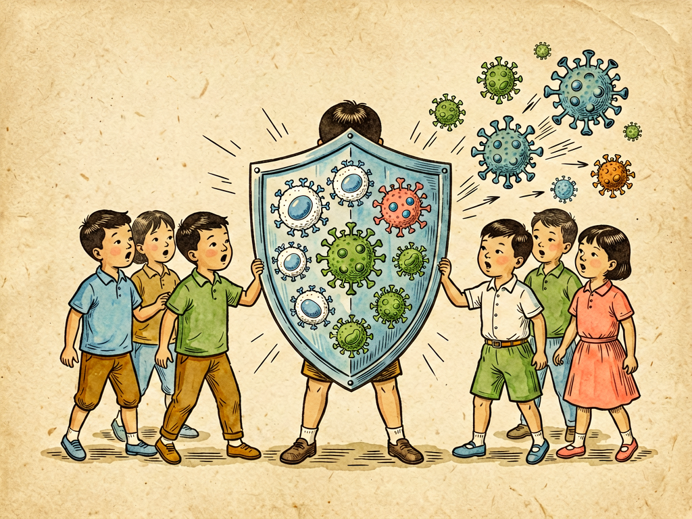

## 第十五章 毒菌战争的问题

---

### 📍 本章导航
**核心主题**：只有不到1%的细菌会让人类生病，但就是这一小部分"毒菌"，在历史上杀死了数以亿计的人——人类和致病菌的战争打了几千年，我们有疫苗、有抗生素，但永远不可能彻底打赢，因为细菌进化得比我们快。真正的胜利，不是消灭所有细菌，而是学会和它们共处，把风险控制住  
**你将发现**：
- 致病菌有自己的全套武器：有的产剧毒毒素，有的能钻透组织，有的能躲避免疫细胞，有的能在细胞里寄生
- 我们的身体有三道防线：皮肤黏膜是城墙，先天免疫是快速反应部队，后天免疫是特种部队，疫苗就是提前给军队做演习
- 疫苗是人类发明的最有效的防御武器——天花被彻底消灭，脊髓灰质炎几乎绝迹，都是疫苗的功劳。中国古代的人痘接种是全世界最早的疫苗实践，比西方早了800年
- 抗生素是20世纪的奇迹，但滥用抗生素正在筛选出不怕任何抗生素的"超级细菌"——现在每年70万人死于耐药菌感染，预计2050年会超过1000万，超过癌症死亡人数
- 1910年东北大鼠疫，伍连德医生只用了口罩、隔离、火化尸体三个简单措施，4个月就控制住了杀死6万人的疫情，这是中国近代公共卫生的第一场大胜仗
- 细菌在地球上已经活了35亿年，经历过无数次灭绝事件，我们不可能彻底消灭它们——和微生物共处，才是这场战争唯一的结局
- 最好的"武器"从来不是吃药打针，是勤洗手、喝开水、打疫苗、注意公共卫生——这些简单的措施，比任何药物都有效
- 传染病没有国界，在全球化的今天，任何一个地方的疫情都可能变成全世界的疫情，对抗毒菌是全人类共同的战争

**阅读建议**：读完这一章，你会明白为什么不能乱吃抗生素，为什么要打疫苗，为什么公共卫生如此重要。

---

### 🖋️ 经典原文

前面我们讲了细菌学的历史和方法，今天这一章，我们来讲讲细菌里的"坏家伙"——那些会让我们生病的致病菌，也就是我们常说的"毒菌"。人类和毒菌的战争已经打了几千年，历史上死于细菌传染病的人，比所有战争加起来死的人还要多。
但是我要先给你说清楚：**致病菌只占所有细菌的不到1%。** 地球上绝大多数细菌对人无害，甚至有益——它们帮我们分解垃圾，帮我们做酸奶酿酒，帮我们固定氮肥，帮我们消化食物，没有它们我们根本活不了。只有非常少的一部分细菌，进化出了在我们身体里生存繁殖、让我们生病的能力——就像人类社会里也有坏人，但坏人永远是少数。
我们讲这场"毒菌战争"，不是要让你害怕所有细菌，而是要让你知道敌人是谁，它们怎么进攻，我们怎么防御，怎么才能和细菌世界和平共处。

那这些毒菌，凭什么能让我们生病？它们有自己的武器库。
第一类武器是**毒素**，这是细菌最厉害的化学武器。毒素分外毒素和内毒素两种：
外毒素是细菌分泌出来的蛋白质，毒性特别强——比如破伤风杆菌产生的痉挛毒素，1毫克就能杀死100万只老鼠，它专门攻击神经系统，让你全身肌肉痉挛，最后窒息而死；肉毒毒素更厉害，是目前已知最毒的物质，1克纯肉毒毒素能毒死100万人，它会让肌肉麻痹，呼吸停止；还有白喉毒素、霍乱毒素、猩红热毒素，都是外毒素，这些毒素很小的量就能造成严重的症状。很多细菌本身没那么可怕，它们产生的毒素才是真凶。
内毒素是革兰氏阴性菌细胞壁里的成分，只有细菌死了破裂的时候才会放出来，它会导致发烧、炎症、血压下降，严重的时候会引起感染性休克，多器官衰竭——很多严重的细菌感染死人，就是内毒素导致的。
第二类武器是**侵袭性酶**，这是它们的"攻城锤"。比如透明质酸酶能溶解细胞之间的透明质酸，让细菌在组织里扩散，就像拆城墙的砖头；链激酶能溶解血栓，让细菌能穿过血块继续前进；胶原酶能分解胶原蛋白，破坏结缔组织，让细菌能钻得更深。
第三类武器是**防御装备**。很多细菌外面有一层厚厚的荚膜，像穿了盔甲一样，我们的免疫细胞（白细胞）吞不下去它们；有的细菌会产生蛋白A，能粘住抗体，让抗体失效；有的细菌会躲在我们自己的细胞里面生存，比如结核杆菌、伤寒杆菌，躲在巨噬细胞里面，抗体和药物都很难找到它们；还有的细菌会不断变异，换一身"衣服"，让我们的免疫系统认不出来，比如淋球菌、流感嗜血杆菌，隔一段时间就换表面抗原，我们的抗体刚做好，它们已经变了。
有了这些武器，毒菌就能入侵我们的身体了。它们入侵的路线主要有几条：
- **呼吸道**：通过飞沫、灰尘吸进来，比如肺结核、白喉、百日咳、肺炎、脑膜炎；
- **消化道**：通过被污染的水和食物吃进去，比如霍乱、伤寒、痢疾、食物中毒；
- **皮肤伤口**：划破、刺伤、咬伤，细菌从伤口钻进去，比如破伤风、气性坏疽、皮肤化脓感染；
- **接触传播**：直接接触、性接触，比如淋病、梅毒、麻风；
- **虫媒传播**：通过跳蚤、蚊子、蜱虫咬我们传进来，比如鼠疫、莱姆病；
- **母婴传播**：怀孕或者生孩子的时候从妈妈传给孩子，比如梅毒、淋病。
进来之后，它们不是立刻就让你生病——它们会先粘在你的细胞上，然后繁殖到足够多的数量，再产生毒素，往深处钻，进入血液和淋巴，扩散到全身。从感染到出现症状，这段时间叫潜伏期，短的几个小时，长的几个月甚至几年——比如结核杆菌感染之后，可能几年、几十年之后才发病。

面对这些进攻，我们的身体不是毫无防备的，我们有三道非常坚固的防线。
**第一道防线是皮肤和黏膜**，这是我们的城墙。完整的皮肤，细菌根本钻不进去；呼吸道黏膜上有纤毛，会把粘了细菌的黏液扫出去，变成痰和鼻涕；消化道里有胃酸，pH值只有1-2，几乎所有吃进去的细菌都被胃酸杀死了；眼睛里有溶菌酶，能溶解细菌细胞壁；而且我们的皮肤、肠道、呼吸道上还住着大量正常菌群——这些"好细菌"占满了位置，抢了营养，还会分泌抗菌物质，让致病菌没法落脚，这叫"菌群屏障"，是"以菌制菌"。
这第一道防线，就能挡住99%以上的细菌入侵。
**第二道防线是先天免疫系统**，这是我们的快速反应部队。如果细菌突破了第一道防线，进入了组织，首先冲上来的是中性粒细胞和巨噬细胞——这些白细胞会像变形虫一样，把细菌吞进去，用酶和活性氧把它们消化掉；同时会引发炎症反应：感染的地方红、肿、热、痛，血管扩张，更多的免疫细胞冲过来，体温升高抑制细菌繁殖；补体系统会被激活，在细菌细胞壁上打孔，把细菌溶解掉。
这套反应是天生的，不需要学习，反应很快，几分钟到几小时就能启动，大部分细菌感染到这一步就被消灭了，你甚至都感觉不到。
**第三道防线是获得性免疫系统**，这是我们的特种部队。如果先天免疫系统打不赢，树突状细胞会把细菌的抗原（特征）带到淋巴结，激活T细胞和B细胞：B细胞会产生专门针对这种细菌的抗体，抗体能粘住细菌，让它们不能入侵细胞，还能标记细菌让白细胞来吃，还能中和毒素；T细胞里的杀手T细胞，能专门杀死被细菌寄生的自身细胞；还有记忆细胞，会记住这种细菌的样子——下次同样的细菌再来，免疫系统能在几分钟之内就做出反应，不等它们繁殖起来就消灭掉，这就是**免疫力**。
疫苗就是利用这个原理——把死细菌、减毒细菌，或者细菌的一部分抗原打进去，让免疫系统"演习"一次，产生记忆细胞，但又不会让你真的生病。下次真的有毒菌来了，身体已经准备好了，就能轻松打赢。疫苗是人类发明的最伟大的医学武器之一：天花被彻底消灭了，脊髓灰质炎（小儿麻痹症）几乎绝迹了，白喉、百日咳、破伤风、麻疹这些以前杀死无数孩子的传染病，现在已经很少见了——靠的就是疫苗。
除了疫苗，我们还有一个大杀器：**抗生素**。1928年青霉素被发现，1940年代量产，之后几十年里我们陆续发现了链霉素、四环素、红霉素、头孢、喹诺酮等等几十种抗生素——这些抗生素有的能阻止细菌合成细胞壁，让细菌破裂死亡；有的能阻止细菌合成蛋白质，让细菌没法生长繁殖；有的能阻止细菌DNA复制，让细菌没法分裂。
抗生素发明之前，得了肺炎、结核、败血症、伤口感染，基本就是等死；青霉素出来之后，这些病都能治了。抗生素让人类平均寿命一下子提高了15岁，有人说抗生素是20世纪最伟大的发明，一点都不夸张。
但是，抗生素有个大问题：它在杀死致病菌的同时，也在筛选耐药菌。
细菌繁殖特别快，几十分钟就能繁殖一代，而且它们还能互相交换基因——一个细菌产生了耐药性，很快就能通过质粒把耐药基因传给其他细菌，甚至传给不同种类的细菌。抗生素用得越多，筛选压力越大，耐药菌活下来繁殖得越多，最后就会出现不怕所有抗生素的"超级细菌"。
现在全球每年有70万人死于耐药菌感染，如果不控制，预计到2050年，每年会有1000万人死于耐药菌感染，超过癌症的死亡人数——到时候一个普通的肺炎、一个小小的伤口感染，就可能死人，我们会回到没有抗生素的时代。这不是危言耸听，现在已经出现了对所有已知抗生素都耐药的细菌，也就是"全耐药菌"，感染了真的无药可治。
耐药菌问题很大程度上是滥用抗生素导致的：很多人感冒发烧就吃抗生素，但感冒90%是病毒引起的，抗生素对病毒完全没用；很多人养殖业把抗生素当饲料添加剂，给猪鸡鸭鱼喂抗生素预防生病，占了全球抗生素用量的一半还多，这些抗生素最后都通过环境和食物回到我们身上，筛选出大量耐药菌；还有很多人不按疗程吃抗生素，吃两天觉得好了就停药，没被杀死的细菌就是最耐药的那些，它们活下来继续繁殖，变成耐药菌。
除了疫苗和抗生素，我们还有很多其他武器：
- **消毒灭菌**：高温煮沸、高压蒸汽、酒精、碘伏、含氯消毒剂、紫外线，这些物理化学方法能直接杀死环境里的细菌；
- **隔离防护**：戴口罩、勤洗手、隔离病人、检疫，能直接切断传播途径；
- **公共卫生措施**：安全饮用水、污水处理、食品卫生检查、垃圾处理、爱国卫生运动——这些是从源头上减少细菌传播；
- **新疗法**：噬菌体疗法（用细菌的病毒——噬菌体来杀死特定细菌，专门杀致病菌，不破坏正常菌群）、CRISPR基因编辑靶向杀死耐药菌、菌群移植（把健康人的肠道菌群移植到病人身上，恢复菌群平衡）、新型抗生素和疫苗——这些是未来的希望。

人类和毒菌打了几千年仗，从完全被动挨打，到现在有了疫苗、抗生素、公共卫生体系，我们赢了很多次，但我们永远不可能彻底赢——因为细菌进化得比我们快得多，它们35亿年的历史里，经历过比抗生素厉害得多的环境压力，它们什么大风大浪没见过？我们不可能彻底消灭所有致病菌，而且就算消灭了今天的致病菌，明天还会有新的致病菌从动物身上跳过来——艾滋病、埃博拉、新冠、SARS、禽流感，都是从动物传给人的。
这场战争永远不会结束，我们能做的不是"消灭所有细菌"，而是**控制**——把传染病控制在低水平，把风险降到最低，学会和细菌世界和平共处。
这一点，我们中国人早就有经验了。
- 早在北宋宋真宗时期（11世纪），我们的祖先就发明了人痘接种——把天花病人的痂磨成粉，吹到健康人鼻子里，让人得一次轻微的天花，从而获得终身免疫力。这是人类历史上最早的疫苗实践，比英国医生詹纳发明牛痘早了800年，后来人痘接种传到欧洲，才有了后来的疫苗学。
- 1910年东北大鼠疫，疫情沿着铁路传播，几个月死了6万人，当时全世界都觉得没救了。伍连德——第一个拿到剑桥大学医学博士的华人，临危受命去东北。他发现这次鼠疫是通过呼吸道飞沫传播的，不是之前认为的鼠蚤传播，于是他做了三件事：发明了加厚口罩（后来叫"伍氏口罩"）让所有人戴；把病人和接触者严格隔离；把病死的尸体集中火化，而不是土葬——就这三个简单的措施，只用了4个月，就彻底控制住了这场烈性传染病。这是中国近代公共卫生史上第一场大胜仗，伍连德也是第一个获得诺贝尔奖提名的华人。
- 新中国成立之后，我们开展爱国卫生运动，喝开水、管水管粪、改水井改厕所、除四害、全民接种疫苗——短短几十年时间，我们消灭了天花，消除了脊髓灰质炎，基本控制了霍乱、鼠疫、血吸虫病这些以前为害千年的瘟疫，人均寿命从35岁提高到77岁，这是人类公共卫生史上的奇迹。
- 2003年非典、2020年新冠，我们也用隔离、口罩、检测、疫苗这些传统但有效的公共卫生措施，控制住了疫情。

对我们普通人来说，这场"战争"不需要你去当医生、当科学家，你只需要做好几件最简单的事：
1. **按时接种疫苗**——疫苗是最有效的防御，不仅保护你自己，也保护那些不能打疫苗的老人、孩子、病人，形成群体免疫；
2. **不滥用抗生素**——普通感冒发烧不要自己买抗生素吃，要听医生的，吃抗生素就要吃够剂量吃够疗程，不要随便停药；
3. **勤洗手、讲卫生**——饭前便后洗手，外出回家洗手，用七步洗手法，这是最简单最有效的预防方法；
4. **喝开水、吃熟食**——不喝生水，食物要煮熟煮透，生熟分开，不吃不干净的食物；
5. **咳嗽打喷嚏遮口鼻**——不要对着人咳嗽，用纸巾或者手肘挡，戴口罩既是保护自己也是保护别人；
6. **多运动、规律作息**——提高自身免疫力，你的免疫系统才是你最好的医生；
7. **相信科学、不恐慌**——遇到疫情听专业人员的，不信谣不传谣，理性应对。

人类和微生物的关系，永远是既有战争也有和平。大部分时候我们是和平共处的，只有很小一部分细菌会和我们打仗；就算是致病菌，也不是它们"坏"，它们只是在找地方生存繁殖，这是它们的本能。我们不需要、也不可能杀光所有细菌，我们只需要守住自己的防线，和它们保持距离，控制住它们，不被它们感染，就足够了。
毕竟，我们自己也是这个微生物世界的一部分，我们的身体里住着100万亿个细菌，它们是我们的一部分——和微生物做朋友，和致病菌做有准备的防御，这才是我们和细菌世界最好的相处方式。

下一章，我们讲凶手在哪儿——流行病学怎么追踪传染病的源头。

---

> 📜 **科学史话：1910年东北大鼠疫——伍连德的四个月奇迹**
>
> 1910年冬天，中国东北爆发了一场可怕的瘟疫。
>
> 最开始是在满洲里的一个猎人身上，他打了旱獭（土拨鼠），吃了旱獭肉，之后开始发烧、咳嗽、咳血，没过几天就死了，死的时候全身皮肤发紫。然后沿着铁路，疫情一路往南传，到哈尔滨、长春、沈阳，每天死几十人、上百人，棺材铺的棺材都卖光了，尸体扔在街上没人敢收。
>
> 当时清政府没有自己的防疫机构，外国专家都说这是腺鼠疫，是老鼠身上的跳蚤传的，要灭鼠。但是31岁的伍连德医生到了哈尔滨之后，发现事情不对：这次瘟疫死的人大多是肺部感染，咳血，而且在冬天，跳蚤根本不活动，疫情却沿着铁路快速传播，都是家里一个人生病，全家都被传染——他判断这是一种通过呼吸道飞沫传播的新型鼠疫，也就是肺鼠疫，人传人，不需要老鼠和跳蚤。
>
> 当时所有外国专家都反对他：鼠疫怎么能人传人呢？一个年轻的中国医生懂什么？直到一个法国医生不戴口罩去看病人，自己也染病死了，大家才开始信他。
>
> 伍连德做了三件在当时惊世骇俗的事：
> 第一，他发明了一种用两层纱布夹一块棉花的口罩，让所有人都必须戴，阻止飞沫传播——这就是后来的"伍氏口罩"，也是现代医用口罩的雏形，成本只有当时2.5分钱一个，非常简单但特别有效；
> 第二，他把病人和密切接触者严格隔离，把疫区划分成不同区域，居民不能随便流动，出入要检查；
> 第三，也是最有争议的——他要求把所有病死的尸体集中火化，而不是土葬。当时中国人讲究入土为安，火化是大逆不道的事情，他顶着巨大的压力，上奏朝廷，最后得到了摄政王的批准，几千具尸体堆在一起浇上煤油烧掉了——这切断了最大的传染源。
>
> 就这三个简单的措施，四个月之后，这场杀死了6万多人的烈性鼠疫，就被彻底控制住了。这是人类历史上第一次用科学方法控制住大规模肺鼠疫流行，伍连德因此成为了全球知名的流行病学家，也是第一个获得诺贝尔奖提名的华人。
>
> 100多年后的今天，我们应对新冠、应对各种呼吸道传染病，核心措施还是这几条：口罩、隔离、切断传播途径。科学就是这样，不管过了多少年，正确的方法永远有效。

---

> 🔬 **科学更新：对抗超级细菌——我们现在有什么新武器？**
>
> 面对越来越严重的抗生素耐药性问题，科学家们正在开发全新的武器：
>
> **第一，噬菌体疗法"复活"了**。噬菌体是专门感染细菌的病毒，它们在自然界里无处不在，只杀特定的细菌，不伤害人体细胞，也不破坏正常菌群，杀菌比抗生素还精准。噬菌体疗法在苏联和东欧用了几十年，但因为抗生素的出现被西方忽视了。现在耐药菌越来越多，噬菌体疗法又被重新重视起来——美国已经有几例全耐药菌感染的病人，用噬菌体疗法治愈了。未来噬菌体可能成为对抗超级细菌的重要武器。
>
> **第二，CRISPR基因编辑能精准杀死耐药菌**。CRISPR本来是细菌的免疫系统，我们现在反过来用它：设计CRISPR系统，专门识别耐药菌的耐药基因，进去之后把耐药基因剪掉，把细菌杀死，不影响其他细菌。这个方法非常精准，现在已经在动物实验里取得了很好的效果，未来可能做成药物专门杀超级细菌。
>
> **第三，新型抗生素在研发中**。虽然新抗生素研发越来越难、越来越慢，但还是有新的类型在开发：比如新型细胞壁合成抑制剂、毒力因子抑制剂（不让细菌产生毒素，而不是直接杀死细菌，这样筛选压力小，不容易产生耐药性）、抗菌肽（我们免疫系统里本来就有的小肽，能快速杀死细菌，不容易耐药）。
>
> **第四，疫苗是预防耐药菌最好的方法**。如果我们有疫苗能预防耐药菌感染，就不需要用抗生素了——现在肺炎链球菌疫苗、脑膜炎疫苗已经大大减少了这两种细菌的感染和耐药性。针对金黄色葡萄球菌、绿脓杆菌、艰难梭菌这些常见耐药菌的疫苗都在研发中。
>
> **第五，菌群移植能治疗耐药菌感染**。有一种叫艰难梭菌的耐药菌，会引起严重的腹泻，以前抗生素很难治，死亡率很高。现在用健康人的粪便做成菌液移植到病人肠道里，治愈率能达到90%以上——就是靠健康菌群把艰难梭菌挤走。未来我们还可能设计人工菌群，预防和治疗各种感染。
>
> 但不管有多少新武器，最有效的方法永远是：**不滥用抗生素，做好公共卫生，预防比治疗重要一万倍。** 新武器研发的速度，永远赶不上细菌产生耐药性的速度，我们不能永远指望科学家发明新药，从源头上减少抗生素滥用，才是解决问题的根本。

---

> 🧪 **现实连接：普通家庭怎么合理使用抗生素？记住这几条就够了**
>
> 90%的家庭抗生素滥用，都是因为不懂怎么用，记住这几条，你就能避免90%的滥用：
>
> 1. **抗生素只杀细菌，不杀病毒**——普通感冒、流感、新冠、大部分喉咙痛、大部分咳嗽，都是病毒引起的，吃抗生素完全没用，反而会破坏你的肠道菌群，筛选耐药菌。
>
> 2. **不要自己买抗生素吃**——抗生素是处方药，要不要吃、吃哪种、吃多久，要听医生的，不要自己去药店买，不要吃家里剩下的抗生素。
>
> 3. **吃抗生素要吃够疗程、吃够剂量**——医生让你吃7天，不要吃3天觉得好了就停，那样你杀不死所有细菌，剩下的都是最耐药的，它们活下来就会变成耐药菌。
>
> 4. **不要用抗生素"预防感染"**——很多人感冒了吃抗生素预防肺炎，手上破个口子吃抗生素预防感染，完全没必要，反而会增加耐药风险。
>
> 5. **不要随便用抗生素软膏**——皮肤上长个小疙瘩、小伤口，用碘伏消毒就行，不要动不动就涂红霉素软膏、莫匹罗星软膏，长期用会筛选耐药菌。
>
> 6. **买肉买菜尽量选无抗生素的**——养殖业用的抗生素占了全球用量的一半以上，这些抗生素残留和耐药菌会通过食物到我们身上。尽量选标注"无抗"的肉、蛋、奶，虽然贵一点，但对自己、对公共卫生都有好处。
>
> 抗生素是非常珍贵的资源，是我们每个人的"公共卫生保险"——每一次不必要的抗生素使用，都是在消耗这份保险。我们今天少滥用一次抗生素，未来我们的孩子感染的时候，就多一份药可用。
>
> 不要小看你吃的每一片抗生素，它关系到全人类的未来。

---

### 💬 读后思考与讨论

1. 我们说致病菌只占细菌的不到1%，99%的细菌对人无害甚至有益，但历史上杀死人最多的就是这1%的致病菌。生活中是不是也有类似的"少数关键风险"？我们应该怎么对待这类风险？
2. 抗生素的发明让我们以为我们打赢了和细菌的战争，但耐药菌的出现让我们发现我们可能会回到没有抗生素的时代。这个故事告诉你，技术有没有"一劳永逸"的解决方案？我们应该怎么看待技术的局限性？
3. 1910年伍连德控制东北大鼠疫，用的就是口罩、隔离、火化这三个非常简单的措施，没有什么高科技，四个月就赢了。但越是简单的公共卫生措施，越难执行——你觉得难点在哪里？
4. 疫苗是人类发明的最有效的医学手段，但现在有很多人反对疫苗，相信疫苗有害的谣言。为什么有人会反对保护自己和孩子的疫苗？我们怎么才能让更多人相信科学？
5. "人类不可能彻底消灭细菌，我们能做的是和它们和平共处，控制风险"——这种"共处而非消灭"的思路，除了对待微生物，还能用在生活中的哪些地方？

### 🔗 关联阅读
- 第一部第八章：《肺港之役》→ 呼吸道细菌感染的故事
- 第一部第十一章：《食道的占领》→ 消化道细菌感染的故事
- 第二部第八章：《细菌的衣食住行》→ 细菌的基本结构和生存方式
- 第二部第十四章：《细菌学的第一课》→ 我们怎么研究细菌
- 第二部第十六章：《凶手在哪儿》→ 流行病学怎么找传染源
- 跨章节思考：为什么说"公共卫生是最大的人权"？为什么简单的公共卫生措施，往往比昂贵的药物和高科技更有效？
