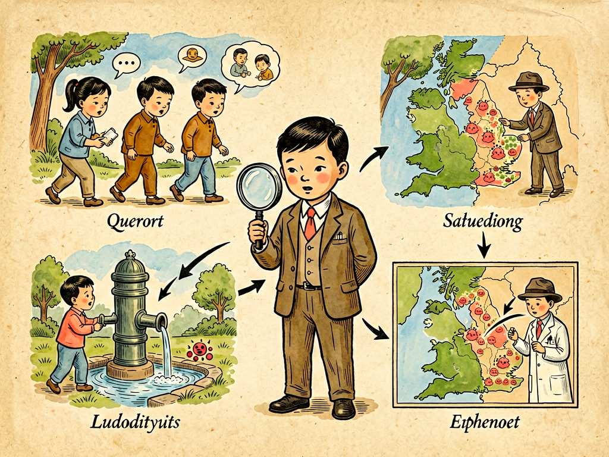

## 第十六章 凶手在哪儿

---

### 📍 本章导航
**核心主题**：传染病爆发的时候，怎么找到"真凶"——传染源是什么？传播途径是什么？怎么切断传播链？这门学问叫流行病学，它就是医学里的"刑侦学"。最厉害的是，流行病学根本不需要看见细菌，只要通过逻辑推理和证据，就能找到凶手，控制疫情——1854年伦敦霍乱，约翰·斯诺医生就是这么做的。这一章讲的不只是怎么找病菌，更是一套通用的"找原因"的科学思维，遇到任何问题都能用  
**你将发现**：
- 在显微镜发明之前，人们以为传染病是"瘴气"、"神罚"，根本不知道有细菌病毒这些凶手存在
- 流行病学调查就像侦探破案：问五个问题——谁病了？什么时候病的？在哪里病的？为什么是他们？怎么才能不病？靠这五个问题就能找到凶手
- 1854年伦敦霍乱大流行，约翰·斯诺医生把所有病例标在地图上，发现病人都围着宽街的一个水泵，他让人拆掉水泵把手，疫情就结束了——这时候离科赫发现霍乱弧菌还有30年，他根本没看见细菌，就靠逻辑推理破了案
- 凶手可能藏在任何地方：水里、食物里、空气里、土壤里、接触的东西上、蚊子跳蚤身上，甚至医院本身就是危险的地方
- 现在我们有了PCR、基因测序这些新技术，能直接读出病毒的基因，精确画出传播链，甚至能通过监测污水提前预警疫情——但技术再厉害，核心还是逻辑、证据和现场调查
- 溯源思维是通用的：遇到任何问题，不管是生病、产品出问题、项目失败，都可以用流行病学的方法：看分布、找差异、提假设、验证据、断根源
- 传染病没有国界，找到凶手需要全球合作、数据共享、公开透明——疫情面前，政治、国界、谣言都是帮凶
- 科学永远是谦卑的：我们永远会遇到新的疾病，永远有未知的东西，不恐慌、不盲从、信证据、讲理性，这才是对付任何"凶手"最好的武器

**阅读建议**：这是第二部的最后一章，读完这一章，你不仅会懂怎么对付传染病，更会学会一套能解决所有问题的科学思维方法。

---

### 🖋️ 经典原文

上一章我们讲了人类和毒菌的战争，今天我们来讲打仗的时候最重要的一件事：**找到凶手，搞清楚它从哪来，怎么传过来的**。这门学问，就叫流行病学——说白了，流行病学就是医学里的"刑侦破案"。
在微生物被发现之前，人类遇到传染病，完全是两眼一抹黑：西方人说是"瘴气"——坏空气导致的；中国人说是"戾气"、"时疫"；还有人说是神的惩罚，是瘟神下凡，要烧香拜佛驱鬼。那时候人们根本不知道，看不见的细菌病毒才是真凶，更不知道它们藏在哪里、怎么传播，所以每次瘟疫大流行，只能等死，一点办法都没有。
直到有了微生物学，有了流行病学，我们才终于学会怎么当"医学侦探"，找到这些看不见的凶手，把它们绳之以法。

那流行病学是怎么破案的呢？它和侦探破案一模一样，首先要问五个问题，也就是流行病学里常说的"五W"：
第一个问题：**Who？谁生病了？** 是老人还是孩子？是男人还是女人？做什么工作的？吃过什么？去过哪里？接触过什么人？——这些信息能帮你缩小嫌疑人范围。
第二个问题：**What？生的是什么病？** 有什么症状？是发烧咳嗽还是上吐下泻？是哪个器官出了问题？——先搞清楚是什么类型的案件，是谋杀还是盗窃，对应的凶手类型完全不一样。
第三个问题：**When？什么时候发病的？** 是集中在某几天还是持续了几个月？是冬天多还是夏天多？和什么事件在时间上吻合？——时间线是破案的关键，谁先发病，谁后发病，谁传给谁，顺着时间线就能摸出传播链。
第四个问题：**Where？在哪里生病的？** 病人住在哪个区？在哪个单位上班？在哪个餐馆吃饭？喝哪里的水？——把病例的位置标在地图上，往往一眼就能看出问题。
第五个问题：**Why？为什么是这些人生病，不是别人？** 生病的人和没生病的人有什么不一样？是喝了不同的水，还是吃了不同的食物，还是接触了什么特殊的东西？——找到差异，就找到了原因。
问完这五个问题，你基本就能猜个八九不离十，然后再去做实验验证你的猜测：从病人身上、从可疑的水源食物里分离病原体，拿到实验室化验，看是不是同一种；如果怀疑是某种食物，就看看没吃这种食物的人是不是不生病；如果怀疑是水，就把水源换掉，看看疫情会不会停止——就像侦探找到嫌疑人之后，要找证据、做验证，证据确凿才能定罪。

历史上最经典的一次"破案"，就是1854年伦敦宽街的霍乱事件。
那时候伦敦正在闹霍乱，几天之内就死了好几百人，大家都说是"瘴气"——空气不好导致的。但是有个叫约翰·斯诺的医生不信，他觉得霍乱上吐下泻，肯定是吃进去喝进去的东西有问题，不是空气。
他做了一件非常简单的事：跑到伦敦苏豪区，挨家挨户问，把所有霍乱死者的住址都标在一张地图上。标完之后他一眼就看出来了——几乎所有死者都围着宽街的一个公用水泵住，离水泵越近，死人越多；离得远的地方，几乎没人得病。
有几个特殊的病例更验证了他的猜测：有个老太太早就搬走了，不在这个区住，但她喜欢喝宽街水泵的水，每天专门叫人送水过来喝，结果她也得了霍乱死了；还有个住在附近的救济院，有自己的水井，500多个人几乎没人得病。
斯诺医生就说：凶手就在这个水泵里，水被污染了。他去说服当地政府，把水泵的把手拆掉，不让大家从这里打水了。果然，把手拆掉没几天，霍乱疫情就慢慢停了。
最厉害的是什么？这是1854年的事，科赫发现霍乱弧菌是1884年——整整30年之后！斯诺医生根本没看见霍乱弧菌是什么样子，甚至连细菌致病理论都还没被普遍接受，他就靠一张地图、一点点走访、逻辑推理，就找到了凶手，阻止了疫情。这就是流行病学的力量：**不需要看见凶手，只要证据链完整，逻辑通顺，就能破案。**
斯诺医生也被称为"现代流行病学之父"。后来我们发现，那次宽街水泵的水，是被附近一个霍乱病人的粪便污染了——下水道漏了，粪便渗到了水井里。

那这些看不见的"凶手"，通常都藏在哪里呢？我给你列几个它们最常藏身的地方：
第一个藏身处是**水**——这是最古老也最危险的藏身处。霍乱、伤寒、痢疾、甲肝，几乎所有消化道传染病，都是通过水传播的。饮用水被粪便污染了，喝了就会生病。19世纪之前欧洲城市的饮用水大多是被粪便污染的，所以霍乱反复大流行，直到有了自来水、污水处理、加氯消毒，水源性传染病才得到控制。直到今天，全世界每年还有几十万人因为喝了不干净的水死于腹泻。
第二个藏身处是**食物**——食源性疾病。沙门氏菌、金黄色葡萄球菌、肉毒杆菌、李斯特菌、诺如病毒，都藏在食物里。食物没煮熟、生熟不分、放坏了、被带菌的人碰过，吃了就会食物中毒。每年夏天医院急诊室里一大半上吐下泻的病人，都是吃出来的。
第三个藏身处是**空气**——呼吸道传染病。肺结核、麻疹、白喉、流感、新冠，都是通过飞沫、气溶胶在空气里传播的，病人咳嗽打喷嚏喷出来的小液滴，被别人吸进去就会感染。所以通风、戴口罩、保持距离，就是对付空气传播最有效的方法。
第四个藏身处是**土壤**——土里藏着破伤风杆菌、炭疽杆菌、钩虫、蛔虫卵这些东西，它们能在土里活很多年。如果身上有伤口沾了泥土，特别是很深的刺伤，一定要打破伤风疫苗，不然破伤风杆菌在缺氧的伤口里繁殖，产生毒素，死亡率很高。
第五个藏身处是**接触**——直接接触、性接触、接触被污染的物体表面。淋病、梅毒、HPV、艾滋、普通感冒、皮肤病，都可以通过接触传播。所以勤洗手、不用别人的毛巾牙刷、安全性行为，就是对付接触传播的方法。
第六个藏身处是**虫媒**——蚊子、跳蚤、蜱虫、虱子这些小虫子，它们咬病人，再咬健康人，就把病原体传过去了。疟疾、登革热、鼠疫、乙脑、莱姆病，都是虫媒传染病。所以灭蚊、防蚊虫叮咬，就能防这些病。
第七个藏身处你可能想不到：**医院本身**。医院里病人多，耐药菌多，做各种侵入性操作，如果消毒不严格、手卫生没做好，很容易发生交叉感染——MRSA、CRE这些超级细菌，大多是在医院里传播的。所以医院其实是最需要注意卫生的地方，医生护士勤洗手，是防止医院感染最有效的方法。
知道了凶手藏在哪里，我们就能针对性地切断传播途径：把水烧开、把食物煮熟、勤洗手、戴口罩、通风、灭蚊、伤口消毒——这些简单的措施，就能挡住绝大多数传染病。

现在科技发达了，我们找凶手的工具也越来越厉害。
以前找病原体，要靠显微镜看，要在培养基里养上好几天甚至几个星期，很慢。现在有了**PCR技术**，只要取一点样本，几个小时就能把病原体的特定基因放大几百万倍，检测出来有没有，是什么型号；有了**基因测序**，我们能直接读出病原体的全部基因序列——就像给凶手做DNA鉴定一样，不仅能确定是什么病原体，还能知道它是从哪来的，和其他地方的毒株是什么关系，谁传给谁的，传播链画得清清楚楚。
新冠疫情期间，我们就是靠基因测序，几天之内就测出了新冠病毒的全部序列，分享给全世界；之后每次出现聚集性疫情，我们都能通过测序精确找到感染源，画出传播链，快速控制住疫情。
还有更厉害的：**污水监测**。我们不需要等人生病去医院，只要定期测下水道的污水，就能在病例出现之前，发现有没有病毒——因为感染病毒的人，哪怕没有症状，粪便里也会排出病毒，污水里就能测到。现在很多国家用污水监测来预警新冠、脊髓灰质炎、诺如病毒的爆发，能比医院发现早一两个星期。
人工智能也在帮忙：现在有AI系统每天看全世界的新闻、医院报告、动物疫情报告，自动扫描有没有异常的疾病聚集，提前预警疫情爆发——加拿大的BlueDot系统，2019年底就比WHO早9天预警了新冠的爆发。
但是，工具再厉害，最核心的东西永远不会变：**现场调查、逻辑推理、证据说话**。技术只是帮我们更快找证据，不能替你思考，不能替你判断。如果不去现场看，不去问病人，不做推理，光有实验室数据，也可能搞错方向。
流行病学最厉害的地方，不只是用来对付传染病——这套"找凶手"的思维方法，其实是通用的，能用来解决生活中几乎所有问题：
- 家里人一起吃饭，吃完几个人拉肚子，你就可以用流行病学方法：谁吃了什么？什么时候开始拉的？吃了哪种食物的人都拉了，没吃的都没拉？很快就能找到是哪个菜有问题；
- 工厂里产品出了质量问题，你也可以用：哪批产品出问题了？什么时候生产的？用了哪批原材料？哪个工人做的？哪台机器生产的？找到差异就能找到原因；
- 公司里项目失败了，你也可以用：哪个环节出问题了？什么时候开始不对的？哪些项目成功了哪些失败了？成功和失败的项目有什么不一样？找到根本原因，下次就能避免。
这套方法叫**溯源思维**：遇到问题不要慌，不要上来就瞎猜，先看现象——把"谁、什么、何时、何地"搞清楚，再找差异——生病的和没生病的、出问题的和没出问题的有什么不一样，提出假设，然后找证据验证假设，最后切断根源。这是科学思维最核心的部分，不止医生需要，每个人都需要。

最后，我要和你说几个关于"找凶手"的重要道理，这是和打病菌一样重要的事：
第一，**疾病很少是单一原因导致的**。不是说找到细菌就完事了——同样接触细菌，为什么有的人发病有的人不发病？这和免疫力、营养状况、卫生条件、甚至贫困和压力都有关系。很多疾病是病原体、人、环境共同作用的结果，不能把所有问题都怪在细菌头上。比如结核杆菌感染了全世界三分之一的人，但只有10%的人会发病，发病的大多是营养不良、过度劳累、免疫力差的人。
第二，**科学永远是谦卑的**。我们永远会遇到新的疾病，从艾滋、SARS、新冠到未来可能出现的新病原体，我们不可能提前知道所有凶手，不可能一开始就有所有答案。科学不是什么都知道，科学是在不断犯错、不断修正中接近真相。遇到新的疫情，一开始判断错了很正常，只要尊重证据、及时修正、公开透明，就能慢慢找到答案。
第三，**传染病没有国界**。在全球化的今天，一个地方爆发疫情，飞机火车几天之内就能把病毒带到全世界，没有哪个国家能独善其身。所以找凶手、对付疫情，需要全球合作、数据共享、互相帮助，而不是甩锅、造谣、搞政治对立——在微生物面前，人类是一个命运共同体。
第四，**比病毒更可怕的是恐慌和谣言**。每次疫情出来，总有人造谣传谣，总有人抢东西、乱吃药、歧视病人，这些东西比病毒本身造成的危害还大。面对未知，不恐慌、不盲从、信科学、听专业人员的，做好自己该做的防护，就是对防疫最大的贡献。

到这里，我们第二部"细菌与人"就全部讲完了。我们讲了人的生命周期，讲了我们的血液、淋巴、组织液，讲了我们的五感，讲了细菌是什么、怎么生活、从哪来、长什么样，讲了水和土壤里的细菌，讲了人类怎么研究细菌，怎么和毒菌打仗，怎么找到致病菌。
从下一章开始，我们进入第三部"科学与文明"——我们会把视线放得更宽，讲细胞、讲新陈代谢、讲我们吃的粮食、用的纸张、钢铁、眼镜、镜子，讲灰尘、讲电、讲热、讲海洋、讲土壤，讲科学怎么改变了我们的文明，怎么改变了人类的生活。我们会看到，微生物学只是现代科学的一部分，整个现代科学和技术，是怎么一步步把人类从蒙昧带到文明的。

下一章，我们讲细胞的不死精神。

---

> 📜 **科学史话：约翰·斯诺和宽街水泵——流行病学的诞生**
>
> 1854年的伦敦，是工业革命的中心，也是一个肮脏的大城市。
>
> 那时候伦敦没有下水道系统，家家户户的粪便、污水都倒在粪坑里，满了就渗到地下，或者直接排到泰晤士河里。人们喝水就从街上的公用水泵打，很多水泵的水早就被粪便污染了，但大家不知道。
>
> 霍乱已经在伦敦流行过好几次了，每次都死好几万人。当时主流观点是"瘴气说"——大家都觉得霍乱是吸了脏空气、坏空气得的，所以有人建议烧硫磺、烧柏油来净化空气，有人建议把窗户都关紧不让坏空气进来，没人想到水有问题。
>
> 约翰·斯诺是个伦敦的医生，他之前就研究过霍乱，他发现霍乱的症状是上吐下泻，首先影响消化道，所以肯定是吃进去喝进去的，不是吸进去的。1854年8月底，苏豪区宽街附近突然爆发霍乱，10天之内死了500多人，居民吓得纷纷搬家。
>
> 斯诺医生立刻开始了他的调查。他去了死亡登记处，拿到了所有霍乱死者的名单和住址，然后一个一个标在他画的地图上。标完之后，规律非常明显：除了极少数例外，所有死者都住在离宽街水泵步行几分钟的范围内；离宽街越近，死亡率越高；有几个离其他水泵更近的死者，家属说他们平时更喜欢喝宽街的水，因为水更甜一点。
>
> 有两个"反例"反而更证明了他的结论：
> 一个是住在宽街东边的一个救济院（相当于养老院），500多个住户里只有5个人得霍乱死了——这个救济院有自己的水井，根本不用宽街的水；
> 另一个是住在伦敦另一个区的一个老太太，她以前住在宽街附近，搬走之后还是怀念宽街水泵的水，每天让马车夫专门给她送一桶宽街的水过来喝。她和她的侄女喝了这个水之后，都得了霍乱死了——她们住的地方周围根本没有其他霍乱病例。
>
> 证据已经确凿无疑了。斯诺医生拿着他的地图去说服当地的社区理事会，要求拆掉宽街水泵的把手。理事会的人本来半信半疑，但疫情实在太严重，死的人太多，他们还是同意了——派人把水泵的把手拆了，不让大家再从这里打水。
>
> 神奇的事情发生了：水泵把手拆掉之后，新发病例立刻就减少了，没过多久疫情就结束了。
>
> 后来人们挖开地面检查，发现离宽街水井不到一米的地方，有个化粪池漏了，一户得霍乱的人家的粪便，正好渗到了水井里——这就是这次疫情的根源。
>
> 约翰·斯诺当时根本不知道什么是霍乱弧菌，他没有显微镜，没有PCR，没有现代实验室，他就靠一张地图、挨家挨户的走访、严谨的逻辑推理，就找到了真凶，阻止了疫情。他用的方法，直到今天还是流行病学调查最核心的方法。
>
> 今天，在伦敦宽街原来那个水泵的位置，立着一个纪念约翰·斯诺的水泵雕塑，旁边有个酒吧叫"约翰·斯诺酒吧"——人们永远记得，170年前，一个医生靠观察、思考和证据，打败了瘟疫，开创了一门新的科学。

---

> 🔬 **科学更新：分子流行病学——给病毒"查家谱"找传播链**
>
> 过去找传播链，只能靠问：你去过哪？接触过谁？这种方法遇到无症状感染者、遇到超级传播事件，很容易断链。现在有了基因测序，我们能直接给病原体"做DNA鉴定"，把传播链画得清清楚楚。
>
> 病毒每次复制都会发生微小的基因突变，这些突变会一代代传下去，就像人的家谱一样——两个毒株的基因越像，说明它们的亲缘关系越近，传播链上的位置越近。我们只要把每个病人身上的病毒都测个序，放在一起比一比，就能精确知道谁传给谁的，哪条传播链是哪里来的，不需要靠人回忆。
>
> 举个例子：2021年深圳有一次疫情，有个病例是在机场工作的保安，一开始大家以为他是被入境的乘客传染的。但是基因测序发现，他身上的病毒和之前一个境外输入病例的病毒差了两个突变，反而和两周前另一个隔离点的病例更像——最后追查发现，是隔离点的垃圾消毒不彻底，保安收垃圾的时候被感染了，根本不是乘客传染的。如果没有基因测序，这个传播链就永远查不清楚。
>
> 还有更厉害的**污水监测**：现在我们不需要等人生病去医院，只要在污水处理厂定期取样，测污水里的病毒核酸，就能知道这个区域有没有人感染病毒，大概有多少人感染——哪怕感染的人没有症状，没去医院，也能测到。这个方法比医院发现病例早7-14天，能给我们争取宝贵的反应时间。
>
> 2022年，纽约就是通过污水监测，提前发现了脊髓灰质炎病毒在社区传播——当时还没有出现瘫痪病例，要是等出现病例，已经传播开了。现在全世界很多国家都在用污水监测来预警新冠、诺如、脊髓灰质炎、麻疹等传染病。
>
> 还有**基因组监测网络**：现在全球科学家把所有测得的病毒序列都放在公开的数据库里共享，不管哪个国家出现了新的突变株，几天之内全世界就都知道了，能立刻研发新的疫苗和检测试剂。2020年初中国科学家用了5天时间就测出了新冠病毒的全基因组序列，立刻分享给全世界，这才让全世界能快速研发出疫苗和检测方法——如果我们像以前那样保密几个月，后果不堪设想。
>
> 技术越来越先进，但约翰·斯诺教给我们的核心永远不变：去现场，看数据，找规律，讲证据。工具会变，科学方法不会变。

---

> 🧪 **现实连接：普通人怎么用溯源思维解决生活问题？**
>
> 流行病学的溯源思维，不是只有疾控中心的医生才需要，你生活中遇到几乎所有问题，都可以用这套方法来解决，非常好用。我教你一个简单的"五步法"：
>
> **第一步：先搞清楚事实，不要上来就猜原因。**
> 遇到问题先把"谁、什么、何时、何地"四个W写下来：到底发生了什么事？有谁受影响？什么时候开始的？在什么地方发生的？把事实搞准了，再谈原因。
> 比如孩子拉肚子，先搞清楚：从几点开始拉的？拉了几次？除了拉肚子还有什么症状？之前吃了什么？去过哪里？家里其他人有没有拉肚子？不要上来就说"肯定是着凉了"、"肯定是昨天吃冰吃的"——先把事实摆出来。
>
> **第二步：找共同点和差异点。**
> 问两个问题：出问题的人/东西有什么共同点？没出问题的和出问题的有什么不一样？——原因往往就在这个差异里。
> 比如全家出去吃饭，回来三个人拉肚子，一个人没事。那就列个表：谁吃了什么菜？吃了凉拌菜的都拉了，没吃的都没事，那大概率就是凉拌菜的问题；如果喝了冰水的都拉了，没喝的没事，那可能是冰的问题。这个方法简单到可笑，但90%的问题都能这么找到原因。
>
> **第三步：提出假设，并且想办法验证。**
> 找到差异之后，你可以猜一个最可能的原因，这就是假设。然后要验证这个假设：除了这个原因，有没有其他可能？如果是这个原因，还应该出现什么现象？
> 比如你怀疑是凉拌菜导致的，那去问问一起吃饭的其他朋友，吃了凉拌菜的是不是都拉了？没吃的是不是都没事？如果是，那假设就更可靠了。
>
> **第四步：采取措施切断原因。**
> 找到最可能的原因之后，立刻采取措施：怀疑是食物的问题就别吃了，怀疑是水的问题就喝开水，怀疑是接触传播就勤洗手消毒——就像斯诺医生拆掉水泵把手一样，先切断原因，再慢慢确认。
>
> **第五步：看措施有没有效果，及时修正。**
> 采取措施之后，看看问题有没有解决：如果拉肚子停了，说明你找对原因了；如果还是拉，说明你找错了，回去重新找。
>
> 这套方法非常简单，但非常有效，从找拉肚子的原因，到找电脑故障、找产品质量问题、找项目失败的原因，甚至找家里的狗乱拉尿是谁干的，都能用。本质上，你遇到任何问题，都是在当"侦探"，找"凶手"，科学思维就是你最好的侦探工具。

---

### 💬 读后思考与讨论

1. 约翰·斯诺在发现霍乱弧菌30年前，就靠逻辑推理找到了霍乱的传播途径，控制住了疫情。这说明"看见"是不是科学发现的必要条件？看不到的东西，我们能不能通过证据和逻辑认识它？
2. 我们说"溯源思维"是通用的，不止用来找病菌，还能解决生活中的各种问题。你生活中有没有遇到过什么问题，是靠找差异、找关联、找证据解决的？
3. 每次疫情出现，总会有各种谣言和阴谋论，比如"病毒是实验室造的"、"疫苗有阴谋"、"某某药能治百病"。为什么会有这么多人相信谣言？我们怎么分辨信息真假？
4. 新冠疫情期间，有人说"要自由不要隔离"，有人说"疫情没有国界，全球要合作"。你觉得在全球大流行病面前，个人自由和公共卫生是什么关系？各国应该怎么合作？
5. 科学是会犯错的，比如一开始我们对新冠的传播途径、潜伏期、致病力的认识都有偏差，后来慢慢修正。有人说"科学家都搞错了，为什么要信他们？"——你怎么看待"科学会犯错"这件事？科学和迷信、和教条最大的区别是什么？

### 🔗 关联阅读
- 第一部第十二章：《肠腔里的会议》→ 消化道细菌和肠道感染
- 第二部第十二章：《清水和浊水》→ 水安全和水源性传染病
- 第二部第十五章：《毒菌战争的问题》→ 我们怎么对抗致病菌
- 第三部：《科学与文明》全系列 → 科学方法如何改变人类文明
- 跨章节思考：为什么说"科学方法比科学知识更重要"？掌握了找证据、讲逻辑、会反思的科学方法，比记住多少知识点都有用？

---

### ✨ 第二部·细菌与人 结语
到这里，我们就走完了第二部"细菌与人"的旅程。我们从人的生命周期讲起，讲了我们身体里的血液、淋巴和组织液，讲了我们的视觉、听觉、嗅觉、味觉、触觉，讲了细菌的结构、营养、形态、起源，讲了水和土壤里的细菌世界，讲了人类怎么发现细菌、研究细菌，怎么和致病菌打仗，怎么追踪传染源。
你现在应该已经明白：细菌不是我们的敌人，它们是这个星球最古老的居民，是我们生存环境不可缺少的一部分，甚至我们自己的身体里，也住着和我们共生的细菌。只有不到1%的细菌是致病菌，会让我们生病。我们不需要"消灭所有细菌"，我们只需要了解它们，尊重它们，和它们和平共处，守住我们的防线，控制住风险。
更重要的是，通过细菌的故事，你应该已经学到了一套看待世界的方法：不要迷信权威，不要相信直觉，要去观察、去实验、去找证据、去讲逻辑——这就是科学的方法。这套方法不止能用来理解细菌，更能用来理解你遇到的所有事情，解决你遇到的所有问题。
接下来我们要进入第三部分：科学与文明。我们会把视野放得更宽，从细胞到宇宙，从食物到材料，从能源到技术，看看现代科学是怎么一步步发展起来，怎么改变了人类的生活，把人类从农业文明带到工业文明、信息文明的。我们下一部分见。
